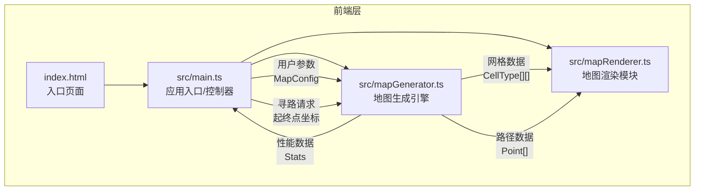

## 1. 架构设计



## 2. 技术说明
- 前端框架：纯TypeScript + HTML5 Canvas（无React/Vue，因需求明确为Canvas渲染）
- 构建工具：Vite
- 语言：TypeScript（严格模式，target ES2020）
- 无后端：纯前端应用，所有计算在浏览器端完成
- 无数据库：数据在内存中管理

## 3. 文件结构与职责

| 文件 | 职责 | 调用关系 |
|------|------|----------|
| package.json | 依赖管理(typescript, vite)，启动脚本 | - |
| vite.config.js | 开发服务器配置(端口3000，热更新) | - |
| tsconfig.json | TypeScript配置(严格模式，ES2020) | - |
| index.html | 入口页面，全屏Canvas容器，深色主题 | 加载main.ts |
| src/main.ts | 应用入口，初始化UI/画布，监听参数调整→调用生成器→触发渲染 | 调用mapGenerator, mapRenderer |
| src/mapGenerator.ts | 柏松点采样获取房间位置、生成房间矩形、A星算法连接房间生成走廊 | 被main.ts调用，返回GridData给renderer |
| src/mapRenderer.ts | 接收网格数据绘制地图，支持缩放平移，路径动画渲染 | 被main.ts调用 |

## 4. 数据模型

### 4.1 核心类型定义

```typescript
enum CellType {
  WALL = 0,
  FLOOR = 1,
  CORRIDOR = 2,
  START = 3,
  END = 4,
  PATH = 5
}

interface MapConfig {
  width: number;
  height: number;
  roomCount: number;
  minRoomSize: number;
  corridorWidth: number;
}

interface Room {
  x: number;
  y: number;
  width: number;
  height: number;
  centerX: number;
  centerY: number;
}

interface Stats {
  generationTime: number;
  roomCount: number;
  corridorLength: number;
  pathfindingTime: number;
}

interface GridData {
  grid: CellType[][];
  rooms: Room[];
  width: number;
  height: number;
}

interface Point {
  x: number;
  y: number;
}
```

## 5. 算法说明

### 5.1 柏松点采样
- 在网格内生成候选点，保持最小距离约束
- 房间间距最少1格
- 生成指定数量的不重叠房间矩形

### 5.2 A星寻路
- 使用曼哈顿距离作为启发函数
- 优先连接相邻房间中心点
- 构建最小生成树确保连通性后再生成走廊
- 走廊宽度可配置(1-3格)

### 5.3 路径动画
- 逐帧渲染，每帧移动8像素
- 路径节点处显示白色小圆点(半径3px)
- 移动速度每秒2格
