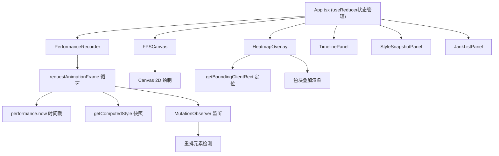

## 1. 架构设计



## 2. 技术描述

- **前端框架**：React@18 + TypeScript@5 + Vite@5
- **构建工具**：Vite@5，开发服务器端口3000，热更新开启
- **状态管理**：React.useReducer 集中管理应用状态
- **Canvas库**：canvas-confetti 用于仪表盘背景装饰效果
- **性能API**：performance.now、requestAnimationFrame、MutationObserver、getComputedStyle、getBoundingClientRect
- **无其他外部动画库**：所有动画使用CSS transition/transform或requestAnimationFrame原生实现

## 3. 项目结构

```
src/
├── main.tsx                    # 入口文件，ReactDOM.createRoot
├── App.tsx                     # 主应用组件，useReducer状态管理
├── types/
│   └── index.ts                # TypeScript类型定义
├── components/
│   ├── PerformanceRecorder.tsx # 录制控制与帧数据收集
│   ├── FPSCanvas.tsx           # 实时FPS仪表盘
│   ├── HeatmapOverlay.tsx      # 布局重排热力图
│   ├── TimelinePanel.tsx       # 时间轴面板
│   ├── StyleSnapshotPanel.tsx  # CSS样式快照面板
│   └── JankListPanel.tsx       # 卡顿列表面板
├── hooks/
│   ├── usePerformanceRecorder.ts # 录制逻辑Hook
│   └── useMutationObserver.ts    # DOM变化监听Hook
└── utils/
    ├── dom.ts                  # DOM元素路径获取
    ├── reflow.ts               # 重排检测工具
    └── stack.ts                # 调用栈解析
```

## 4. 核心类型定义

```typescript
interface FrameData {
  id: number;
  timestamp: number;
  fps: number;
  duration: number;
  hasLongTask: boolean;
  longTaskDuration: number;
  reflowElements: string[];
  styleSnapshot: StyleSnapshot[];
}

interface StyleSnapshot {
  elementPath: string;
  styles: Record<string, string>;
}

interface JankData {
  id: number;
  timestamp: number;
  duration: number;
  functionName: string;
  stackTrace: string;
}

interface ReflowStats {
  elementPath: string;
  count: number;
  totalDuration: number;
  element: HTMLElement;
}

interface AppState {
  isRecording: boolean;
  frames: FrameData[];
  selectedFrameIndex: number;
  heatmapEnabled: boolean;
  jankList: JankData[];
  reflowStats: Map<string, ReflowStats>;
}
```

## 5. 关键技术实现

### 5.1 帧数据录制
- 使用 `performance.now()` 获取高精度时间戳
- `requestAnimationFrame` 循环驱动帧捕获
- 检测 `duration > 50ms` 标记为长任务
- `duration > 100ms` 标记为卡顿点
- 通过 `Error.stack` 解析卡顿引发的JS函数名

### 5.2 重排检测
- 使用 `MutationObserver` 监听DOM结构变化
- 监听 `scroll` 和 `resize` 事件
- 在帧捕获时检测元素 `offsetHeight`、`offsetWidth` 触发强制同步布局
- 构建CSS选择器路径：`div#container > span.text`

### 5.3 性能优化
- 录制循环使用 `requestAnimationFrame` 与浏览器绘制同步
- 样式快照仅记录动画元素的computed样式变化
- 热力图使用 `transform: translate3d()` 避免重排
- Canvas绘制使用 `requestAnimationFrame` 节流
- 大数组操作使用 `requestIdleCallback` 分块处理

## 6. 配置文件

### package.json
```json
{
  "dependencies": {
    "react": "^18.2.0",
    "react-dom": "^18.2.0",
    "canvas-confetti": "^1.9.2"
  },
  "devDependencies": {
    "typescript": "^5.3.0",
    "vite": "^5.0.0",
    "@vitejs/plugin-react": "^4.2.0",
    "@types/react": "^18.2.0",
    "@types/react-dom": "^18.2.0",
    "@types/canvas-confetti": "^1.6.4"
  },
  "scripts": {
    "dev": "vite"
  }
}
```

### vite.config.js
- 开发服务器端口：3000
- 热更新：开启
- resolve.alias：`@` → `src`

### tsconfig.json
- 严格模式：启用
- target：ES2020
- jsx：react-jsx
