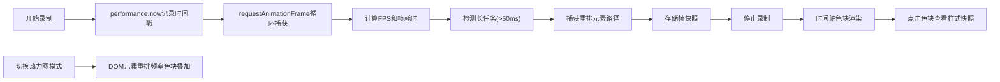

## 1. 产品概述

网页动画性能追踪与可视化工具，帮助前端开发者精确感知每一帧的绘制耗时和布局抖动问题。通过录制页面动画、帧级回放、实时FPS仪表盘和布局重排热力图，开发者可以快速定位和优化性能瓶颈。

- **核心问题**：前端开发者在调试复杂CSS/JS动画时，难以精确感知每一帧的绘制耗时和布局抖动问题
- **目标用户**：前端开发工程师、性能优化工程师
- **核心价值**：可视化性能数据，快速定位动画卡顿和布局重排问题

## 2. 核心功能

### 2.1 功能模块

1. **动画录制与帧级回放**：录制所有动画（CSS过渡、requestAnimationFrame驱动的JS动画），时间轴展示，点击跳转查看CSS样式快照
2. **实时帧率仪表盘**：圆形canvas仪表盘，动态指示FPS，低帧率时红色光晕警告，卡顿点列表展示
3. **布局重排热力图**：根据重排频率叠加半透明色块，鼠标悬停显示详细统计

### 2.2 页面详情

| 页面名称 | 模块名称 | 功能描述 |
|-----------|-------------|---------------------|
| 主页面 | 录制控制区 | 开始/停止录制按钮，录制状态指示，热力图开关 |
| 主页面 | FPS仪表盘 | 右上角固定圆形仪表盘，实时显示FPS，低帧率闪烁警告 |
| 主页面 | 时间轴面板 | 水平时间轴展示所有帧，色块编码（绿/黄/红），点击跳转 |
| 主页面 | 样式快照面板 | 右侧显示选中帧的所有动画元素computed样式 |
| 主页面 | 卡顿列表面板 | 左侧显示卡顿点详情（时长、时间戳、函数名） |
| 主页面 | 热力图叠加层 | 预览区域半透明色块显示重排频率，悬停显示统计 |

## 3. 核心流程

用户点击开始录制 → 系统捕获所有动画帧数据（时间戳、FPS、长任务、重排元素）→ 时间轴实时更新色块 → 用户点击停止 → 时间轴完整展示 → 用户点击色块 → 右侧显示该帧CSS样式快照 → 用户可切换热力图模式查看重排分布。

## 4. 用户界面设计

### 4.1 设计风格

- **主题**：暗色高科技风格，专业性能调试工具
- **主色调**：背景#1E1E1E，卡片#2D2D2D，主文字#E0E0E0，强调色#64B5F6
- **帧状态色**：绿色#4CAF50（正常）、黄色#FFC107（低帧率）、红色#F44336（重排）
- **热力图渐变**：无色→浅蓝#BBDEFB→橘黄#FFB74D→深红#D32F2F，不透明度0.5
- **按钮风格**：圆角矩形，SVG图标，hover缩放1.02（0.2秒ease-out）
- **字体**：12px monospace用于数据展示，清晰易读
- **布局风格**：卡片式布局，面板可折叠，平滑过渡动画

### 4.2 页面设计概述

| 页面名称 | 模块名称 | UI Elements |
|-----------|-------------|-------------|
| 主页面 | 录制控制区 | 播放/停止SVG图标按钮，热力图切换开关，状态指示灯 |
| 主页面 | FPS仪表盘 | 80px直径圆形canvas，背景#333，白色刻度，指针动画，低帧率红色光晕闪烁 |
| 主页面 | 时间轴面板 | 水平滚动容器，帧色块（8px宽），hover放大，选中高亮 |
| 主页面 | 样式快照面板 | 可滚动代码区域，monospace字体，元素路径高亮，CSS属性分组 |
| 主页面 | 卡顿列表面板 | 320px宽可折叠，每项显示卡顿时长、时间戳、函数名，红色警示图标 |
| 主页面 | 热力图叠加层 | 半透明色块覆盖DOM元素，悬停tooltip显示统计数据 |

### 4.3 响应式设计

- **≥1200px**：三栏布局（左侧筛选320px + 中间时间轴 + 右侧详情）
- **768-1199px**：两栏布局（时间轴与详情上下堆叠，筛选面板可层叠）
- **<768px**：所有面板垂直排列，仪表盘缩小至50px直径
- **动画**：面板折叠0.3秒水平滑动，按钮hover 0.2秒ease-out缩放

## 5. 性能指标

- 录制期间主线程卡顿检测响应延迟：<10ms
- 热力图叠加模式下滚动流畅度：≥30fps
- 帧数据存储：支持录制至少30秒（约1800帧）
