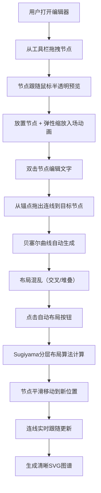

## 1. 产品概述

在线流程图编辑器与自动布局优化工具，帮助产品经理和开发者快速绘制、编辑和优化流程图。通过智能算法自动检测并修复布局混乱问题，生成清晰易读的SVG图谱。

- 核心价值：降低流程图绘制门槛，自动优化视觉呈现，提升工作效率
- 目标用户：产品经理、开发者、设计师、项目管理人员
- 市场定位：轻量级、高性能的Web端流程图绘制与优化工具

## 2. 核心功能

### 2.1 用户角色

| 角色 | 注册方式 | 核心权限 |
|------|----------|----------|
| 普通用户 | 无需注册，直接使用 | 完整的流程图绘制、编辑、自动布局功能 |

### 2.2 功能模块

1. **主画布编辑器**：SVG画布渲染、节点拖拽、连线绘制、缩放平移
2. **左侧工具栏**：节点类型选择（矩形/圆形）、拖拽添加节点
3. **顶部操作栏**：自动布局按钮、缩放控制、其他操作入口
4. **自动布局引擎**：基于Sugiyama框架的分层布局算法、交叉消除、层级拉平

### 2.3 页面详情

| 页面名称 | 模块名称 | 功能描述 |
|---------|----------|----------|
| 主编辑页 | 左侧工具栏 | 提供矩形和圆形节点拖拽到画布，Material Design风格图标 |
| 主编辑页 | 顶部操作栏 | 自动布局按钮（四箭头汇聚图标）、响应式折叠菜单 |
| 主编辑页 | 中央画布 | SVG渲染节点和连线，支持拖拽、缩放、多选、删除等交互 |
| 主编辑页 | 节点组件 | 双击编辑文字、锚点连接、选中高亮、入场动画 |
| 主编辑页 | 连线组件 | 贝塞尔曲线路径、交叉点标记、选中高亮、删除功能 |
| 主编辑页 | 自动布局模块 | 一键优化布局、平滑动画过渡、消除连线交叉 |

## 3. 核心流程

用户从左侧工具栏拖拽节点到画布，放置后可编辑文字。从节点锚点拖出连线连接其他节点。当布局混乱时，点击顶部自动布局按钮，系统分析连接关系并重新排布节点，节点平滑移动到新位置，连线实时更新。

## 4. 用户界面设计

### 4.1 设计风格

- **主色调**：清爽浅色主题，画布背景 #F5F5F5
- **节点样式**：白色 #FFFFFF 背景，细边框 #E0E0E0，选中外发光 #2196F3
- **连线样式**：深灰 #666666，选中蓝色加粗，交叉点橙色标记
- **工具栏**：左侧240px宽 #FAFAFA 背景，顶部48px高操作栏带分割线
- **图标风格**：Material Design 单色线条图标
- **字体**：采用现代无衬线字体，确保中文显示清晰
- **动效**：节点入场弹性动画0.15秒，布局过渡0.5秒ease-out缓动

### 4.2 页面设计概述

| 页面名称 | 模块名称 | UI 元素 |
|---------|----------|---------|
| 主编辑页 | 左侧工具栏 | 240px宽浅灰背景，节点图标卡片，拖拽反馈，hover效果 |
| 主编辑页 | 顶部操作栏 | 48px高白色背景，底部1px分割线，自动布局按钮，响应式折叠 |
| 主编辑页 | 画布区域 | SVG画布，浅灰背景网格，节点拖拽阴影（模糊6px，Y偏移2px，透明度0.15） |
| 主编辑页 | 节点组件 | 120x60px默认尺寸，蓝色锚点（hover变绿），双击编辑文字，选中外发光 |
| 主编辑页 | 连线组件 | 贝塞尔曲线，控制点避障，交叉点橙色圆点标记次数，选中加粗高亮 |
| 主编辑页 | 交互反馈 | 半透明拖拽预览，弹性缩放入场，平滑位置过渡，Delete键删除 |

### 4.3 响应式

- **桌面优先**：默认完整布局，左侧240px工具栏 + 顶部48px操作栏 + 中央画布
- **响应式断点**：768px以下，工具栏和操作栏自动隐藏为折叠按钮
- **触摸优化**：移动端支持触摸拖拽，放大触控热区

### 4.4 性能指标

- 200个节点 + 300条连线时保持30fps以上拖拽和缩放
- 50个节点以内自动布局计算耗时不超过2秒
- 布局动画流畅，无明显卡顿
