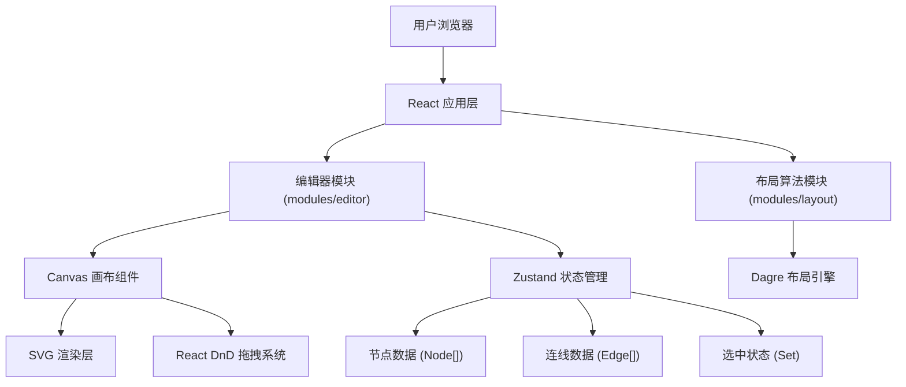
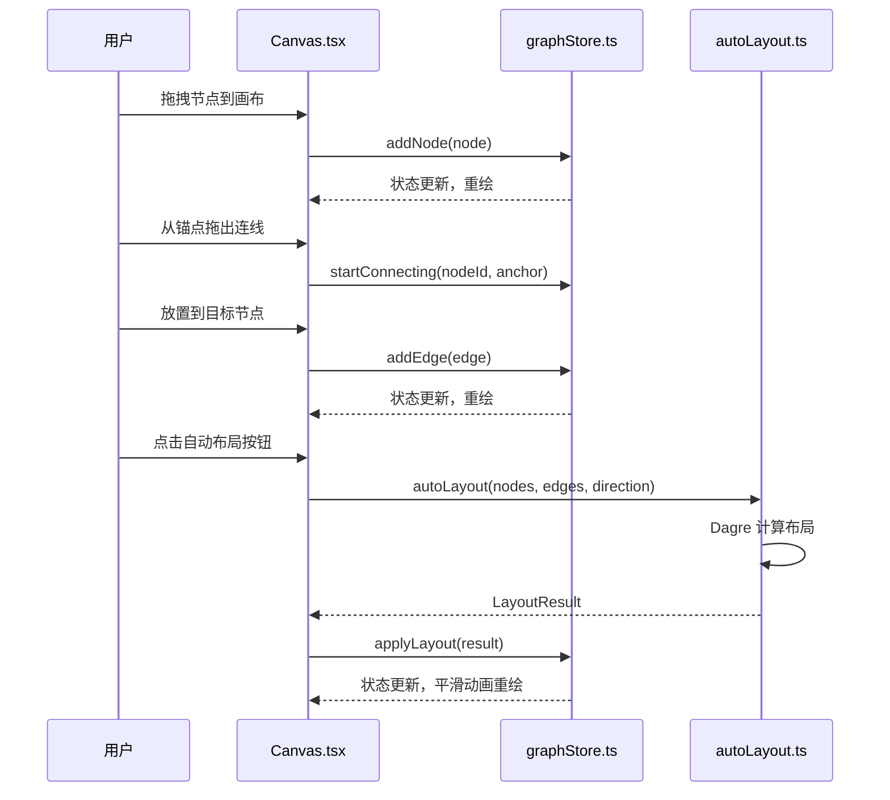

## 1. 架构设计



## 2. 技术描述

- **前端框架**：React@18 + TypeScript
- **构建工具**：Vite@5
- **状态管理**：Zustand@4
- **布局算法**：Dagre@0.8.5 (Sugiyama 分层布局框架)
- **拖拽系统**：react-dnd@16 + react-dnd-html5-backend@16
- **唯一标识**：uuid@9
- **开发服务器**：Vite 内置，端口 5173，开启 HMR 热更新

## 3. 目录结构

```
├── src/
│   ├── main.tsx              # React 应用入口
│   ├── App.tsx               # 根组件
│   ├── modules/
│   │   ├── editor/
│   │   │   ├── components/
│   │   │   │   └── Canvas.tsx        # 主画布组件
│   │   │   └── stores/
│   │   │       └── graphStore.ts     # 全局状态池
│   │   └── layout/
│   │       └── autoLayout.ts         # 自动布局算法
├── index.html
├── package.json
├── vite.config.js
└── tsconfig.json
```

## 4. 数据模型

### 4.1 TypeScript 类型定义

```typescript
// 节点类型
interface Node {
  id: string;
  type: 'rect' | 'circle';
  x: number;
  y: number;
  width: number;
  height: number;
  label: string;
  createdAt: number;
}

// 连线类型
interface Edge {
  id: string;
  source: string;
  target: string;
  sourceAnchor?: { x: number; y: number };
  targetAnchor?: { x: number; y: number };
  pathPoints?: { x: number; y: number }[];
}

// 锚点类型
interface Anchor {
  x: number;
  y: number;
  position: 'top' | 'right' | 'bottom' | 'left';
}

// 布局方向
type LayoutDirection = 'LR' | 'TB';

// 布局结果
interface LayoutResult {
  nodes: { id: string; x: number; y: number }[];
  edges: { id: string; points: { x: number; y: number }[] }[];
}

// Store 状态
interface GraphState {
  nodes: Node[];
  edges: Edge[];
  selectedIds: Set<string>;
  layoutDirection: LayoutDirection;
  isDragging: boolean;
  isConnecting: boolean;
  connectingFrom: { nodeId: string; anchor: Anchor } | null;
  zoom: number;
  pan: { x: number; y: number };
  
  // Actions
  addNode: (node: Omit<Node, 'id' | 'createdAt'>) => void;
  removeNode: (id: string) => void;
  moveNode: (id: string, x: number, y: number) => void;
  updateNodeLabel: (id: string, label: string) => void;
  addEdge: (edge: Omit<Edge, 'id'>) => void;
  removeEdge: (id: string) => void;
  setSelected: (ids: Set<string>, append?: boolean) => void;
  clearSelection: () => void;
  deleteSelected: () => void;
  applyLayout: (result: LayoutResult) => void;
  setZoom: (zoom: number) => void;
  setPan: (x: number, y: number) => void;
  startConnecting: (nodeId: string, anchor: Anchor) => void;
  endConnecting: () => void;
}
```

### 4.2 数据交互流程



## 5. 核心技术实现

### 5.1 SVG 渲染与性能优化

- 使用 SVG `<g>` 元素分组管理节点和连线
- 节点拖拽时使用 CSS `transform` 而非重新计算布局
- 200+ 节点场景下使用 `requestAnimationFrame` 批量更新
- 连线交叉检测使用空间索引减少计算量

### 5.2 贝塞尔曲线生成

```
控制点计算策略：
1. 计算源节点和目标节点中心点
2. 根据方向（左→右或上→下）确定控制点偏移方向
3. 偏移距离 = 节点间距 × 0.5
4. 检测控制点是否与其他节点重叠，若重叠则微调位置
```

### 5.3 Sugiyama 分层布局（Dagre 配置）

- **ranker**: 'network-simplex'（最小化边长总和）
- **rankdir**: 'LR' 或 'TB'（根据用户选择）
- **nodesep**: 50px（节点间距）
- **ranksep**: 80px（层级间距）
- **marginx**: 50px, **marginy**: 50px（画布边距）

### 5.4 动画实现

- **节点入场**：`transform: scale(0.8) → scale(1)`，`transition: all 0.15s cubic-bezier(0.34, 1.56, 0.64, 1)`
- **布局过渡**：`transition: all 0.5s ease-out`
- **拖拽预览**：`opacity: 0.7`，半透明跟随

### 5.5 响应式布局

- CSS 媒体查询 `@media (max-width: 768px)`
- 左侧工具栏 `transform: translateX(-100%)` 隐藏
- 顶部操作栏按钮折叠为汉堡菜单

## 6. 性能指标与优化策略

| 指标 | 目标 | 优化策略 |
|------|------|----------|
| 200节点拖拽帧率 | ≥30fps | 1. 使用 CSS transform 替代 top/left<br>2. 防抖处理高频事件<br>3. 离屏节点使用 visibility:hidden |
| 300连线渲染帧率 | ≥30fps | 1. 连线路径缓存<br>2. 交叉检测空间索引<br>3. requestAnimationFrame 批量重绘 |
| 50节点布局耗时 | ≤2秒 | 1. Dagre 算法参数调优<br>2. Web Worker 异步计算<br>3. 增量布局（仅计算变动部分） |
| 首屏加载时间 | ≤2秒 | 1. Vite 代码分割<br>2. 依赖按需引入<br>3. SVG 资源预加载 |

## 7. 依赖清单

```json
{
  "dependencies": {
    "react": "^18.2.0",
    "react-dom": "^18.2.0",
    "zustand": "^4.5.0",
    "dagre": "^0.8.5",
    "uuid": "^9.0.1",
    "react-dnd": "^16.0.1",
    "react-dnd-html5-backend": "^16.0.1"
  },
  "devDependencies": {
    "@types/react": "^18.2.0",
    "@types/react-dom": "^18.2.0",
    "@types/dagre": "^0.7.52",
    "@types/uuid": "^9.0.7",
    "typescript": "^5.3.0",
    "vite": "^5.0.0",
    "@vitejs/plugin-react": "^4.2.0"
  }
}
```
