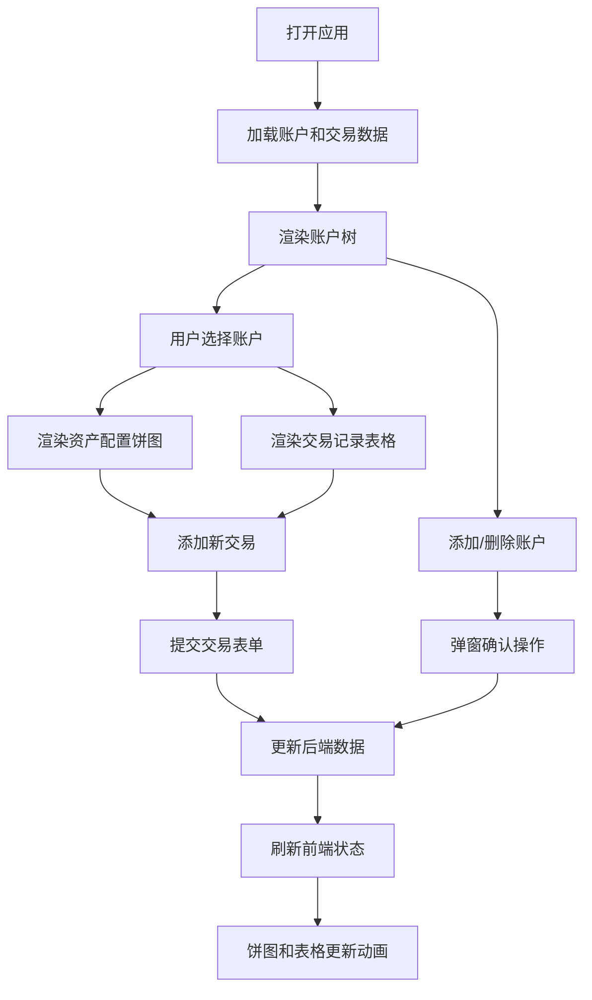

## 1. 产品概述

多账户资产配置聚合与收益可视化应用，帮助个人投资者统一管理股票、基金、加密货币等多个投资账户，自动计算资产配置比例和收益表现，并通过交互式图表直观展示投资组合状况。

- **解决痛点**：手动汇总多账户资产繁琐，缺乏直观的资产分布和收益分析工具
- **目标用户**：拥有多个投资账户的个人投资者
- **核心价值**：一站式账户管理、实时资产分析、可视化收益追踪

## 2. 核心功能

### 2.1 用户角色

| 角色 | 注册方式 | 核心权限 |
|------|----------|----------|
| 普通用户 | 无需注册，本地数据存储 | 管理账户、记录交易、查看资产分析图表 |

### 2.2 功能模块

1. **账户管理模块**：添加/删除投资账户，支持多层级账户结构，显示账户总资产和收益率
2. **交易记录模块**：记录买入/卖出交易，包含日期、资产类别、金额、备注信息
3. **资产配置模块**：自动计算各资产类别占比，交互式饼图展示资产分布
4. **收益分析模块**：计算累计收益和收益率，区分正/负收益显示

### 2.3 页面详情

| 页面名称 | 模块名称 | 功能描述 |
|-----------|-------------|---------------------|
| 主页面 | 顶部导航栏 | 应用标题、菜单按钮（移动端）、全局操作入口 |
| 主页面 | 侧边栏账户树 | 树状展示所有账户，显示总资产和收益率，支持添加/删除账户 |
| 主页面 | 资产配置饼图 | 交互式饼图展示选中账户的资产类别占比，支持hover详情 |
| 主页面 | 交易记录表格 | 展示选中账户的所有交易记录，支持添加新交易 |
| 主页面 | 添加账户弹窗 | 表单输入账户名称和类别，提交动画效果 |
| 主页面 | 删除确认弹窗 | 确认删除操作，防止误删 |
| 主页面 | 添加交易弹窗 | 表单输入交易详情，添加后自动滚动高亮 |

## 3. 核心流程

### 主操作流程
用户打开应用 → 查看已有账户列表 → 选择账户查看详情 → 查看资产配置饼图和交易记录 → 添加新交易或管理账户

### 账户管理流程
点击添加账户 → 弹出表单 → 输入账户信息 → 提交后账户滑入显示 → 选中新账户 → 开始记录交易

### 交易记录流程
选中账户 → 点击添加交易 → 选择交易类型和资产类别 → 输入金额和日期 → 提交后表格滚动到新行并闪烁高亮

## 4. 用户界面设计

### 4.1 设计风格
- **主色调**：深蓝 #1A237E（专业财务风格）
- **辅助色**：浅蓝 #64B5F6（高亮和交互元素）
- **背景色**：极浅灰 #FAFAFA（舒适阅读）
- **成功色**：绿色 #4CAF50（正收益、股票类别）
- **警告色**：红色 #F44336（负收益）
- **资产类别色板**：股票 #4CAF50、基金 #FF9800、加密货币 #9C27B0、现金 #2196F3
- **卡片风格**：白底、圆角8px、阴影深度2、卡片间距16px
- **字体**：使用现代无衬线字体，数字使用等宽字体增强可读性
- **动画**：所有交互0.2-0.5秒平滑过渡，hover效果、切换动画、数据更新动画

### 4.2 页面设计概述

| 页面名称 | 模块名称 | UI元素 |
|-----------|-------------|-------------|
| 主页面 | 顶部导航栏 | 高度56px、深蓝背景、白色标题、左侧菜单按钮（移动端）、右对齐操作按钮 |
| 主页面 | 侧边栏账户树 | 宽度280px、固定定位、白底、可滚动、树状缩进、选中节点浅蓝#E3F2FD背景、hover浅灰#F5F5F5、0.2秒淡入切换 |
| 主页面 | 资产配置饼图 | 响应式容器、recharts饼图、扇形0.5秒旋转入场动画、hover放大1.1倍、tooltip显示详情、预设色板 |
| 主页面 | 交易记录表格 | 表头固定、行hover浅灰背景、新行绿色#C8E6C9闪烁3次（每次0.3秒）、自动滚动到新行 |
| 主页面 | 弹窗组件 | 添加账户卡片从顶部滑入（0.3秒缓动）、删除确认居中显示、删除时列表项渐隐缩放（0.3秒） |
| 主页面 | 收益率显示 | 正收益绿色、负收益红色、数字变化时0.2秒翻转动画 |

### 4.3 响应式设计
- **桌面端**（≥768px）：左右布局，侧边栏固定280px，右侧内容区可滚动，padding 24px
- **移动端**（<768px）：侧边栏收窄为抽屉菜单，点击左上角菜单按钮展开，覆盖式显示
- **触摸优化**：按钮最小尺寸44px，触摸反馈效果

### 4.4 性能设计
- **初始加载优化**：首次渲染≤2秒（支持100账户×1000条交易）
- **交互响应优化**：切换账户更新≤200毫秒
- **状态管理**：使用zustand进行细粒度状态更新，避免不必要重渲染
- **计算优化**：派生状态缓存，资产占比和收益计算按需触发
