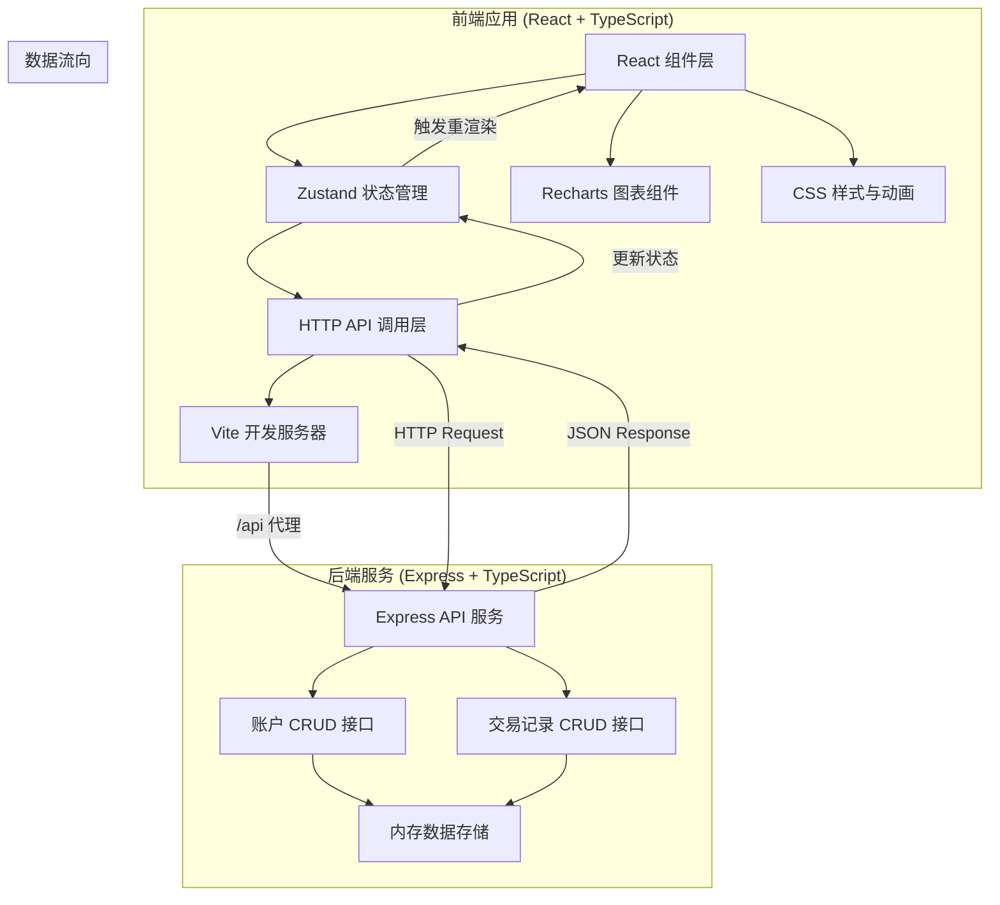
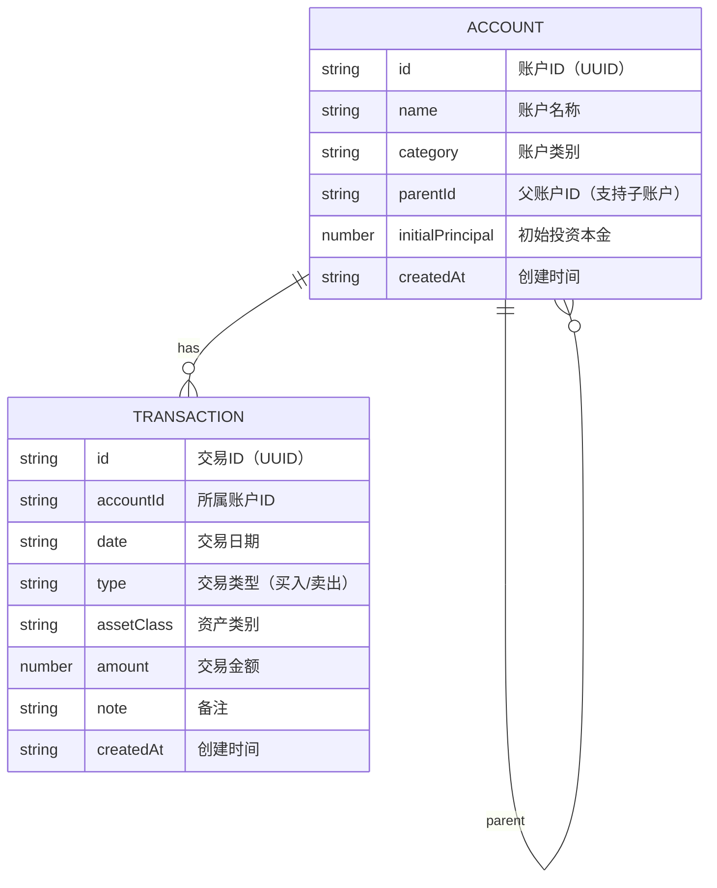
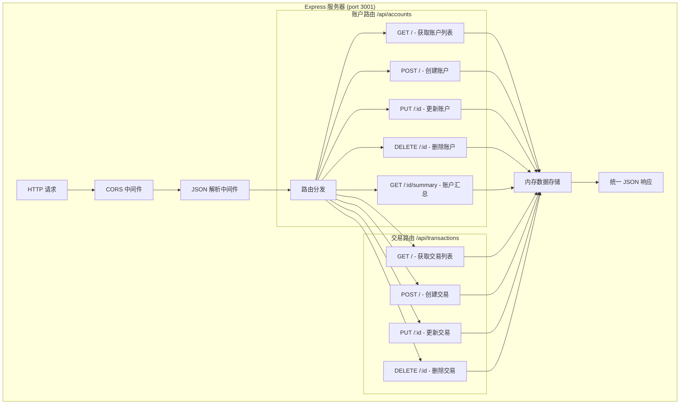

## 1. 架构设计



## 2. 技术描述

### 2.1 前端技术栈
- **框架**：React 18 + TypeScript 5
- **构建工具**：Vite 5
- **状态管理**：Zustand 4
- **图表库**：Recharts 2
- **ID 生成**：uuid 9
- **开发插件**：@vitejs/plugin-react 4
- **数据流向**：组件分发动作 → Zustand 更新状态 → 触发组件重渲染

### 2.2 后端技术栈
- **框架**：Express 4
- **跨域处理**：cors 2
- **语言**：TypeScript 5
- **数据存储**：内存数组（开发阶段）
- **端口**：3001
- **响应格式**：统一 JSON 格式

### 2.3 开发配置
- **代理配置**：Vite 开发服务器将 `/api` 请求转发到 `http://localhost:3001`
- **TypeScript 配置**：严格模式（strict: true）
- **启动脚本**：`npm run dev` - 同时启动前端开发服务器和后端 API 服务

## 3. 目录结构与文件职责

```
project-root/
├── package.json                    # 项目依赖和启动脚本
├── vite.config.js                  # Vite 配置（开发服务器代理）
├── tsconfig.json                   # TypeScript 配置（严格模式）
├── index.html                      # 入口页面
├── server/
│   └── index.ts                    # 后端 API 服务（账户/交易 CRUD）
└── src/
    ├── main.tsx                    # React 应用入口，初始化状态仓库
    ├── App.tsx                     # 主布局组件（flex 布局，三栏结构）
    ├── store/
    │   └── useFinanceStore.ts      # Zustand 全局状态仓库
    ├── components/
    │   ├── AccountTree.tsx         # 侧边栏账户树组件
    │   ├── PortfolioChart.tsx      # 资产配置饼图组件
    │   ├── TransactionList.tsx     # 交易记录表格组件
    │   ├── AddAccountModal.tsx     # 添加账户弹窗
    │   ├── DeleteConfirmModal.tsx  # 删除确认弹窗
    │   └── AddTransactionModal.tsx # 添加交易弹窗
    ├── types/
    │   └── index.ts                # TypeScript 类型定义
    ├── api/
    │   └── index.ts                # HTTP API 请求封装
    └── styles/
        └── index.css               # 全局样式和动画定义
```

### 文件调用关系
1. [main.tsx](file:///e:/solo/VersionFastPro/tasks/auto87/src/main.tsx) → 初始化 Zustand store → 渲染 [App.tsx](file:///e:/solo/VersionFastPro/tasks/auto87/src/App.tsx)
2. [App.tsx](file:///e:/solo/VersionFastPro/tasks/auto87/src/App.tsx) → 从 store 读取数据 → 分发给 [AccountTree](file:///e:/solo/VersionFastPro/tasks/auto87/src/components/AccountTree.tsx)、[PortfolioChart](file:///e:/solo/VersionFastPro/tasks/auto87/src/components/PortfolioChart.tsx)、[TransactionList](file:///e:/solo/VersionFastPro/tasks/auto87/src/components/TransactionList.tsx)
3. 组件 → 调用 store 的动作方法 → store 通过 [api/index.ts](file:///e:/solo/VersionFastPro/tasks/auto87/src/api/index.ts) 发送 HTTP 请求
4. [api/index.ts](file:///e:/solo/VersionFastPro/tasks/auto87/src/api/index.ts) → 请求 [server/index.ts](file:///e:/solo/VersionFastPro/tasks/auto87/server/index.ts) 的 API 接口
5. [server/index.ts](file:///e:/solo/VersionFastPro/tasks/auto87/server/index.ts) → 操作内存数据 → 返回 JSON 响应

## 4. 数据模型定义

### 4.1 TypeScript 类型

```typescript
// 资产类别
type AssetClass = '股票' | '基金' | '加密货币' | '现金';

// 交易类型
type TransactionType = '买入' | '卖出';

// 账户接口
interface Account {
  id: string;
  name: string;
  category: string;
  parentId: string | null;
  initialPrincipal: number;
  createdAt: string;
}

// 交易记录接口
interface Transaction {
  id: string;
  accountId: string;
  date: string;
  type: TransactionType;
  assetClass: AssetClass;
  amount: number;
  note?: string;
  createdAt: string;
}

// 资产占比接口
interface AssetAllocation {
  assetClass: AssetClass;
  value: number;
  percentage: number;
}

// 账户汇总信息
interface AccountSummary {
  account: Account;
  totalAssets: number;
  totalProfit: number;
  profitRate: number;
  allocations: AssetAllocation[];
}

// API 统一响应格式
interface ApiResponse<T> {
  success: boolean;
  data?: T;
  error?: string;
}
```

### 4.2 数据实体关系



## 5. API 接口定义

### 5.1 账户管理接口

| 方法 | 路径 | 描述 | 请求体 | 响应 |
|------|------|------|--------|------|
| GET | `/api/accounts` | 获取所有账户列表 | - | `ApiResponse<Account[]>` |
| POST | `/api/accounts` | 创建新账户 | `{ name, category, parentId?, initialPrincipal }` | `ApiResponse<Account>` |
| PUT | `/api/accounts/:id` | 更新账户信息 | `{ name?, category?, initialPrincipal? }` | `ApiResponse<Account>` |
| DELETE | `/api/accounts/:id` | 删除账户（级联删除交易） | - | `ApiResponse<{ deleted: boolean }>` |
| GET | `/api/accounts/:id/summary` | 获取账户汇总信息 | - | `ApiResponse<AccountSummary>` |

### 5.2 交易记录接口

| 方法 | 路径 | 描述 | 请求体 | 响应 |
|------|------|------|--------|------|
| GET | `/api/transactions?accountId=:id` | 获取账户的所有交易 | - | `ApiResponse<Transaction[]>` |
| POST | `/api/transactions` | 创建新交易 | `{ accountId, date, type, assetClass, amount, note? }` | `ApiResponse<Transaction>` |
| PUT | `/api/transactions/:id` | 更新交易 | `{ date?, type?, assetClass?, amount?, note? }` | `ApiResponse<Transaction>` |
| DELETE | `/api/transactions/:id` | 删除交易 | - | `ApiResponse<{ deleted: boolean }>` |

## 6. 服务器架构



## 7. 状态管理设计

### 7.1 Zustand Store 结构

```typescript
interface FinanceState {
  // 状态数据
  accounts: Account[];
  transactions: Transaction[];
  selectedAccountId: string | null;
  isLoading: boolean;
  error: string | null;
  recentlyAddedTransactionId: string | null;
  
  // 派生状态（getters）
  selectedAccount: Account | null;
  selectedAccountTransactions: Transaction[];
  accountSummaries: Map<string, AccountSummary>;
  assetAllocations: AssetAllocation[];
  
  // 动作方法
  fetchAccounts: () => Promise<void>;
  fetchTransactions: (accountId: string) => Promise<void>;
  addAccount: (data: Omit<Account, 'id' | 'createdAt'>) => Promise<void>;
  deleteAccount: (id: string) => Promise<void>;
  selectAccount: (id: string | null) => void;
  addTransaction: (data: Omit<Transaction, 'id' | 'createdAt'>) => Promise<void>;
  deleteTransaction: (id: string) => Promise<void>;
  
  // 计算方法
  calculateTotalAssets: (accountId: string) => number;
  calculateProfitRate: (accountId: string) => number;
  calculateAssetAllocations: (accountId: string) => AssetAllocation[];
}
```

### 7.2 性能优化策略
1. **派生状态缓存**：使用 zustand 的 computed 中间件缓存计算结果
2. **细粒度订阅**：组件只订阅需要的状态片段
3. **防抖处理**：高频操作防抖处理
4. **虚拟滚动**：交易记录表格支持虚拟滚动（大数据量）
5. **Memo 优化**：使用 React.memo、useMemo、useCallback 避免不必要重渲染

## 8. 核心业务算法

### 8.1 资产占比计算算法
```
输入：账户ID
输出：各资产类别的持有金额和占比

1. 获取账户所有交易记录
2. 按资产类别分组，计算净额（买入+，卖出-）
3. 计算总资产值 = 各类别净额之和
4. 计算每类占比 = 类别净额 / 总资产值 * 100%
5. 过滤掉金额为0的类别
6. 返回按金额降序排列的结果
```

### 8.2 累计收益计算算法
```
输入：账户ID
输出：累计收益金额和收益率

1. 计算当前总资产值（同上）
2. 获取账户初始投资本金
3. 累计收益 = 当前总资产 - 初始本金
4. 收益率 = 累计收益 / 初始本金 * 100%
5. 保留两位小数返回
```

## 9. 关键动画实现

| 动画名称 | 实现方式 | 时长 | 触发时机 |
|----------|----------|------|----------|
| 账户卡片滑入 | CSS transform: translateY + opacity | 0.3s | 添加账户后 |
| 账户删除消失 | CSS transform: scale + opacity | 0.3s | 确认删除后 |
| 节点选中淡入 | CSS transition: background-color | 0.2s | 切换选中账户 |
| 饼图扇形入场 | Recharts animationBegin/animationDuration | 0.5s | 饼图首次渲染 |
| 饼图更新过渡 | Recharts isAnimationActive | 0.3s | 数据更新时 |
| 饼图hover放大 | CSS transform: scale(1.1) | 0.2s | 鼠标hover扇形 |
| 新交易行闪烁 | CSS @keyframes flash | 0.9s（3次×0.3s） | 添加交易后 |
| 收益率翻转动画 | CSS transform: rotateX | 0.2s | 收益率变化时 |
| 抽屉菜单展开 | CSS transform: translateX | 0.3s | 移动端点击菜单按钮 |
