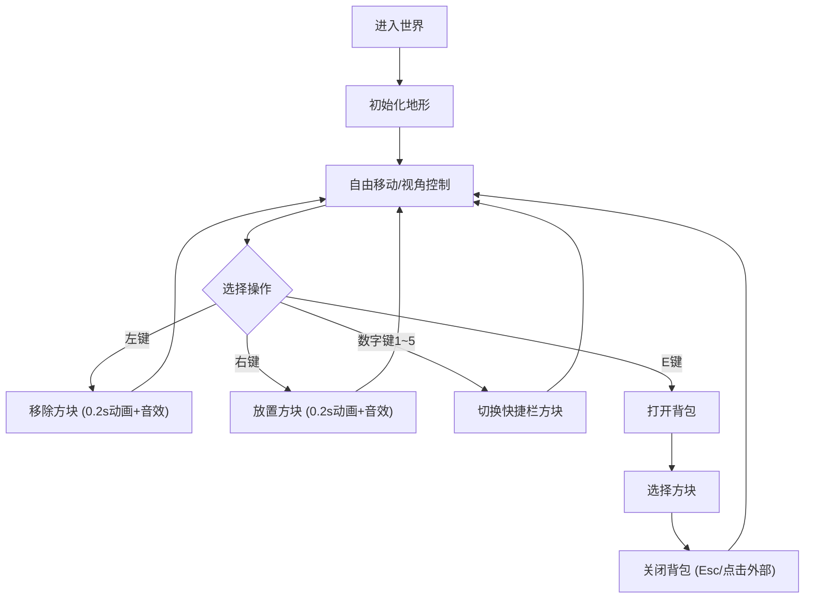

## 1. 产品概述

基于体素（Voxel）的3D沙盒建造与破坏模拟器，让玩家在32x32x8的立方体世界中自由放置和移除方块，体验类似Minecraft的创造乐趣。面向休闲玩家和创意爱好者，提供流畅的浏览器端3D建造体验。

## 2. 核心功能

### 2.1 功能模块

1. **3D体素世界**：32x32x8网格，初始地形为泥土层+石头层
2. **方块交互**：左键移除、右键放置，带缩放动画和音效
3. **玩家控制**：WASD移动、鼠标视角、跳跃/下蹲物理
4. **快捷栏系统**：数字键1~5切换方块，底部居中横行
5. **背包系统**：E键打开全屏模态框，6x4网格展示
6. **HUD信息**：左上角坐标+面向方块，右下角选中方块+数量

### 2.2 方块类型

| 方块 | 特性 |
|------|------|
| 泥土 | 棕色纹理，地表层 |
| 石头 | 灰色纹理，地下层 |
| 木材 | 棕黄色纹理 |
| 玻璃 | 半透明，可透视 |
| 钻石 | 青色闪光纹理 |

### 2.3 页面详情

| 页面/场景 | 模块 | 功能描述 |
|-----------|------|----------|
| 3D世界视图 | 地形渲染 | 渲染32x32x8体素网格，泥土石头初始层 |
| 3D世界视图 | 方块交互 | 左键移除（0.2s缩小动画+音效）、右键放置（0.2s放大动画+音效） |
| 3D世界视图 | 玩家移动 | WASD移动(4格/s)、跳跃(1.5格高)、Shift下蹲、鼠标拖拽旋转视角 |
| HUD覆盖层 | 坐标显示 | 左上角显示x,y,z坐标和面向方块名称 |
| HUD覆盖层 | 方块信息 | 右下角显示选中方块类型和剩余数量(初始64) |
| HUD覆盖层 | 快捷栏 | 底部居中横行，5种方块图标，选中放大1.2倍+弹性动画 |
| 背包模态框 | 背包网格 | E键打开，6x4网格(60x60px/格)，半透明+模糊背景，0.2s淡入淡出 |

## 3. 核心流程

玩家进入世界 → 查看初始地形 → 通过WASD和鼠标控制移动和视角 → 按数字键1~5切换方块类型 → 左键移除/右键放置方块 → E键打开背包切换方块 → 持续建造和破坏

## 4. 用户界面设计

### 4.1 设计风格

- **主色**：#2C3E50（深蓝灰）
- **强调色**：#3498DB（亮蓝）
- **危险色**：#E74C3C（红色，用于移除操作）
- **背景色**：#1a1a2e（深蓝黑）
- **字体**：系统无衬线字体
- **按钮**：hover时背景变浅+0.2s过渡
- **布局**：3D全屏视图+HUD覆盖层

### 4.2 页面设计概览

| 页面 | 模块 | UI元素 |
|------|------|--------|
| 3D世界 | 场景画布 | Three.js全屏Canvas，背景#1a1a2e |
| HUD | 坐标面板 | 左上角半透明面板，白色文字，显示x,y,z和方块名 |
| HUD | 方块信息 | 右下角半透明面板，方块图标+数量徽章 |
| HUD | 快捷栏 | 底部居中，半透明深灰背景(rgba(0,0,0,0.6))，白色边框方块图标，8px间距 |
| 背包 | 模态框 | 全屏覆盖，backdrop-filter: blur(4px)，6x4网格，60x60px格子 |

### 4.3 响应式

- 桌面优先设计
- 视口宽度<768px时：快捷栏字体和图标缩小30%，坐标显示改为竖排
- 鼠标拖拽旋转视角，点击放置/移除方块

### 4.4 3D场景指导

- **环境**：深蓝色天空，无HDRI，简洁氛围
- **光照**：环境光+方向光，柔和阴影
- **相机**：第一人称视角，FOV 75度
- **交互**：鼠标拖拽旋转，WASD移动，左键破坏右键放置
- **动画**：方块放置0.2s从0缩放到1，移除0.2s从1缩放到0
- **性能**：可见方块>1000时启用面剔除，仅渲染面向相机的面

## 5. 性能要求

- Chrome 108+上保持60FPS
- 可见方块>1000时启用背面剔除优化
- 放置/移除操作响应<16ms
- 音效使用Web Audio API正弦波生成
