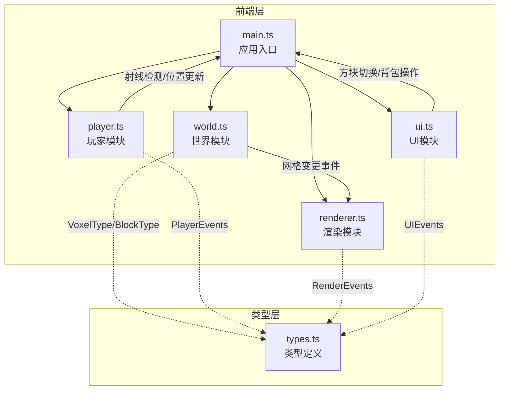

## 1. 架构设计



## 2. 技术说明

- **前端框架**：TypeScript + Three.js（无React/Vue，纯3D渲染项目）
- **构建工具**：Vite（端口3000，热更新）
- **3D引擎**：Three.js（r160+）
- **音频**：Web Audio API（正弦波音效）
- **样式**：纯CSS（暗色主题，CSS变量）
- **无后端**：纯客户端运行

## 3. 文件结构与职责

| 文件 | 职责 |
|------|------|
| `package.json` | 依赖管理：three, @types/three, typescript, vite |
| `index.html` | 入口页面，加载main.ts，背景色#1a1a2e |
| `tsconfig.json` | 严格模式，target ES2020，moduleResolution bundler |
| `vite.config.js` | 端口3000，开启热更新 |
| `src/main.ts` | 应用入口，创建场景/相机/渲染器，初始化各模块，渲染循环 |
| `src/world.ts` | 体素网格管理，getVoxel/setVoxel，地形生成，方块变更事件 |
| `src/player.ts` | WASD移动，鼠标视角，跳跃物理(重力-10m/s²)，碰撞检测，射线检测 |
| `src/renderer.ts` | Three.js Mesh管理，动态创建/移除/更新，背面剔除优化 |
| `src/ui.ts` | 快捷栏、坐标显示、背包界面，DOM操作，响应式适配 |
| `src/types.ts` | VoxelType枚举、BlockType接口、事件类型定义 |

## 4. 数据流

```
玩家输入(鼠标/键盘)
  → player.ts (移动/视角/射线检测)
  → main.ts (协调)
  → world.ts (修改网格数据)
  → world.ts (触发变更事件)
  → renderer.ts (更新Three.js Mesh)
  → ui.ts (更新HUD信息)
```

## 5. 关键算法

### 5.1 面剔除优化

当可见方块>1000时，仅渲染面向相机的面：
- 对每个体素检查6个面
- 如果相邻位置有不透明方块，则该面不渲染
- 玻璃方块视为透明，相邻面的不透明方块仍需渲染靠近玻璃的面

### 5.2 碰撞检测

- 玩家碰撞箱：宽0.6格，高1.8格（下蹲1.2格）
- 检测玩家碰撞箱与周围体素的AABB碰撞
- 分别在X/Y/Z轴独立检测，允许滑墙

### 5.3 射线检测

- 从相机中心发射射线
- 沿射线方向步进，检测第一个非空体素
- 返回命中方块的坐标和面法线（用于放置新方块的位置）

## 6. 性能策略

- 合并相同材质方块的几何体，减少Draw Call
- 超过1000可见方块时启用面剔除
- 使用InstancedMesh渲染大量相同类型方块
- 方块动画使用requestAnimationFrame驱动
- 音效使用Web Audio API离线生成，避免网络请求
