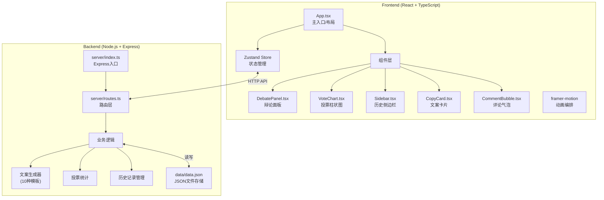
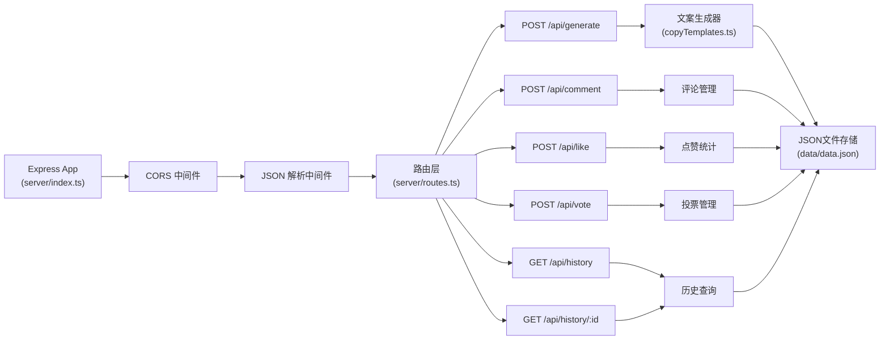
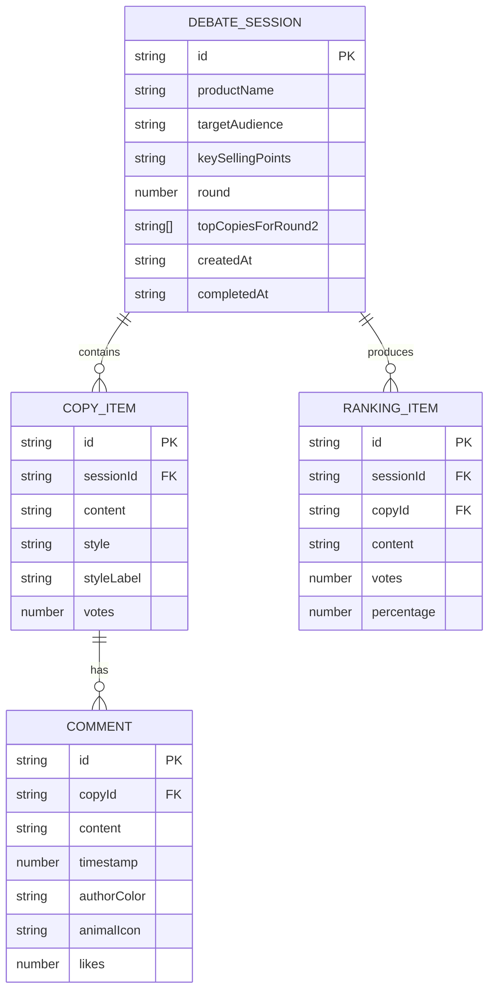

## 1. 架构设计



## 2. 技术描述

- **前端**：React@18 + TypeScript + Vite@5 + Zustand@4 + framer-motion@11
- **构建工具**：Vite@5，配置代理转发/api请求到后端3001端口
- **后端**：Express@4 + TypeScript + ts-node
- **数据存储**：本地JSON文件（server/data/data.json）
- **状态管理**：Zustand，集中管理文案、评论、投票、历史记录等状态
- **动画方案**：framer-motion，实现所有交互动效和入场动画
- **代码规范**：TypeScript严格模式，target ES2020

## 3. 目录结构

```
project-root/
├── package.json
├── vite.config.js
├── tsconfig.json
├── index.html
├── src/
│   ├── App.tsx
│   ├── main.tsx
│   ├── store/
│   │   └── useStore.ts
│   ├── types/
│   │   └── index.ts
│   ├── components/
│   │   ├── DebatePanel.tsx
│   │   ├── VoteChart.tsx
│   │   ├── Sidebar.tsx
│   │   ├── CopyCard.tsx
│   │   ├── CommentBubble.tsx
│   │   ├── VoteButton.tsx
│   │   └── CountdownTimer.tsx
│   └── api/
│       └── fetchAPI.ts
└── server/
    ├── index.ts
    ├── routes.ts
    ├── copyTemplates.ts
    └── data/
        └── data.json
```

## 4. API 定义

### 类型定义
```typescript
interface CopyItem {
  id: string;
  content: string;
  style: string;
  styleLabel: string;
  comments: Comment[];
  votes: number;
}

interface Comment {
  id: string;
  content: string;
  timestamp: number;
  authorColor: string;
  animalIcon?: string;
  likes: number;
}

interface DebateSession {
  id: string;
  productName: string;
  targetAudience: string;
  keySellingPoints: string;
  copies: CopyItem[];
  round: number; // 0: 生成, 1: 第一轮辩论, 2: 第二轮辩论, 3: 投票, 4: 完成
  topCopiesForRound2: string[]; // 第二轮的文案ID
  votes: Record<string, number>;
  createdAt: number;
  completedAt?: number;
  finalRankings: RankingItem[];
}

interface RankingItem {
  copyId: string;
  content: string;
  votes: number;
  percentage: number;
}
```

### API 接口

| 方法 | 路径 | 请求参数 | 响应 | 说明 |
|------|------|----------|------|------|
| POST | `/api/generate` | `{ productName, targetAudience, keySellingPoints }` | `{ sessionId, copies: CopyItem[] }` | 生成4条备选文案 |
| POST | `/api/comment` | `{ sessionId, copyId, content }` | `{ comment: Comment }` | 提交第一轮评论 |
| POST | `/api/like` | `{ sessionId, copyId, commentId }` | `{ likes: number }` | 第二轮评论点赞 |
| POST | `/api/vote` | `{ sessionId, copyId }` | `{ success: boolean }` | 提交投票 |
| GET | `/api/round2/:sessionId` | - | `{ topCopies: CopyItem[] }` | 获取第二轮待辩论文案 |
| POST | `/api/finish/:sessionId` | - | `{ rankings: RankingItem[] }` | 结束投票，计算排名 |
| GET | `/api/history` | - | `{ sessions: DebateSession[] }` | 获取历史记录列表 |
| GET | `/api/history/:id` | - | `{ session: DebateSession }` | 获取单条历史详情 |

## 5. 服务器架构



## 6. 数据模型

### 6.1 数据结构定义



### 6.2 data.json 初始结构
```json
{
  "sessions": []
}
```

## 7. 前端状态管理（Zustand Store）

```typescript
interface AppState {
  // 当前辩论会话
  currentSession: DebateSession | null;
  // 历史记录
  history: DebateSession[];
  // UI状态
  sidebarOpen: boolean;
  currentRound: number;
  votingTimeLeft: number;
  hasVoted: boolean;
  isReplaying: boolean;
  replaySpeed: number;
  
  // Actions
  generateCopy: (params: GenerateParams) => Promise<void>;
  submitComment: (copyId: string, content: string) => Promise<void>;
  submitLike: (copyId: string, commentId: string) => Promise<void>;
  submitVote: (copyId: string) => Promise<void>;
  proceedToRound2: () => void;
  startVoting: () => void;
  finishVoting: () => Promise<void>;
  fetchHistory: () => Promise<void>;
  loadHistory: (id: string) => Promise<void>;
  toggleSidebar: () => void;
  startReplay: (session: DebateSession) => void;
  stopReplay: () => void;
}
```

## 8. 性能要求

- **文案生成响应**：≤500ms（模拟数据延迟控制）
- **柱状图动画帧率**：≥30fps（使用CSS transform和opacity实现）
- **动画性能**：优先使用transform和opacity属性，避免布局抖动
- **内存管理**：历史记录加载时按需渲染，避免一次性渲染大量DOM
