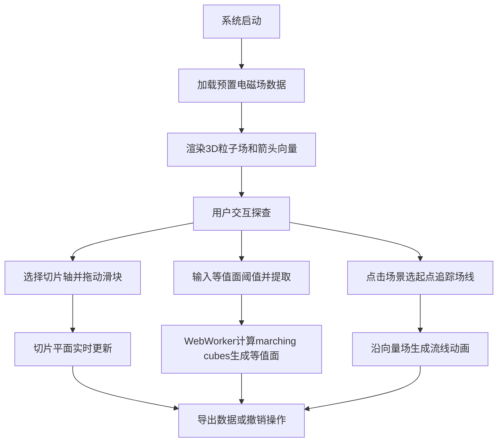

## 1. 产品概述
交互式3D电磁场数据可视化与探查工具，为科研人员和工程师提供直观的电磁场数据探查环境。用户可在三维空间中加载标量与向量场数据，通过切面扫描、等值面提取和场线追踪等操作深入分析电磁场分布特性。

- 核心价值：将抽象的电磁场数据转化为直观的3D可视化呈现，降低理解门槛，提升分析效率
- 目标用户：物理研究人员、电子工程师、学生及教育工作者

## 2. 核心功能

### 2.1 功能模块

1. **数据加载模块**：支持加载本地JSON格式的电磁场数据（网格规格10x10x10），提供3组预置不同频率的电场分布数据供选择
2. **场渲染模块**：粒子系统、箭头向量场、正交切片平面、等值面、场线追踪等多种可视化方式
3. **交互控制模块**：鼠标悬停提示、点击选择场线起点、键盘快捷键、OrbitControls相机控制
4. **UI控制面板**：切片控制、等值面提取、场线追踪三个标签页
5. **数据导出与状态管理**：JSON格式导出、5步撤销栈支持

### 2.2 页面详情

| 页面名称 | 模块名称 | 功能描述 |
|----------|----------|----------|
| 主界面 | 3D场景 | Three.js渲染电磁场粒子、箭头、切片、等值面和场线，支持旋转缩放 |
| 主界面 | 控制面板 | 右下角悬浮面板，分切片/等值面/场线三个标签页 |
| 主界面 | 图例 | 左上角显示场强标量图例（蓝到红渐变） |
| 主界面 | 状态栏 | 显示当前切片位置、场强统计信息 |

## 3. 核心流程

## 4. 用户界面设计

### 4.1 设计风格
- **主题色调**：深色科幻风格，背景#1a1a2e
- **主色调**：蓝色#3b82f6（切片控制光晕）、橙色#f59e0b（等值面按钮）
- **色彩渐变**：场强从蓝#1E90FF到红#FF4500，彩虹色标用于切片热力图，场线从深蓝到亮青
- **材质效果**：控制面板半透明磨砂玻璃（rgba(16,16,32,0.9)），圆角12px
- **交互反馈**：按钮0.15秒弹性收缩动画，滑块圆形拖头带蓝色光晕

### 4.2 页面设计概述

| 页面名称 | 模块名称 | UI元素 |
|----------|----------|--------|
| 主界面 | 3D场景 | 全屏Three.js画布，半透明球体包围粒子场，粒子、箭头、切片平面、等值面、场线 |
| 主界面 | 控制面板 | 标签页切换、滑块（数值实时显示）、输入框+/-按钮、提取按钮、场线列表 |
| 主界面 | 图例 | 渐变色带、标注0%和100%最小值最大值 |
| 主界面 | 悬浮提示 | 鼠标跟随弹窗，背景rgba(0,0,0,0.7)，白色12px字体 |

### 4.3 响应式设计
- **桌面端**（>768px）：右下角固定悬浮控制面板
- **移动端**（<=768px）：控制面板折叠为左侧可拖拽展开侧边栏，主场景占满剩余空间

### 4.4 3D场景指引
- **环境**：深色背景#1a1a2e，雾化效果增强深度感
- **光照**：环境光+方向光，确保粒子和网格材质正确显示
- **相机**：PerspectiveCamera，初始位置(15,15,15)，看向原点
- **交互**：OrbitControls支持旋转、缩放、平移
- **动画**：等值面0.3秒缩放入场，场线0.5秒延伸动画，撤销0.2秒过渡
- **性能**：粒子数≤20000时帧率≥45fps，等值面计算在WebWorker中执行

## 5. 性能指标
- 交互操作帧率 ≥ 30fps
- 粒子数≤20000时渲染帧率 ≥ 45fps
- 主线程阻塞 ≤ 50ms（等值面计算由WebWorker处理）
- 最多同时保留3个等值面
- 撤销栈记录最近5次操作
