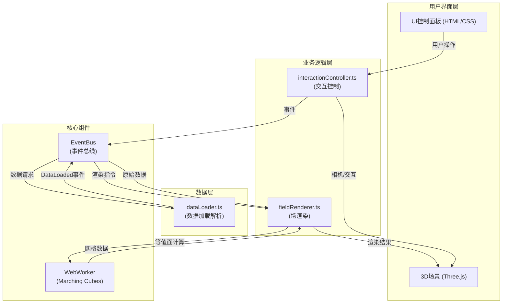

## 1. 架构设计



## 2. 技术选型

| 技术 | 版本/说明 | 用途 |
|------|-----------|------|
| TypeScript | 严格模式，target ES2020 | 类型安全的开发语言 |
| Three.js | latest | 3D渲染引擎 |
| @types/three | latest | Three.js类型定义 |
| D3.js | latest | 颜色插值、比例尺工具 |
| Vite | latest | 构建工具，端口8080，热更新 |
| Web Worker | 原生 | Marching Cubes等值面计算 |
| OrbitControls | Three.js内置 | 相机交互控制 |

## 3. 模块划分与职责

### 3.1 核心模块

| 模块 | 文件 | 职责 |
|------|------|------|
| 数据加载模块 | src/dataLoader.ts | 加载JSON格式电磁场数据，解析为标量值数组和三维向量数组，触发DataLoaded事件 |
| 场渲染模块 | src/fieldRenderer.ts | 创建粒子系统、箭头辅助线、切片平面、等值面、场线等可视化元素 |
| 交互控制模块 | src/interactionController.ts | 处理鼠标悬停、点击、键盘快捷键、OrbitControls、UI面板逻辑 |
| 事件总线 | src/utils/eventBus.ts | 模块间通信，传递数据和操作指令 |
| WebWorker | src/workers/marchingCubes.worker.ts | 后台执行Marching Cubes算法，避免阻塞主线程 |

### 3.2 事件定义

| 事件名 | 触发模块 | 接收模块 | 数据载荷 |
|--------|----------|----------|----------|
| DataLoaded | dataLoader | fieldRenderer | { scalarData, vectorData, gridSize, bounds } |
| SliceChanged | interactionController | fieldRenderer | { axis, position } |
| IsosurfaceRequest | interactionController | fieldRenderer | { threshold } |
| IsosurfaceReady | fieldRenderer | interactionController | { geometry, threshold } |
| FieldLineRequest | interactionController | fieldRenderer | { startPoint } |
| FieldLineReady | fieldRenderer | interactionController | { points, id } |
| FieldLineDragged | interactionController | fieldRenderer | { id, newPosition } |
| ExportRequest | interactionController | fieldRenderer | { type } |
| UndoRequest | interactionController | 全局 | { operation } |
| ViewReset | interactionController | fieldRenderer | - |
| DisplayModeChanged | interactionController | fieldRenderer | { mode: 'particles' \| 'arrows' \| 'both' } |

## 4. 数据结构定义

### 4.1 电磁场数据结构
```typescript
interface ElectromagneticData {
  gridSize: { x: number; y: number; z: number };  // 10x10x10
  bounds: { min: Vector3; max: Vector3 };
  scalarData: Float32Array;  // 标量场值
  vectorData: Float32Array;  // x,y,z向量分量交错
  dataSetName: string;
  frequency: number;
}

interface DataLoadedEvent {
  type: 'DataLoaded';
  data: ElectromagneticData;
}
```

### 4.2 撤销操作记录
```typescript
interface UndoRecord {
  type: 'slice' | 'isosurface' | 'fieldline';
  timestamp: number;
  previousState: any;
  currentState: any;
}
```

### 4.3 导出数据结构
```typescript
interface ExportData {
  exportType: 'slice' | 'isosurface' | 'fieldline';
  timestamp: string;
  dataSetName: string;
  coordinates: Array<{ x: number; y: number; z: number; fieldValue: number }>;
  metadata: any;
}
```

## 5. 核心算法实现

### 5.1 Marching Cubes 算法
- 在WebWorker中执行，避免主线程阻塞
- 输入：3D标量场数据、网格尺寸、等值阈值
- 输出：三角形顶点数组、法向量数组
- 查表法实现15种基本立方体构型

### 5.2 场线追踪算法
- 四阶龙格-库塔（RK4）积分方法
- 最大步长：200步，步长：0.05单位
- 终止条件：场强幅值<0.01或超出边界
- 三线性插值获取任意点向量值

### 5.3 颜色映射
- 标量场：`#1E90FF` → `#FF4500` 双色渐变
- 切片热力图：D3彩虹色标 `d3.interpolateRainbow`
- 场线：深蓝 → 亮青路径渐变
- 透明度：0.3~1.0随标量值渐变

### 5.4 粒子系统
- 使用THREE.Points + ShaderMaterial
- 粒子大小：0.2，数量≤20000
- GPU计算颜色和透明度

## 6. 性能优化策略

1. **WebWorker计算**：等值面提取完全在Worker线程执行
2. **几何体复用**：避免重复创建BufferGeometry
3. **LOD策略**：远场降低箭头密度
4. **帧率监控**：动态调整粒子数量保持45fps
5. **批量更新**：使用BufferGeometry.setDrawRange优化动画

## 7. 项目文件结构

```
├── package.json
├── vite.config.js
├── tsconfig.json
├── index.html
└── src/
    ├── main.ts                    # 应用入口
    ├── style.css                  # 全局样式
    ├── dataLoader.ts              # 数据加载模块
    ├── fieldRenderer.ts           # 场渲染模块
    ├── interactionController.ts   # 交互控制模块
    ├── utils/
    │   ├── eventBus.ts            # 事件总线
    │   ├── colorMaps.ts           # 颜色映射函数
    │   └── undoStack.ts           # 撤销栈管理
    └── workers/
        └── marchingCubes.worker.ts # Marching Cubes WebWorker
```

## 8. 构建与运行

```bash
npm install     # 安装依赖
npm run dev     # 启动开发服务器 (端口8080)
```
