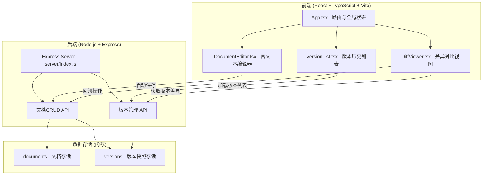
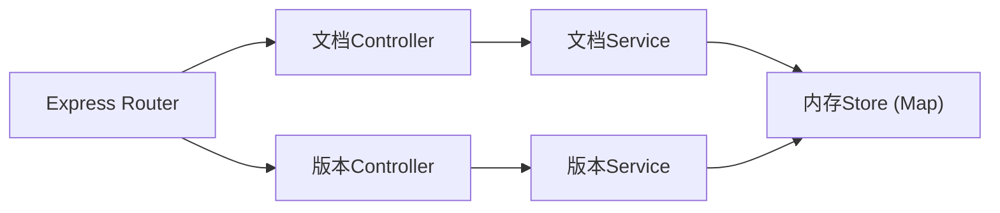
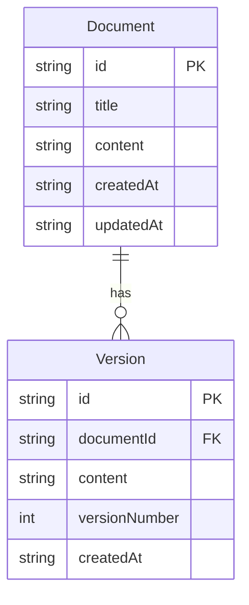

## 1. 架构设计



## 2. 技术说明
- 前端: React@18 + TypeScript + Vite + diff + react-diff-viewer
- 初始化工具: vite-init (react-express-ts 模板)
- 后端: Express@4 + cors + uuid
- 数据库: 内存存储（Map结构）
- 状态管理: Zustand

## 3. 路由定义
| 路由 | 用途 |
|------|------|
| / | 主页面，包含编辑器和版本列表 |

## 4. API定义

### 文档API
| 方法 | 路径 | 描述 | 请求体 | 响应 |
|------|------|------|--------|------|
| GET | /api/documents | 获取文档列表 | - | `{ documents: Document[] }` |
| GET | /api/documents/:id | 获取文档详情 | - | `{ document: Document }` |
| POST | /api/documents | 创建文档 | `{ title, content }` | `{ document: Document }` |
| PUT | /api/documents/:id | 更新文档 | `{ title, content }` | `{ document: Document }` |

### 版本API
| 方法 | 路径 | 描述 | 请求体 | 响应 |
|------|------|------|--------|------|
| GET | /api/documents/:id/versions | 获取版本列表(分页) | Query: `?page=1&limit=20` | `{ versions: Version[], total: number, hasMore: boolean }` |
| GET | /api/versions/:versionId | 获取版本详情 | - | `{ version: Version }` |
| POST | /api/documents/:id/versions | 创建版本快照 | `{ content }` | `{ version: Version }` |
| POST | /api/versions/:versionId/rollback | 回滚到指定版本 | - | `{ version: Version, backupVersion: Version }` |

### 数据类型
```typescript
interface Document {
  id: string;
  title: string;
  content: string;
  createdAt: string;
  updatedAt: string;
}

interface Version {
  id: string;
  documentId: string;
  content: string;
  versionNumber: number;
  createdAt: string;
}
```

## 5. 服务器架构



## 6. 数据模型

### 6.1 数据模型定义



### 6.2 数据定义
- 使用内存 Map 存储文档和版本数据
- 初始化时创建一个默认文档，包含3个初始版本用于演示
