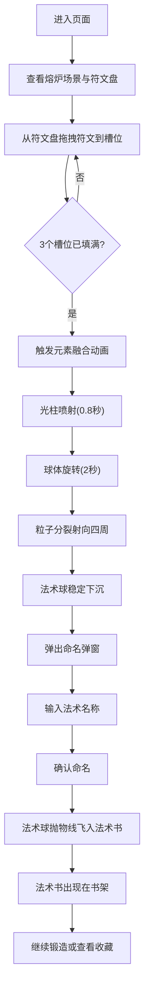

## 1. 产品概述
咒语熔炉是一款暗黑奇幻风格的互动网页游戏，玩家扮演符文锻造师，通过拖拽组合六种元素符文（火、水、风、地、光、暗）在古老熔炉中铸造独一无二的法术卷轴。核心体验围绕符文组合探索、视觉反馈和法术收藏展开。

## 2. 核心功能

### 2.1 功能模块
1. **熔炉锻造页面**: 熔炉场景、符文盘、符文槽位、元素融合动画、法术球生成、命名弹窗
2. **法术书收藏区**: 书架式布局、法术书翻页查看、拖拽排序、计数器

### 2.2 页面详情
| 页面名称 | 模块名称 | 功能描述 |
|----------|----------|----------|
| 熔炉锻造页 | 熔炉场景 | Canvas渲染6块不规则石块拼成的熔炉，炉膛内粒子火焰升腾（红黄橙三色，每帧2-3个），背景暗红与铁灰渐变 |
| 熔炉锻造页 | 符文槽位 | 炉口上方悬浮6个圆形槽位（直径60px），排列成六边形（间距80px），半透明边框，放入符文后边框变色并脉冲发光 |
| 熔炉锻造页 | 符文盘 | 左侧半圆形符文盘（半径120px），6种元素符文图标均匀排列在圆弧上，支持拖拽到槽位，拖拽带尾迹效果 |
| 熔炉锻造页 | 元素融合动画 | 3个槽位填满后自动触发：光柱喷射→球体旋转→粒子分裂→法术球稳定 |
| 熔炉锻造页 | 命名弹窗 | 磨砂玻璃效果弹窗（宽300px高200px），输入法术名称（最多12字符），确认后法术球飞入收藏区 |
| 法术书收藏区 | 书架布局 | 右侧横向滚动书架，每本书脊宽60px高200px，颜色由符文组合决定，显示法术名称缩写 |
| 法术书收藏区 | 翻页查看 | 点击法术书展开翻页动画（0.4秒透视效果），显示完整法术信息：名称、符文组合、生成时间、法术球粒子预览 |
| 法术书收藏区 | 拖拽排序 | 长按法术书拖拽交换位置，弹性吸附效果 |
| 法术书收藏区 | 计数器 | 页面右上角实时显示收藏数量，数字滚动翻转动画（0.3秒） |

## 3. 核心流程

玩家进入页面后看到熔炉场景和符文盘，从符文盘拖拽3个符文到槽位，触发元素融合动画生成法术球，命名后法术球飞入法术书收藏区，可随时查看和排序收藏的法术。

## 4. 用户界面设计

### 4.1 设计风格
- **主色调**: 暗红(#3a1c1c)与铁灰(#1a1a1a)渐变背景，符文各自对应色（火#ff6b35、水#4ecdc4、风#95e1d3、地#c4908a、光#ffe66d、暗#9b59b6）
- **按钮风格**: 暗色描边1px实线#5a4a3a，多层box-shadow模拟烛光（偏移3-5px，模糊6-8px，rgba(0,0,0,0.6)）
- **字体**: 奇幻风格显示字体 + 简洁衬线正文
- **布局**: 左60%熔炉+符文盘，右40%法术书收藏
- **动画曲线**: 所有动画使用cubic-bezier(0.25, 0.46, 0.45, 0.94)缓入缓出

### 4.2 页面设计概览
| 页面名称 | 模块名称 | UI元素 |
|----------|----------|--------|
| 熔炉锻造页 | 熔炉场景 | Canvas全屏渲染，石板纹理地面(CSS重复渐变)，铁链火把剪影装饰(CSS绘制)，不规则石块熔炉，粒子火焰 |
| 熔炉锻造页 | 符文盘 | 半圆形Canvas，6种符文形状图标（火焰/波浪/螺旋/菱形/星形/漩涡），对应颜色描边 |
| 熔炉锻造页 | 符文槽位 | 6个圆形悬浮槽位，六边形排列，脉冲光效 |
| 熔炉锻造页 | 融合动画 | 光柱喷射→旋转球体→粒子分裂→法术球 |
| 熔炉锻造页 | 命名弹窗 | 磨砂玻璃(backdrop-filter:blur(8px))，深色半透明背景 |
| 法术书收藏区 | 书架 | 横向滚动书架，书脊式排列，翻页展开带透视 |

### 4.3 响应式设计
- 桌面优先设计，适配1920x1080和1366x768
- 宽度≥1200px：左右布局（左60%右40%）
- 宽度<1200px：上下布局
- Canvas粒子系统和符文旋转动画在Chrome/Firefox保持55FPS+
- 初始加载时间不超过2秒
