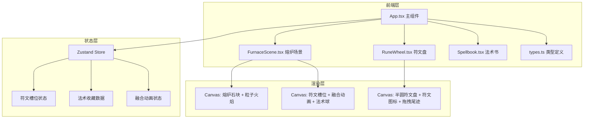
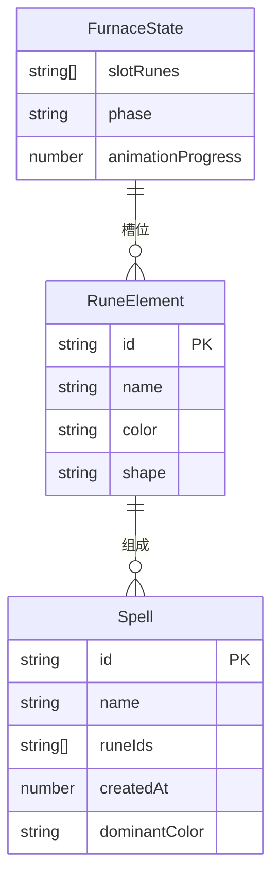

## 1. 架构设计



## 2. 技术说明
- 前端: React@18 + TypeScript + Vite
- 样式: CSS Modules + Tailwind CSS
- 状态管理: Zustand
- 渲染引擎: Canvas 2D API（熔炉、粒子、符文盘）
- 初始化工具: vite-init (react-ts模板)
- 后端: 无（纯前端项目，数据存储在localStorage）
- 数据库: 无（使用localStorage持久化法术收藏）

## 3. 路由定义
| 路由 | 用途 |
|------|------|
| / | 单页应用，所有功能在一个页面内完成 |

## 4. 数据模型

### 4.1 数据模型定义



### 4.2 核心类型定义

```typescript
interface RuneElement {
  id: string;
  name: string;
  color: string;
  shape: 'flame' | 'wave' | 'spiral' | 'diamond' | 'star' | 'vortex';
}

interface Spell {
  id: string;
  name: string;
  runeIds: [string, string, string];
  createdAt: number;
  dominantColor: string;
}

type FurnacePhase = 'idle' | 'fusion' | 'naming' | 'complete';

interface Particle {
  x: number;
  y: number;
  vx: number;
  vy: number;
  life: number;
  maxLife: number;
  color: string;
  size: number;
}
```

## 5. 组件职责

### App.tsx
- 整体布局（左60%右40%，响应式切换）
- Zustand store定义与提供
- 协调子组件间数据流
- 法术球飞行动画调度
- 收藏计数器

### FurnaceScene.tsx
- Canvas渲染熔炉主体（6块不规则石块）
- 粒子火焰系统（红黄橙三色，持续升腾）
- 6个符文槽位绘制与状态显示
- 元素融合动画三阶段（光柱→球体→分裂→稳定）
- 法术球粒子系统（80-120粒子，颜色渐变）
- 命名弹窗

### RuneWheel.tsx
- Canvas渲染半圆形符文盘
- 6种符文图标绘制（火焰/波浪/螺旋/菱形/星形/漩涡）
- 拖拽交互处理（鼠标跟随、尾迹3-5个淡出圆）
- 符文放入槽位判定
- 符文缓慢旋转发光粒子特效

### Spellbook.tsx
- 书架式横向滚动布局
- 书脊渲染（宽60px高200px，颜色由符文组合决定）
- 翻页展开动画（0.4秒透视效果）
- 法术详情展示（名称、符文组合、生成时间、法术球预览）
- 长按拖拽排序（弹性吸附）
- 缩小法术球粒子预览

## 6. 性能优化策略
- Canvas使用requestAnimationFrame驱动动画循环
- 粒子数量限制在120以内，使用对象池复用
- 6个符文旋转动画合并到同一Canvas渲染循环
- 使用will-change和transform进行GPU加速
- CSS动画优先于JS动画（悬停浮动、脉冲光等）
- localStorage存储法术数据，避免网络请求
