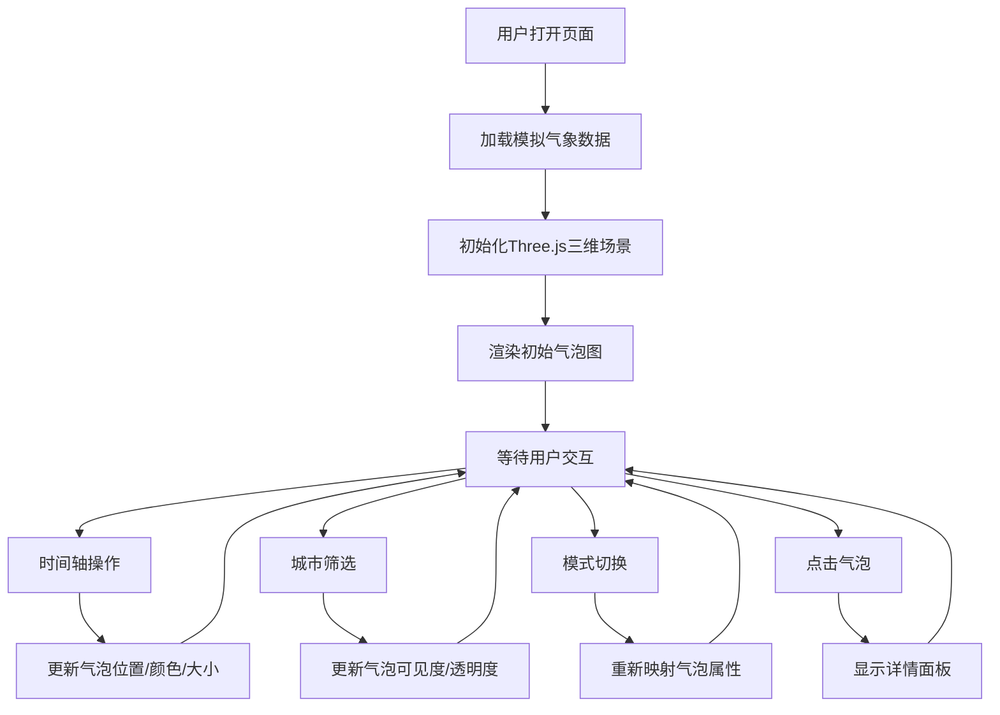

## 1. 产品概述

三维气象数据可视化仪表盘是一个面向气候数据分析人员的交互式数据展示工具，通过三维气泡图直观展示多维度气象数据随时间的变化趋势。产品解决了现有工具难以灵活自定义可视化风格的问题，支持温度、湿度、降水量的多维度映射和动态切换。

- 核心价值：将抽象的气象数据转化为直观的三维空间可视化，帮助用户快速发现数据规律
- 目标用户：气候数据分析人员、科研工作者、气象爱好者

## 2. 核心功能

### 2.1 用户角色
| 角色 | 注册方式 | 核心权限 |
|------|---------|----------|
| 数据分析师 | 无需注册 | 浏览和交互所有可视化功能 |

### 2.2 功能模块
1. **三维气泡图展示**：使用Three.js在三维空间中渲染气泡，每个气泡代表一个城市在特定时间点的综合数据
2. **时间轴播放控制**：底部时间轴支持手动拖拽和自动播放，气泡状态平滑过渡
3. **城市筛选**：右侧下拉菜单选择单个城市或全部城市，非选中城市气泡半透明化
4. **数据模式切换**：顶部分页按钮切换温度/湿度/降水量模式，动态改变气泡映射关系
5. **详情查看**：点击气泡在侧边面板显示详细数据

### 2.3 页面详情
| 页面名称 | 模块名称 | 功能描述 |
|---------|---------|----------|
| 主仪表盘 | 三维气泡图 | x轴：湿度，y轴：温度，z轴：时间；气泡大小映射降水量，颜色渐变映射温度 |
| 主仪表盘 | 时间控制器 | 播放/暂停按钮、时间滑块、月份标签、平滑过渡动画 |
| 主仪表盘 | 城市筛选器 | 下拉菜单选择单个城市或全部城市，支持筛选动画 |
| 主仪表盘 | 数据模式切换 | 顶部分页式按钮切换温度/湿度/降水量显示模式 |
| 主仪表盘 | 详情面板 | 点击气泡后显示城市、月份、温度、湿度、降水量详细数据 |

## 3. 核心流程

用户打开页面 → 自动加载模拟气象数据 → 三维气泡图渲染初始状态（第一个月）
→ 用户可通过以下方式交互：
  - 拖拽时间轴或点击播放查看数据随时间变化
  - 下拉菜单筛选城市
  - 顶部按钮切换数据显示模式
  - 点击气泡查看详细数据

## 4. 用户界面设计

### 4.1 设计风格
- **主色调**：深色背景 #1a1a2e，营造科技感和数据沉浸感
- **强调色**：#e94560（亮红色）用于主操作按钮和时间轴高亮，#0f3460（深蓝色）用于次要控件和背景元素
- **气泡配色**：温度从蓝色（冷）到红色（热）的渐变，鲜艳但不过度刺眼
- **字体**：使用现代无衬线字体，数字使用等宽字体增强数据感
- **按钮风格**：圆角矩形，悬停有缩放和发光效果，点击有按压反馈
- **整体风格**：科技感、数据可视化风格、深色主题

### 4.2 页面设计概述
| 页面名称 | 模块名称 | UI元素 |
|---------|---------|--------|
| 主仪表盘 | 顶部导航栏 | 标题、数据模式切换按钮组（温度/湿度/降水量） |
| 主仪表盘 | 左侧主区域 | Three.js三维画布，占主要空间，气泡悬浮其中 |
| 主仪表盘 | 右侧面板 | 城市筛选下拉菜单、详情面板（默认隐藏，点击气泡后显示） |
| 主仪表盘 | 底部控制栏 | 播放/暂停按钮、时间轴滑块、月份标签、时间进度条 |

### 4.3 响应式设计
- **桌面端**：三列布局，左侧气泡图占主要空间，右侧详情面板自适应宽度
- **移动端（<768px）**：单列堆叠布局，气泡图占满宽度，控制面板移至底部
- 触摸优化：增大按钮点击区域，支持触摸滑动时间轴

### 4.4 3D场景指导
- **环境和氛围**：深色空间背景，微弱的网格地面，营造数据空间感
- **光照设置**：环境光 + 点光源，确保气泡有立体感和光泽感
- **相机设置**：透视相机，初始角度略微俯视，支持鼠标拖拽旋转视角
- **构图和焦点**：气泡群位于场景中心，z轴时间维度从后向前延伸
- **交互和动画**：气泡位置/大小/颜色使用easeInOut缓动函数平滑过渡，播放时按月逐步推进
- **后处理效果**：轻微的辉光效果增强科技感
- **性能预算**：最多50个气泡（10城市×5个月），帧率不低于30 FPS
