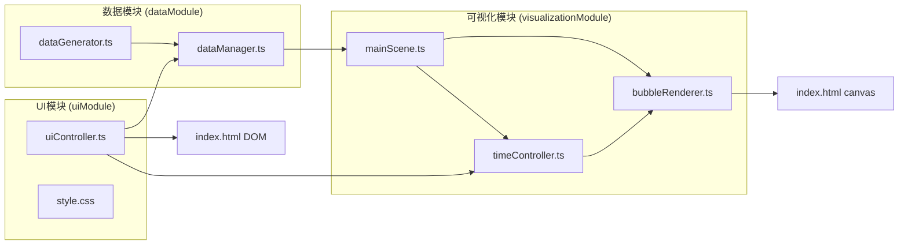
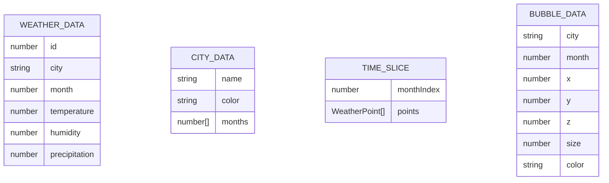

## 1. 架构设计

本项目采用模块化架构设计，按照功能划分为三个核心模块：数据模块、可视化模块、UI模块。各模块职责明确，通过单向数据流进行通信，确保代码可维护性和可扩展性。



## 2. 技术描述

- **前端框架**：原生 TypeScript + Three.js + D3.js
- **构建工具**：Vite
- **编程语言**：TypeScript（严格模式，target ES2020）
- **3D渲染**：Three.js（三维场景、相机、渲染器、几何体、材质）
- **数据处理**：D3.js（数据比例尺、颜色插值、缓动函数）
- **样式方案**：原生 CSS（CSS变量、响应式布局、CSS动画）
- **数据来源**：模拟生成，无需后端服务

**技术选型理由**：
- Three.js：业界最成熟的WebGL库，适合构建复杂三维可视化场景
- D3.js：强大的数据处理能力，提供完善的比例尺、颜色插值和缓动函数
- Vite：快速的开发服务器和构建工具，原生支持ES模块
- TypeScript：类型安全，提升代码可维护性

## 3. 模块定义与数据流向

| 模块 | 文件 | 职责 | 输入 | 输出 |
|------|------|------|------|------|
| 数据模块 | dataGenerator.ts | 生成模拟气象数据 | 无 | 气象数据数组 |
| 数据模块 | dataManager.ts | 数据聚合、过滤、格式化 | 原始数据数组 | 按城市/时间分组的格式化数据 |
| 可视化模块 | mainScene.ts | 初始化Three.js场景、相机、渲染器 | 格式化数据 | 渲染到canvas |
| 可视化模块 | bubbleRenderer.ts | 绘制和更新三维气泡 | 当前时间片数据 | 气泡网格对象 |
| 可视化模块 | timeController.ts | 时间轴播放控制 | 用户交互事件 | 当前时间索引、播放状态 |
| UI模块 | uiController.ts | 管理所有UI控件交互 | 用户操作 | 事件通知、数据筛选 |
| UI模块 | style.css | 定义整体布局和样式 | 无 | 视觉样式 |

### 核心数据流向
1. dataGenerator → dataManager：生成的原始气象数据
2. dataManager → mainScene / bubbleRenderer：格式化后的数据集
3. uiController → dataManager：城市筛选条件
4. uiController → timeController：播放/暂停、时间跳转指令
5. timeController → bubbleRenderer：当前时间片索引
6. bubbleRenderer → index.html canvas：渲染结果

## 4. 数据模型

### 4.1 数据模型定义



### 4.2 TypeScript 类型定义

```typescript
interface WeatherDataPoint {
  city: string;
  month: number;
  temperature: number;
  humidity: number;
  precipitation: number;
}

interface CityInfo {
  name: string;
  baseColor: string;
}

type DataMode = 'temperature' | 'humidity' | 'precipitation';

interface TimeState {
  currentMonth: number;
  isPlaying: boolean;
  totalMonths: number;
}

interface BubbleState {
  city: string;
  month: number;
  position: { x: number; y: number; z: number };
  size: number;
  color: string;
  visible: boolean;
}
```

### 4.3 数据范围
- 城市数量：10个
- 时间范围：12个月（性能约束下展示5个时间点）
- 温度范围：-10°C ~ 40°C
- 湿度范围：20% ~ 100%
- 降水量范围：0mm ~ 300mm

## 5. 性能优化策略

- **对象池模式**：预创建所有气泡网格，更新时仅修改位置/大小/颜色，避免频繁创建销毁
- **增量更新**：仅在数据变化时更新气泡属性，避免每帧全量重绘
- **材质复用**：相同属性的气泡共享材质，减少Draw Call
- **FPS监控**：内置帧率监控，确保不低于30 FPS
- **平滑过渡**：使用D3.easeInOut缓动函数实现属性插值动画，避免视觉跳跃

## 6. 文件结构

```
project-root/
├── package.json
├── vite.config.js
├── tsconfig.json
├── index.html
└── src/
    ├── main.ts              # 入口文件，整合所有模块
    ├── dataModule/
    │   ├── dataGenerator.ts # 模拟数据生成
    │   └── dataManager.ts   # 数据管理与格式化
    ├── visualizationModule/
    │   ├── mainScene.ts     # Three.js场景初始化
    │   ├── bubbleRenderer.ts # 气泡渲染与更新
    │   └── timeController.ts # 时间轴控制
    └── uiModule/
        ├── uiController.ts  # UI交互控制
        └── style.css        # 全局样式
```
