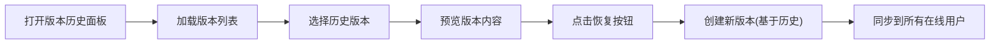

## 1. 产品概述

协作文档编辑器是一款支持多人实时协作的在线文档编辑工具，解决多人同时编辑同一份文档时版本混乱和实时同步困难的问题。

- **主要用途**：团队协作编写文档、会议纪要、项目文档等
- **目标用户**：企业团队、项目组、远程协作团队
- **核心价值**：实时同步、版本可控、权限清晰、编辑高效

## 2. 核心功能

### 2.1 用户角色

| 角色 | 注册方式 | 核心权限 |
|------|---------|---------|
| 文档创建者 | 系统用户 | 拥有文档所有权限，可设置权限、删除文档、管理版本 |
| 协作者 | 被邀请/公开 | 可编辑文档，查看版本历史 |
| 访客 | 公开文档 | 仅可查看文档内容 |

### 2.2 功能模块

1. **文档编辑模块**：富文本编辑器，实时协作编辑
2. **文档列表模块**：文档导航、创建、删除、搜索
3. **版本历史模块**：版本记录、回溯、恢复
4. **权限管理模块**：文档权限设置、用户管理
5. **实时通信模块**：WebSocket 实时同步编辑内容

### 2.3 页面详情

| 页面名称 | 模块名称 | 功能描述 |
|---------|---------|---------|
| 主页面 | 左侧导航栏 | 文档列表、团队空间、新建文档按钮 |
| 主页面 | 右侧编辑区 | 富文本编辑器、工具栏、版本历史面板 |
| 主页面 | 权限设置弹窗 | 权限类型选择、用户邀请、权限保存 |
| 主页面 | 版本历史侧边栏 | 版本列表、版本对比、恢复操作 |

## 3. 核心流程

### 3.1 编辑协作流程

用户打开文档后，通过 WebSocket 连接到服务器，加入对应文档的编辑房间。当用户进行编辑操作时，操作数据通过 WebSocket 发送到服务器，服务器广播给同房间的其他用户，实现实时同步。

### 3.2 版本回溯流程

用户查看版本历史，选择某个历史版本，可以预览该版本内容，或选择恢复到该版本。

## 4. 用户界面设计

### 4.1 设计风格

- **主色调**：深蓝色 #1a237e（品牌色、导航栏、主按钮）
- **背景色**：浅灰色 #f5f5f5（页面背景）
- **编辑区**：白色 #ffffff（纸张质感背景）
- **按钮风格**：柔和渐变、圆角 8px、悬停微放大效果
- **字体**：系统字体栈，标题加粗，正文常规
- **布局风格**：左右分栏，卡片式文档列表
- **图标风格**：线性图标，与主色调一致

### 4.2 页面设计概览

| 页面名称 | 模块名称 | UI 元素 |
|---------|---------|---------|
| 主页面 | 左侧导航 | 深蓝背景、白色文字、悬停高亮、文档卡片 |
| 主页面 | 文档卡片 | 白色卡片、标题、权限标签、悬停阴影上升动画 |
| 主页面 | 编辑器 | 纸张质感背景、Quill 编辑器、工具栏固定顶部 |
| 主页面 | 工具栏 | 浅灰背景、格式化按钮、分隔线、悬停反馈 |
| 主页面 | 版本面板 | 右侧滑入、版本时间线、恢复按钮 |

### 4.3 响应式设计

- **桌面端**：左右分栏布局，左侧导航宽度 280px
- **平板端**：左侧导航折叠为汉堡菜单，点击展开
- **移动端**：导航完全隐藏，使用底部标签栏切换

### 4.4 动效设计

- 文档卡片悬停：阴影加深 + 轻微上移(translateY -4px)
- 切换文档：编辑器内容淡入过渡(opacity 0→1)
- 按钮交互：悬停渐变加深，点击轻微缩放(scale 0.97)
- 侧边栏滑入：从右向左平滑过渡(transform translateX)
- 在线用户头像：呼吸灯效果表示在线状态
