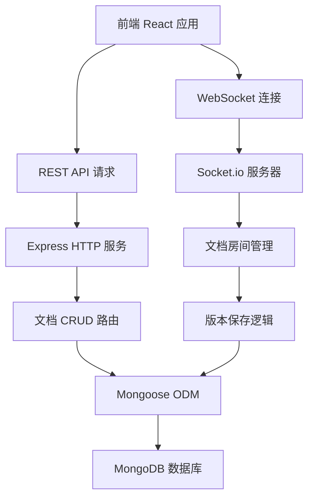
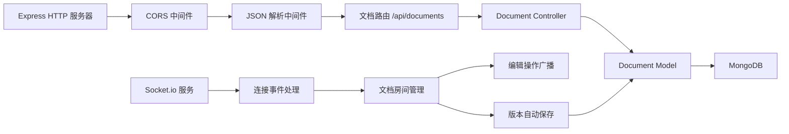
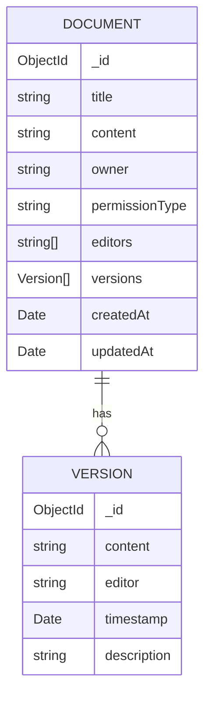

## 1. 架构设计



## 2. 技术描述

- **前端**：React@18 + TypeScript + Vite@5 + Quill 富文本编辑器 + Socket.io-client
- **后端**：Node.js + Express@4 + TypeScript + Socket.io + Mongoose
- **数据库**：MongoDB
- **实时通信**：Socket.io (WebSocket)
- **状态管理**：React Context + Zustand
- **样式方案**：CSS Modules + TailwindCSS

## 3. 目录结构

```
.
├── src/                          # 前端源代码
│   ├── components/               # React 组件
│   │   ├── Editor.tsx            # 富文本编辑器组件
│   │   ├── DocumentList.tsx      # 文档列表组件
│   │   ├── Sidebar.tsx           # 侧边栏导航
│   │   ├── Toolbar.tsx           # 编辑器工具栏
│   │   ├── VersionHistory.tsx    # 版本历史面板
│   │   └── PermissionModal.tsx   # 权限设置弹窗
│   ├── context/                  # React Context
│   │   └── WebSocketContext.tsx  # WebSocket 上下文
│   ├── hooks/                    # 自定义 Hooks
│   ├── pages/                    # 页面组件
│   ├── types/                    # TypeScript 类型定义
│   ├── utils/                    # 工具函数
│   ├── App.tsx                   # 应用入口组件
│   └── main.tsx                  # 应用入口
├── server/                       # 后端源代码
│   └── src/
│       ├── index.ts              # 服务器入口
│       ├── models/               # 数据模型
│       │   └── Document.ts       # 文档模型
│       ├── routes/               # API 路由
│       │   └── documents.ts      # 文档路由
│       └── socket/               # Socket.io 处理
│           └── handler.ts        # 事件处理器
├── vite.config.ts                # Vite 构建配置
├── tsconfig.json                 # TypeScript 配置
├── package.json                  # 前端依赖
└── server/package.json           # 后端依赖
```

## 4. 路由定义

| 路由路径 | 页面/组件 | 功能描述 |
|---------|----------|---------|
| `/` | 首页/文档列表 | 显示所有文档，可新建和切换文档 |
| `/document/:id` | 文档编辑页 | 编辑指定文档，显示编辑器 |

## 5. API 定义

### 5.1 文档相关接口

```typescript
// 文档数据类型
interface Document {
  _id: string;
  title: string;
  content: string;
  owner: string;
  permissions: {
    type: 'public' | 'editors' | 'private';
    editors: string[];
  };
  versions: Version[];
  createdAt: Date;
  updatedAt: Date;
}

// 版本数据类型
interface Version {
  _id: string;
  content: string;
  editor: string;
  timestamp: Date;
  description?: string;
}
```

**REST API 列表：**

| 方法 | 路径 | 描述 |
|------|------|------|
| GET | `/api/documents` | 获取文档列表 |
| GET | `/api/documents/:id` | 获取单个文档详情 |
| POST | `/api/documents` | 创建新文档 |
| PUT | `/api/documents/:id` | 更新文档信息 |
| DELETE | `/api/documents/:id` | 删除文档 |
| GET | `/api/documents/:id/versions` | 获取文档版本列表 |
| GET | `/api/documents/:id/versions/:versionId` | 获取指定版本详情 |
| POST | `/api/documents/:id/versions/:versionId/restore` | 恢复到指定版本 |

### 5.2 WebSocket 事件

| 事件名 | 方向 | 数据 | 描述 |
|--------|------|------|------|
| `join-document` | 客户端→服务器 | `{ documentId, userId }` | 加入文档编辑房间 |
| `leave-document` | 客户端→服务器 | `{ documentId, userId }` | 离开文档编辑房间 |
| `editor-change` | 客户端→服务器 | `{ documentId, userId, content, delta }` | 发送编辑操作 |
| `editor-change` | 服务器→客户端 | `{ userId, content, delta }` | 广播编辑操作 |
| `user-joined` | 服务器→客户端 | `{ userId, userName }` | 通知有用户加入 |
| `user-left` | 服务器→客户端 | `{ userId }` | 通知有用户离开 |
| `online-users` | 服务器→客户端 | `{ users: User[] }` | 在线用户列表 |
| `version-saved` | 服务器→客户端 | `{ version: Version }` | 版本保存通知 |

## 6. 服务器架构图



## 7. 数据模型

### 7.1 数据模型定义



### 7.2 Mongoose Schema

```typescript
// Document Schema
const versionSchema = new mongoose.Schema({
  content: { type: String, required: true },
  editor: { type: String, required: true },
  timestamp: { type: Date, default: Date.now },
  description: { type: String }
});

const documentSchema = new mongoose.Schema({
  title: { type: String, required: true, default: '未命名文档' },
  content: { type: String, default: '' },
  owner: { type: String, required: true },
  permissions: {
    type: {
      type: String,
      enum: ['public', 'editors', 'private'],
      default: 'private'
    },
    editors: [{ type: String }]
  },
  versions: [versionSchema]
}, { timestamps: true });
```

## 8. 性能指标

- **输入延迟**：< 50ms（本地编辑器响应）
- **同步延迟**：< 200ms（WebSocket 端到端同步）
- **版本保存**：每 30 秒自动保存或用户停止输入 2 秒后保存
- **并发用户**：单文档支持至少 50 人同时在线编辑
