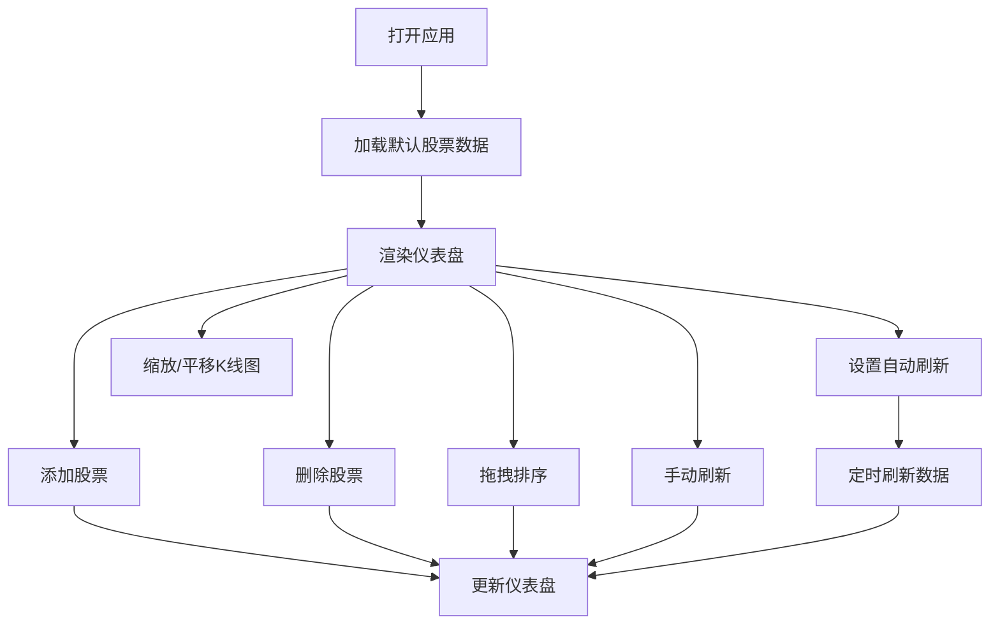

## 1. 产品概述
实时金融数据可视化仪表盘，用于展示股票价格变动趋势和交易量统计，帮助交易者和投资者快速追踪多只股票的市场表现。
- 核心功能：K线图展示、成交量统计、股票管理、实时数据刷新、自定义排序
- 目标用户：个人投资者、金融从业者、交易员

## 2. 核心特性

### 2.1 功能模块
1. **股票管理模块**：添加/删除股票、拖拽排序、股票列表展示
2. **数据可视化模块**：K线图（开盘/收盘/最高/最低价）、成交量柱状图、移动平均线
3. **数据刷新模块**：手动刷新、自动刷新（5秒/10秒/30秒间隔）
4. **交互控制模块**：图表缩放（鼠标滚轮）、图表平移（拖拽）、响应式布局

### 2.2 页面详情
| 页面名称 | 模块名称 | 功能描述 |
|----------|----------|----------|
| 主仪表盘 | 侧边栏 | 可折叠股票列表、添加股票表单、刷新控制 |
| 主仪表盘 | 主视图 | 股票卡片网格、K线图、成交量柱状图 |
| 主仪表盘 | 股票卡片 | 当前价格、涨跌幅、成交量、K线图缩略 |

## 3. 核心流程
用户打开应用 → 查看默认股票仪表盘 → 添加/删除股票 → 拖拽调整排序 → 设置自动刷新间隔 → 通过缩放和平移查看详细K线数据 → 手动刷新获取最新数据

## 4. 界面设计

### 4.1 设计风格
- **主色调**：深色主题，背景#1a1a2e，卡片底色#16213e，强调色#e94560
- **涨跌颜色**：上涨绿色(#22c55e)，下跌红色(#ef4444)
- **字体**：现代无衬线字体，数字使用等宽字体
- **按钮样式**：圆角8px，悬停时放大1.05倍，颜色微变
- **布局**：左右分栏，卡片式布局，细腻阴影和圆角分隔

### 4.2 页面设计概述
| 页面名称 | 模块名称 | UI元素 |
|----------|----------|--------|
| 主仪表盘 | 侧边栏 | 折叠动画、股票列表项、输入框、下拉选择器、刷新按钮 |
| 主仪表盘 | 股票卡片 | 价格标签、涨跌幅徽章、成交量数字、K线图画布、渐变填充柱状图 |
| 主仪表盘 | 交互控件 | 拖拽手柄、缩放控制、平移提示、自动刷新下拉菜单 |

### 4.3 响应式设计
- **桌面端**（≥768px）：左右分栏布局，侧边栏固定宽度280px
- **移动端**（<768px）：侧边栏收起为浮动图标按钮，点击展开全屏抽屉
- **触摸优化**：支持触摸滑动缩放和平移K线图

### 4.4 动画效果
- K线图缩放过渡动画：0.3s ease
- 卡片悬停效果：阴影加深、轻微上浮
- 按钮悬停：放大1.05倍，颜色亮度提升
- 侧边栏展开/收起：平滑过渡
- 数据更新：价格数字跳动动画
