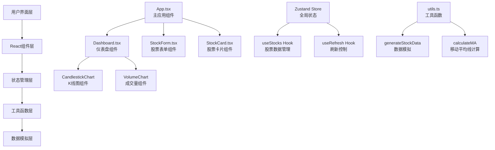
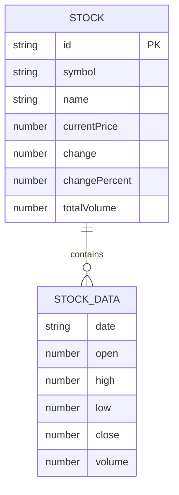

## 1. 架构设计



## 2. 技术栈描述
- **前端框架**：React 18 + TypeScript
- **构建工具**：Vite 5
- **状态管理**：Zustand
- **图表渲染**：Canvas 2D API（原生实现，高性能）
- **拖拽排序**：@dnd-kit/core + @dnd-kit/sortable
- **图标库**：lucide-react
- **样式方案**：CSS Modules + CSS Variables

## 3. 文件结构

```
.
├── index.html                 # 入口HTML文件
├── package.json               # 项目依赖和脚本
├── tsconfig.json              # TypeScript配置
├── vite.config.js             # Vite构建配置
└── src/
    ├── main.tsx               # 应用入口
    ├── App.tsx                # 主组件，全局状态管理
    ├── Dashboard.tsx          # 仪表盘组件
    ├── StockForm.tsx          # 股票表单组件
    ├── StockCard.tsx          # 股票卡片组件
    ├── components/
    │   ├── CandlestickChart.tsx   # K线图组件
    │   ├── VolumeChart.tsx        # 成交量柱状图
    │   └── Sidebar.tsx            # 侧边栏组件
    ├── hooks/
    │   ├── useStocks.ts           # 股票数据Hook
    │   └── useChartInteraction.ts # 图表交互Hook
    ├── store/
    │   └── useStockStore.ts       # Zustand状态管理
    ├── types/
    │   └── stock.ts               # 类型定义
    ├── utils.ts                   # 工具函数
    └── styles/
        ├── global.css             # 全局样式
        └── variables.css          # CSS变量
```

## 4. 数据模型

### 4.1 核心类型定义

```typescript
// 股票日K数据
interface StockData {
  date: string;
  open: number;
  high: number;
  low: number;
  close: number;
  volume: number;
}

// 股票信息
interface Stock {
  id: string;
  symbol: string;
  name: string;
  data: StockData[];
  currentPrice: number;
  change: number;
  changePercent: number;
  totalVolume: number;
  ma5: number[];
  ma10: number[];
  ma20: number[];
}

// 仪表盘状态
interface DashboardState {
  stocks: Stock[];
  refreshInterval: number | null;
  isSidebarCollapsed: boolean;
  isLoading: boolean;
}

// 图表视口
interface ChartViewport {
  startIndex: number;
  endIndex: number;
}
```

### 4.2 数据结构ER图



## 5. 核心API定义

### 5.1 工具函数

```typescript
// 生成模拟股票数据
function generateStockData(symbol: string, days: number = 30): StockData[];

// 计算移动平均线
function calculateMA(data: StockData[], period: number): number[];

// 格式化价格显示
function formatPrice(price: number): string;

// 格式化成交量显示
function formatVolume(volume: number): string;

// 格式化涨跌幅显示
function formatChangePercent(percent: number): string;
```

### 5.2 Zustand Store Actions

```typescript
interface StockStoreActions {
  addStock: (symbol: string) => Promise<void>;
  removeStock: (id: string) => void;
  reorderStocks: (fromIndex: number, toIndex: number) => void;
  refreshStock: (id: string) => Promise<void>;
  refreshAll: () => Promise<void>;
  setRefreshInterval: (interval: number | null) => void;
  toggleSidebar: () => void;
}
```

## 6. 性能优化策略

1. **Canvas分批渲染**：K线图使用requestAnimationFrame分帧绘制，确保FPS≥50
2. **数据防抖**：缩放和平移操作使用debounce减少重绘次数
3. **组件懒渲染**：股票卡片使用IntersectionObserver实现虚拟滚动
4. **状态更新优化**：Zustand使用shallow比较避免不必要重渲染
5. **内存管理**：Canvas绘制完成后及时释放资源，定时器正确清理

## 7. 浏览器兼容性

- 支持Chrome 90+、Firefox 88+、Safari 14+
- 使用CSS变量和现代CSS特性，通过postcss-autoprefixer处理兼容性
- Canvas 2D API全浏览器支持
