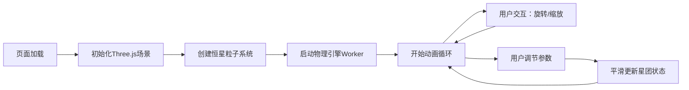

## 1. 产品概述

三维星系演化模拟器是一个基于浏览器的交互式天体物理模拟应用，通过Three.js渲染数千颗恒星在引力作用下的运动和合并过程。用户可以自由缩放旋转视角，调整物理参数，实时观察星团的演化过程。

- **目标用户**：天文爱好者、学生、科学教育工作者
- **核心价值**：提供直观的引力模拟体验，帮助用户理解星系演化的基本物理规律

## 2. 核心功能

### 2.1 用户角色
| 角色 | 注册方式 | 核心权限 |
|------|----------|----------|
| 普通用户 | 无需注册，直接访问 | 完整的模拟体验、参数调节、视角控制 |

### 2.2 功能模块
1. **3D星团渲染**：5000+颗恒星粒子系统，基于光谱类型的颜色和大小，柔和光晕效果
2. **物理引擎**：N体引力计算、恒星碰撞合并、质量与颜色更新
3. **交互控制**：鼠标拖拽旋转、滚轮缩放、视角自由控制
4. **控制面板**：实时参数调节（引力常数G、时间步长、恒星数量）、数据显示面板

### 2.3 页面详情
| 页面名称 | 模块名称 | 功能描述 |
|----------|----------|----------|
| 主页面 | 3D场景渲染 | 全屏Canvas渲染星团，深空蓝黑渐变背景，星光粒子闪烁 |
| 主页面 | 控制面板 | 左侧悬浮毛玻璃面板，包含参数滑块和数据显示 |
| 主页面 | 交互控制 | 鼠标拖拽旋转视角，滚轮缩放，平滑过渡动画 |

## 3. 核心流程

用户打开页面 → 3D场景初始化（5000颗恒星随机分布）→ 物理引擎启动（Web Worker后台计算）→ 渲染循环持续运行 → 用户可通过鼠标拖拽旋转/滚轮缩放调整视角 → 用户可通过左侧控制面板调节参数 → 星团状态实时平滑更新

## 4. 用户界面设计

### 4.1 设计风格
- **主色调**：深空蓝黑渐变背景（#000428 → #004e92），星光粒子闪烁效果
- **强调色**：青蓝色光晕（#00d4ff），控制面板半透明毛玻璃效果
- **字体**：现代无衬线字体，数字使用等宽字体增强科技感
- **布局**：全屏Canvas + 左侧悬浮控制面板
- **动效**：恒星周围柔和光晕脉动，控件悬停高亮，点击反馈动画

### 4.2 页面设计概述
| 页面名称 | 模块名称 | UI元素 |
|----------|----------|--------|
| 主页面 | 3D星空背景 | 蓝黑径向渐变、远处星光粒子闪烁、星云效果 |
| 主页面 | 恒星粒子 | 五种光谱类型颜色（蓝/白/黄/橙/红）、不同大小、光晕效果 |
| 主页面 | 控制面板 | 半透明毛玻璃、左侧悬浮、参数滑块、数据面板、悬停高亮 |
| 主页面 | 滑块控件 | 自定义轨道、发光滑块按钮、数值实时显示 |

### 4.3 响应式设计
- 桌面端（1920x1080）：完美显示，控制面板宽度280px
- 平板横屏：自适应调整，控制面板宽度适度缩小
- 触摸设备：支持手势缩放旋转

### 4.4 3D场景指导
- **环境**：深空背景，无外部光源，恒星自发光
- **光照**：环境光微弱，主要光源来自恒星粒子自身
- **相机**：PerspectiveCamera，初始距离可观察整个星团
- **交互**：OrbitControls 轨道控制，支持阻尼效果
- **后期**：Bloom泛光效果增强星光质感
- **性能**：5000颗恒星保持30fps以上，使用Web Worker物理计算
