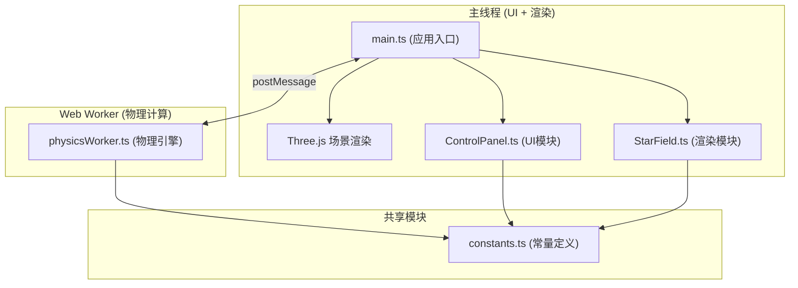

## 1. 架构设计



## 2. 技术描述

- **前端框架**：TypeScript + Three.js + Vite
- **构建工具**：Vite 5.x
- **物理计算**：Web Worker 独立线程，N体引力计算
- **渲染技术**：Three.js Points 粒子系统，ShaderMaterial 自定义光晕
- **UI技术**：原生HTML/CSS + TypeScript，毛玻璃效果

## 3. 项目文件结构

| 文件路径 | 用途 |
|----------|------|
| package.json | 项目依赖和脚本配置 |
| tsconfig.json | TypeScript编译配置（严格模式，ES2020） |
| vite.config.js | Vite构建配置 |
| index.html | 入口页面 |
| src/main.ts | 应用入口，场景初始化与动画循环 |
| src/core/PhysicsEngine.ts | 物理引擎封装，Worker通信管理 |
| src/core/physicsWorker.ts | Web Worker，物理计算实现 |
| src/rendering/StarField.ts | 恒星粒子系统渲染模块 |
| src/ui/ControlPanel.ts | 控制面板UI模块 |
| src/utils/constants.ts | 常量定义 |

## 4. 核心数据结构

### 4.1 恒星数据 (StarData)
```typescript
interface StarData {
  x: number;          // 位置x
  y: number;          // 位置y
  z: number;          // 位置z
  vx: number;         // 速度x
  vy: number;         // 速度y
  vz: number;         // 速度z
  mass: number;       // 质量
  colorIndex: number; // 光谱类型颜色索引 (0-4)
}
```

### 4.2 物理参数 (PhysicsParams)
```typescript
interface PhysicsParams {
  gravitationalConstant: number; // 引力常数G
  timeStep: number;              // 时间步长
  starCount: number;             // 恒星数量
}
```

### 4.3 Worker消息协议
```typescript
type WorkerMessage = 
  | { type: 'init'; data: StarData[] }
  | { type: 'update'; params: PhysicsParams }
  | { type: 'setStarCount'; count: number }
  | { type: 'step' };

type WorkerResponse =
  | { type: 'positions'; positions: Float32Array; colors: Float32Array; collisions: number; count: number };
```

## 5. 性能优化策略

1. **Web Worker物理计算**：引力计算在独立线程执行，不阻塞渲染
2. **粒子系统优化**：使用Points而非Mesh，减少Draw Call
3. **简化引力算法**：使用Barnes-Hut近似或直接N²（5000颗可接受）
4. **对象池复用**：动态增减恒星时复用粒子
5. **帧率自适应**：物理步长根据性能动态调整
6. **Shader实现光晕**：片元着色器实现柔和光晕，无需额外几何体
