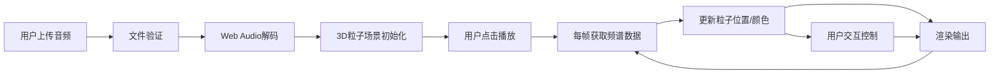

## 1. 产品概述

3D音频粒子波形可视化应用，通过Web Audio API实时解析用户上传的音频文件，在Three.js构建的三维场景中以动态粒子阵列的形式直观展示音频频谱和节奏变化，打造沉浸式太空科幻风格的音乐可视化体验。

- 核心价值：将抽象的音频信号转化为可视化的三维粒子艺术，为用户提供音乐欣赏的全新视觉维度
- 目标用户：音乐爱好者、视觉艺术家、音频可视化体验者

## 2. 核心功能

### 2.1 用户角色

| 角色 | 注册方式 | 核心权限 |
|------|----------|----------|
| 普通用户 | 无需注册，直接使用 | 上传音频、播放控制、视角操作、模式切换 |

### 2.2 功能模块

1. **音频加载模块**：文件上传、Web Audio解码、音量增益控制
2. **3D粒子可视化模块**：球形粒子阵列、频谱驱动的位移与颜色、呼吸脉冲动画
3. **交互控制模块**：OrbitControls视角操作、播放/暂停、进度条、音量滑块、模式切换
4. **后处理渲染模块**：Bloom光晕效果、深空星空背景

### 2.3 页面详情

| 页面名称 | 模块名称 | 功能描述 |
|----------|----------|----------|
| 主页面 | 3D场景区域 | 全屏Canvas渲染Three.js场景，包含球形粒子阵列、星空背景、Bloom后处理 |
| 主页面 | 底部控制栏 | 毛玻璃效果悬浮栏，包含上传按钮、播放/暂停、进度条、音量滑块、模式切换 |
| 主页面 | 文件上传 | 支持MP3/WAV格式，最大10MB，验证后自动加载解码 |

## 3. 核心流程

用户点击上传按钮选择本地音频文件 → 系统验证文件格式和大小 → Web Audio API解码音频数据 → 3D场景初始化球形粒子阵列 → 用户点击播放按钮 → AudioManager每帧获取频域数据 → ParticleSystem根据振幅更新粒子位置和颜色 → 用户可拖拽旋转/滚轮缩放视角 → 用户可切换球体/柱状模式 → 音频播放完毕自动重置状态。

## 4. 用户界面设计

### 4.1 设计风格

- **主色调**：深空蓝 #0a0e27 → 暗紫 #1a1040 渐变背景
- **强调色**：频谱渐变：低频红色 → 中频绿色 → 高频紫色
- **按钮风格**：圆角8px，毛玻璃背景 rgba(255,255,255,0.1)，hover亮度提升20%
- **字体**：现代无衬线字体，暗色调太空科幻风格
- **视觉效果**：粒子Bloom光晕（阈值0.8，强度0.2），backdrop-filter blur(8px) 毛玻璃

### 4.2 页面设计概览

| 页面名称 | 模块名称 | UI元素 |
|----------|----------|--------|
| 主页面 | 3D场景 | 全屏Canvas、深空渐变背景、2000个发光粒子、呼吸脉冲动画 |
| 主页面 | 控制栏 | 播放/暂停按钮(图标+文字)、进度条(时间显示)、音量滑块、模式切换按钮、上传按钮 |
| 主页面 | 移动端适配 | 控制栏收缩为汉堡菜单图标，保持操作可达性 |

### 4.3 响应式设计

- Desktop-first设计，控制栏水平排列在底部
- 移动端（<768px）：控制栏高度不变，文字标签隐藏仅保留图标
- 触控优化：拖拽旋转、捏合缩放适配触屏操作

### 4.4 3D场景设计

- **环境**：深空星空渐变背景，营造太空科幻氛围
- **光照**：场景环境光+粒子自发光，无需额外光源
- **相机设置**：PerspectiveCamera，初始距离15单位，OrbitControls缩放范围1-15
- **构图**：粒子球位于场景中心，控制栏悬浮底部不遮挡主体
- **交互动画**：球体→柱状模式0.5秒线性插值过渡
- **后处理**：UnrealBloomPass实现粒子光晕
- **性能预算**：2000粒子，FFT size=1024，30fps+，内存<200MB
