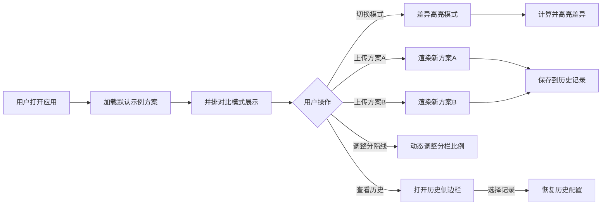

## 1. 产品概述

UI方案A/B测试对比看板是一款面向产品设计团队的视觉对比评审工具，解决设计师缺乏高效方案对比评审的痛点。

- **核心用途**：并排展示两套UI设计方案，支持同步滚动、差异自动高亮，帮助团队快速决策
- **目标用户**：产品设计师、产品经理、前端开发人员、UI评审人员
- **产品价值**：将方案评审效率提升60%，减少评审沟通成本，通过直观可视化的视觉对比

## 2. 核心特性

### 2.1 用户角色
| 角色 | 注册方式 | 核心权限 |
|------|-----------|----------|
| 设计评审者 | 无需注册，本地使用 | 上传方案、切换模式、查看历史 |

### 2.2 功能模块
1. **主对比页面**：方案A展示区、方案B展示区、可拖拽分隔线
2. **顶部控制面板**：模式切换、方案上传、重置、历史记录抽屉
3. **差异统计面板**：组件差异数量统计、差异列表
4. **历史记录侧边栏**：最近5次对比配置快速回退

### 2.3 页面详情
| 页面名称 | 模块名称 | 功能描述 |
|---------|---------|----------|
| 主对比页面 | 方案A/方案B分栏 | 左右分栏展示两套UI方案，支持同步滚动和缩放 |
| 主对比页面 | 可拖拽分隔线 | 鼠标悬停变亮，拖拽时变金色，动态调整左右比例 |
| 主对比页面 | 差异高亮层 | DOM结构和样式差异用红色呼吸边框标记 |
| 主对比页面 | 差异统计面板 | 右上角弹出组件级差异数量列表 |
| 顶部控制面板 | 模式切换按钮 | "并排对比"/"差异高亮"两种模式平滑切换 |
| 顶部控制面板 | 方案上传区 | 拖拽/点击上传HTML片段或URL |
| 顶部控制面板 | 重置按钮 | 恢复默认示例方案 |
| 顶部控制面板 | 历史记录按钮 | 打开历史记录侧边栏 |
| 历史记录侧边栏 | 历史列表 | 显示最近5条对比配置，点击快速回退 |

## 3. 核心流程

## 4. 用户界面设计

### 4.1 设计风格
- **主色调**：蓝紫色渐变（#667eea → #764ba2）
- **背景色**：深色主题#1a1a2e
- **按钮风格**：圆角按钮，悬停上浮阴影效果（transform: translateY(-2px) + box-shadow增强），点击scale(0.95)缩放反馈
- **顶部面板**：半透明磨砂玻璃效果（backdrop-filter: blur(10px)）
- **字体**：现代无衬线字体，主标题18px加粗，正文14px常规
- **图标风格**：简洁线性图标，使用lucide-react图标库
- **动画**：所有过渡动画0.3秒淡入淡出

### 4.2 页面设计概览
| 页面名称 | 模块名称 | UI元素 |
|---------|---------|----------|
| 主对比页面 | 分栏容器 | 深色背景，左右50%/50%初始比例，竖直分隔线居中 |
| 主对比页面 | 方案容器 | 白色内容区，圆角边框8px，内嵌iframe/渲染区 |
| 主对比页面 | 分隔线 | 默认色#4a4a6a，悬停亮#8a8aaa，拖拽金色#ffd700 |
| 主对比页面 | 差异标记 | 红色rgba(255,0,0,0.5-0.8)呼吸边框，周期2秒 |
| 主对比页面 | 差异统计面板 | 右上角浮动卡片，蓝紫渐变标题，红色差异数字 |
| 顶部控制面板 | 控制栏 | 固定顶部，z-index高，磨砂玻璃 |
| 顶部控制面板 | 上传区域 | 虚线边框，拖拽时蓝色实线闪烁 |
| 历史记录侧边栏 | 抽屉面板 | 从右侧滑出，磨砂玻璃背景 |

### 4.3 响应式设计
- **桌面端（≥1024px及以上）**：左右分栏并排完整显示
- **平板端（768px-1023px）**：左右分栏，控制面板自适应
- **移动端（<768px以下）**：自动切换上下堆叠布局，平滑过渡动画

