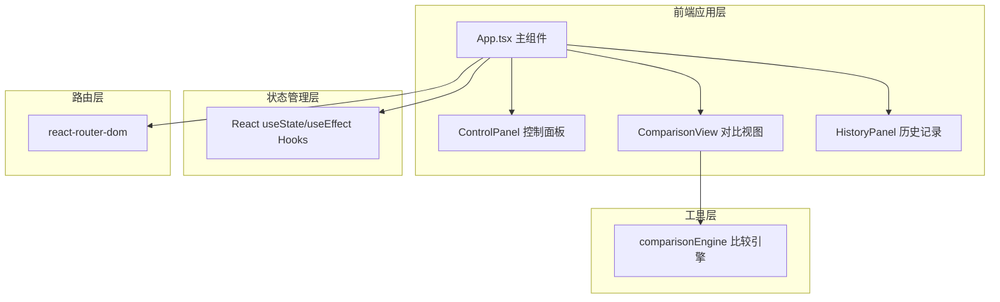

## 1. 架构设计



## 2. 技术栈说明
- **前端框架**：React@18 + TypeScript@5
- **构建工具**：Vite@5
- **路由管理**：react-router-dom@6
- **状态管理**：React内置useState/useReducer（轻量级，无需额外库）
- **样式方案**：原生CSS + CSS Modules（内联样式，无需tailwind）
- **图标库**：lucide-react

## 3. 路由定义
| 路由路径 | 页面用途 |
|-----------|---------|
| / | 主对比页面，包含所有功能模块 |

## 4. 核心数据结构与类型定义

```typescript
// 方案数据类型
interface UIScheme {
  id: string;
  name: string;
  type: 'html' | 'url';
  content: string;
  timestamp: number;
}

// 对比模式
type ComparisonMode = 'side-by-side' | 'diff-highlight';

// 差异点类型
interface DiffPoint {
  id: string;
  componentName: string;
  type: 'structure' | 'style' | 'content';
  path: string;
  description: string;
}

// 对比配置
interface ComparisonConfig {
  id: string;
  schemeA: UIScheme;
  schemeB: UIScheme;
  mode: ComparisonMode;
  timestamp: number;
}

// 应用全局状态
interface AppState {
  schemeA: UIScheme;
  schemeB: UIScheme;
  mode: ComparisonMode;
  splitRatio: number;
  diffPoints: DiffPoint[];
  history: ComparisonConfig[];
}
```

## 5. 模块职责说明

### 5.1 comparisonEngine.ts（比较引擎）
- **输入**：两套方案的DOM结构数据
- **输出**：差异点数组DiffPoint[]
- **核心算法**：递归遍历DOM树，对比标签名、属性、样式、文本内容
- **性能目标**：100组件以内100ms内完成

### 5.2 ControlPanel.tsx（控制面板）
- 模式切换按钮组
- 方案A/B上传区域（拖拽+点击）
- 重置按钮
- 历史记录入口

### 5.3 ComparisonView.tsx（对比视图）
- 左右分栏容器
- 可拖拽分隔线
- iframe/组件渲染
- 同步滚动与缩放
- 差异高亮渲染
- 差异统计面板

### 5.4 App.tsx（主组件）
- 全局状态管理
- 数据流向控制
- 布局容器
- 历史记录持久化（localStorage）

## 6. 文件结构

```
project-root/
├── package.json
├── index.html
├── tsconfig.json
├── vite.config.js
├── vite.config.js
└── src/
    ├── App.tsx
    ├── components/
    │   ├── ComparisonView.tsx
    │   ├── ControlPanel.tsx
    │   └── HistoryPanel.tsx
    └── utils/
        └── comparisonEngine.ts
```

## 7. 性能约束实现策略
- **模式切换**：CSS过渡动画，<200ms响应
- **差异计算**：使用requestIdleCallback + WebWorker（可选）
- **DOM渲染**：使用DocumentFragment批量更新
- **历史记录**：localStorage缓存，最多5条
- **响应式**：CSS媒体查询+ResizeObserver
