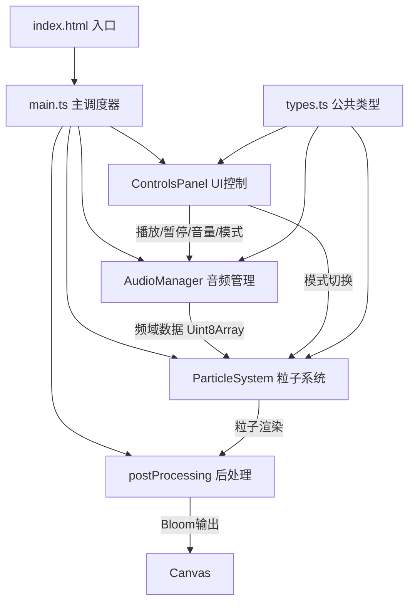

## 1. 架构设计



## 2. 技术选型说明

| 技术 | 版本 | 用途 |
|------|------|------|
| TypeScript | 5.x | 类型安全开发，严格模式 |
| Vite | 5.x | 构建工具与开发服务器，ESM模块 |
| Three.js | 0.160.0 | 3D渲染引擎，粒子系统、相机、控制器、后处理 |
| @types/three | 0.160.0 | Three.js TypeScript类型定义 |
| Web Audio API | - | 浏览器原生，音频解码、频谱分析、增益控制 |

- **初始化工具**：Vite vanilla-ts 模板（手动配置）
- **后端**：无后端，纯前端应用
- **数据存储**：无持久化存储，全部内存处理

## 3. 文件结构

```
auto14/
├── index.html              # 应用入口HTML（含全局CSS）
├── package.json            # 依赖与脚本（three@0.160, typescript, vite, @types/three）
├── vite.config.js          # Vite构建配置（TypeScript支持）
├── tsconfig.json           # TypeScript严格模式（strict: true, esnext模块）
└── src/
    ├── main.ts             # 应用初始化、主循环调度、场景/相机/渲染器/OrbitControls
    ├── types.ts            # 公共类型定义（ParticleMode, AudioState, 配置接口）
    ├── visualizer/
    │   ├── AudioManager.ts # Web Audio API封装（加载/播放/频谱/同步）
    │   └── ParticleSystem.ts # 粒子阵列管理（球坐标采样+柱状+插值）
    ├── ui/
    │   └── ControlsPanel.ts # 底部控制栏（毛玻璃+汉堡菜单+事件回调）
    └── utils/
        └── postProcessing.ts # EffectComposer + RenderPass + UnrealBloomPass
```

## 4. 核心数据类型定义

```typescript
// src/types.ts
export enum ParticleMode {
  SPHERE = 'sphere',
  BAR = 'bar'
}

export interface AudioState {
  isPlaying: boolean
  isLoaded: boolean
  currentTime: number
  duration: number
  volume: number
}

export interface ParticleSystemConfig {
  particleCount: number      // = 2000
  sphereRadius: number       // = 5 单位
  maxDisplacement: number    // = 3 单位 (径向位移上限)
  fftSize: number            // = 1024
  transitionDuration: number // = 0.5 秒 (模式切换时长)
  barRows: number            // 柱状模式每行粒子数
  barSpacing: number         // 柱状间距
}

export interface ParticleData {
  // 球体模式目标位置（基础球壳坐标）
  baseSphereX: Float32Array
  baseSphereY: Float32Array
  baseSphereZ: Float32Array
  // 柱状模式目标位置
  baseBarX: Float32Array
  baseBarY: Float32Array
  baseBarZ: Float32Array
  // 当前渲染位置
  currentX: Float32Array
  currentY: Float32Array
  currentZ: Float32Array
  // 每个粒子对应的频率索引（插值映射后）
  freqIndex: Float32Array
  // 颜色HSL缓存
  hue: Float32Array
}
```

## 5. 数学算法与数据映射公式

### 5.1 球壳粒子均匀分布生成算法

使用球坐标系随机采样确保均匀分布（避免两极聚集）：

```
对于第 i 个粒子 (i ∈ [0, 1999]):
  1. u = random()    ∈ [0, 1]   // 均匀随机
  2. v = random()    ∈ [0, 1]   // 均匀随机
  3. θ = 2π · u      ∈ [0, 2π]  // 方位角 (azimuth)
  4. φ = arccos(2v - 1) ∈ [0, π] // 极角 (polar)，反余弦保证均匀
  5. R = 5.0                     // 球壳半径

  转换为笛卡尔坐标：
    xᵢ = R · sin(φ) · cos(θ)
    yᵢ = R · sin(φ) · sin(θ)
    zᵢ = R · cos(φ)
```

### 5.2 音频振幅 → 粒子径向位移映射

```
输入：
  - freqValue ∈ [0, 255]        // AnalyserNode.getByteFrequencyData() 输出
  - R_base = 5.0                // 基础球壳半径
  - D_max = 3.0                 // 最大径向位移

归一化振幅：
  A = freqValue / 255.0         ∈ [0, 1]

球体模式最终半径：
  R_final = R_base + A · D_max  ∈ [5, 8]

粒子实时位置（沿法线方向膨胀/收缩）：
  设归一化方向向量 n̂ᵢ = (xᵢ/R, yᵢ/R, zᵢ/R)
  Pᵢ(t) = n̂ᵢ · R_final = n̂ᵢ · (R_base + A · D_max)
```

### 5.3 频率 → 颜色渐变映射（低频红 → 高频紫）

```
使用 HSL 色彩空间线性插值：

频率归一化：
  t = freqBinIndex / (FFT_SIZE/2 - 1)   ∈ [0, 1]
  FFT_SIZE/2 = 512 个有效频点

色相 Hue 映射：
  红色 H = 0°，紫色 H = 280°
  H(t) = 0 + t · 280                    ∈ [0°, 280°]

饱和度与亮度：
  S = 100%                               // 完全饱和
  L = clamp(40% + A · 30%, 40%, 70%)     // 振幅越大亮度越高
  其中 A = freqValue / 255.0 ∈ [0, 1]

HSL → RGB 转换由 THREE.Color.setHSL(h, s, l) 完成
```

### 5.4 FFT 频点 → 粒子数量插值映射

```
FFT 输出：512 个频点 (索引 0..511)
粒子数量：2000 个

第 i 个粒子对应的频率索引（浮点）：
  freqIndexᵢ = (i / (PARTICLE_COUNT - 1)) · (512 - 1)
            = i · 511 / 1999             ∈ [0, 511]

线性插值取振幅：
  low = floor(freqIndexᵢ)
  high = low + 1
  frac = freqIndexᵢ - low
  Aᵢ = freqData[low] · (1 - frac) + freqData[high] · frac
```

### 5.5 柱状模式粒子布局规则

```
将 2000 个粒子按频率顺序排列为 N 列柱状：

  列数 N = 64 列（覆盖 64 个频率段，每段 8 个频点）
  每列粒子数 = 2000 / 64 ≈ 31 个 (向下取整 31, 总计 64×31=1984, 剩余补最后一列)
  柱间距 d = 0.5 单位

第 i 个粒子 → 列索引 col、行索引 row：
  col = floor(freqIndexᵢ / 8)            ∈ [0, 63]   // 每 8 个频点合并为 1 列
  row = i % 31                            ∈ [0, 30]   // 每列 31 行

柱状基础位置：
  X = (col - 31.5) · d                    // 居中水平排列，X ∈ [-15.75, 15.75]
  Y = (row - 15) · 0.15                    // 每列垂直堆叠，Y ∈ [-2.25, 2.25]
  Z = 0                                    // 所有柱在 Z=0 平面

高度振幅映射：
  A_col = 该列平均振幅 = mean(freqData[col·8 : col·8+7]) / 255.0
  Y_offset = A_col · 5.0                   // 振幅越大，整列向上偏移
  Y_final = Y + Y_offset                   // 行位置 + 整体提升
```

### 5.6 模式切换线性插值（0.5秒）

```
手动计时实现（不引入TWEEN库，避免额外依赖）：

切换触发时记录：
  transitionStart = performance.now()
  transitionDuration = 500 ms

每帧更新进度：
  now = performance.now()
  t = clamp((now - transitionStart) / transitionDuration, 0, 1)
  eased = t · t · (3 - 2t)                // smoothstep 缓动

位置插值（逐粒子）：
  P_current = lerp(P_sphere, P_bar, eased)  // 球体→柱状
  或 P_current = lerp(P_bar, P_sphere, eased)  // 柱状→球体

颜色插值同步进行：
  H_current = lerp(H_sphere, H_bar, eased)   // 色相同步过渡
```

### 5.7 音频播放与粒子动画同步机制

```
基于 AudioContext.currentTime 实现帧同步：

  1. audioStartTime = audioContext.currentTime  // 调用 play() 时记录
  2. sourceNode.start(audioStartTime, offset)   // source 节点在同一时刻启动

  每帧获取：
    playbackTime = audioContext.currentTime - audioStartTime
    // 若播放暂停需累加 pauseDuration，逻辑在 AudioManager 中处理

  粒子动画不依赖 playbackTime，而是每帧直接读取当前 AnalyserNode 的频域数据，
  由 Web Audio API 内部时钟保证数据与播放进度一致。

  波形循环（loop）处理：
    sourceNode.loop = true
    AudioManager.onended 事件触发时自动重置进度条到 0
```

## 6. 性能优化策略

### 6.1 GPU/CPU 优化

| 优化项 | 具体措施 |
|--------|----------|
| BufferAttribute | 使用 `Float32Array` 存储位置和颜色，直接操作 typed array，仅修改 `needsUpdate = true` |
| 避免对象分配 | 每帧不创建新的 `THREE.Vector3` / `Color`，复用临时变量 |
| 颜色批量写入 | 颜色写入 `BufferAttribute` 的 `color` 数组，而非逐粒子设置 `material.color` |
| PointsMaterial | 单材质实例共享给所有粒子，`vertexColors: true` |
| FFT 采样 | FFT size = 1024，仅处理 512 有效频点，`smoothingTimeConstant = 0.8` |
| FPS 限流 | `requestAnimationFrame` 自然驱动，无需额外限流（目标 60fps，保底 30fps） |

### 6.2 内存控制

- `Float32Array` 预分配：2000 × 3 (位置) × 4 bytes × 3 份(球/柱/当前) ≈ 720 KB
- `Uint8Array` 频谱缓冲区：512 bytes（复用，不重新分配）
- Three.js 内部资源：BufferGeometry、PointsMaterial、EffectComposer 等均为单例
- 预估总内存：Three.js 运行时 ≈ 50 MB，音频 buffer ≈ 50 MB（10MB MP3 解码后），合计 < 150 MB，满足 < 200 MB 要求

### 6.3 Bloom 后处理材质兼容

```
粒子材质设置：
  material = new THREE.PointsMaterial({
    size: 0.08,
    vertexColors: true,
    transparent: true,        // 必须 true，配合 blendAdditive 产生光晕
    opacity: 1.0,
    blending: THREE.AdditiveBlending,
    depthWrite: false          // 透明粒子不写深度，避免排序问题
  })

UnrealBloomPass 参数：
  threshold = 0.8   // 仅亮度 > 0.8 的像素被模糊
  strength  = 0.2   // 光晕强度
  radius    = 0.5   // 模糊半径
```

## 7. 模块设计说明

### 7.1 AudioManager（src/visualizer/AudioManager.ts）
- 封装 `AudioContext`、`AnalyserNode(fftSize=1024)`、`GainNode`、`AudioBufferSourceNode`
- 状态机：`idle → loading → ready → playing → paused → ended`
- 方法：`async loadFile(file: File): Promise<void>`（含 10MB 文件大小校验）、`play()`、`pause()`、`setVolume(v: number)`、`getFrequencyData(dest: Uint8Array): void`、`getCurrentTime(): number`、`getState(): AudioState`、`seek(time: number)`、`dispose()`
- 循环播放：`source.loop = true`，播放结束事件自动触发进度重置

### 7.2 ParticleSystem（src/visualizer/ParticleSystem.ts）
- 构造时分配所有 `Float32Array`，构建球坐标/柱状两套基础位置
- `init(scene: THREE.Scene)`：创建 `BufferGeometry` + `Points` 并加入场景
- `update(freqData: Uint8Array, dt: number)`：
  1. FFT 频点插值到每个粒子振幅
  2. 根据当前模式计算目标位置 + 颜色
  3. 若切换动画进行中则线性插值
  4. 写入 `position` 和 `color` BufferAttribute，标记 `needsUpdate = true`
- `setMode(mode: ParticleMode)`：触发模式切换，记录开始时间戳
- `setStatic()`：无音频时显示静态默认渐变（紫色调）

### 7.3 ControlsPanel（src/ui/ControlsPanel.ts）
- DOM 结构：`<div class="controls-panel">` 包含上传、播放/暂停、进度、音量、模式切换
- 毛玻璃样式：`background: rgba(255,255,255,0.1); backdrop-filter: blur(8px); border-radius: 12px;`
- 按钮样式：`border-radius: 8px; transition: filter 0.2s; &:hover { filter: brightness(1.2); }`
- 响应式：媒体查询 `@media (max-width: 768px)` 时：
  - 隐藏所有 `.label` 文字，仅显示 SVG/Unicode 图标按钮
  - 渲染汉堡菜单按钮 `☰` (U+2630)
  - 点击展开/收起完整控制面板（CSS transform 下滑动画）
- 回调：`onFileSelected(file: File)`、`onPlayPause()`、`onVolumeChange(v: number)`、`onSeek(time: number)`、`onModeToggle()`

### 7.4 postProcessing（src/utils/postProcessing.ts）
- `createBloomComposer(renderer, scene, camera): EffectComposer`
  1. 创建 `EffectComposer`
  2. 添加 `RenderPass(scene, camera)` 作为第 0 pass
  3. 创建 `UnrealBloomPass(resolution, strength=0.2, radius=0.5, threshold=0.8)`
  4. 添加 bloom pass 并返回 composer
- 无额外导出，主循环每帧调用 `composer.render()`

### 7.5 main.ts（主调度器）
- 初始化 `THREE.Scene`（背景深空渐变 CSS 设置到 canvas 父容器）、`PerspectiveCamera(75, w/h, 0.1, 1000)`（初始位置 z=15）、`WebGLRenderer({ antialias: true, alpha: true })`
- 初始化 `OrbitControls`，minDistance=1，maxDistance=15，enableDamping=true
- 实例化各模块并串联回调
- `animate()` 主循环：
  1. `audioManager.getFrequencyData(freqBuffer)`
  2. `particleSystem.update(freqBuffer, deltaTime)`
  3. `controls.update()`
  4. `composer.render()`
  5. `controlsPanel.setAudioState(audioManager.getState())`
- 监听 `window.resize` 更新相机和渲染器尺寸

## 8. 数据流向

```
用户上传文件 → ControlsPanel.onFileSelected → AudioManager.loadFile(校验10MB) → 解码完成
用户点击播放 → ControlsPanel.onPlayPause → AudioManager.play/pause(同步currentTime)
用户调节音量 → ControlsPanel.onVolumeChange → AudioManager.setVolume → GainNode.gain.value
用户切换模式 → ControlsPanel.onModeToggle → ParticleSystem.setMode(启动0.5s插值)
用户拖拽进度 → ControlsPanel.onSeek → AudioManager.seek

主循环(rAF 60fps)：
  AudioManager.getFrequencyData → ParticleSystem.update(位置/颜色插值)
  → BufferAttribute.needsUpdate=true → composer.render(Bloom输出)
  → AudioManager.getCurrentTime → ControlsPanel.setAudioState(更新进度条)
```
