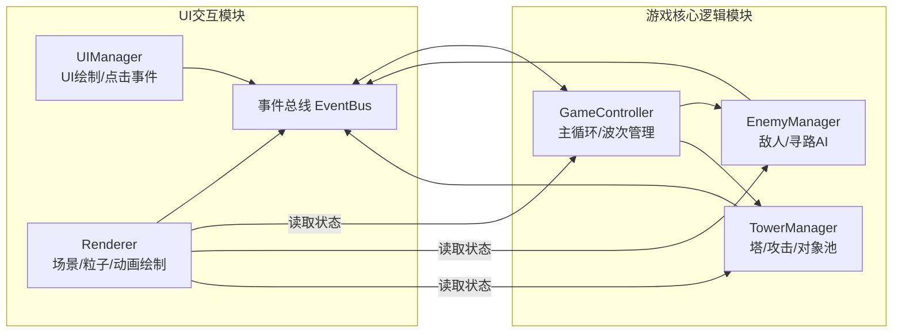

## 1. 架构设计



## 2. 技术栈说明
- **语言**: TypeScript (strict模式, target ES2020)
- **构建工具**: Vite 5.x
- **渲染**: 原生Canvas 2D API
- **状态管理**: 事件总线 (发布/订阅模式)
- **初始化**: 手动配置 Vite + TS vanilla 模板

## 3. 文件结构定义
```
auto15/
├── package.json          # typescript, vite 依赖 & dev 脚本
├── index.html            # 全屏Canvas入口
├── tsconfig.json         # strict ES2020
├── vite.config.js        # 基础配置
└── src/
    ├── core/
    │   ├── GameController.ts   # 主循环、波次、帧更新、事件协调
    │   ├── EnemyManager.ts     # 敌人生成、A*寻路、状态
    │   └── TowerManager.ts     # 塔建造/升级/攻击、对象池
    ├── ui/
    │   ├── UIManager.ts        # UI元素、点击事件、事件总线通信
    │   └── Renderer.ts         # Canvas渲染、粒子、动画
    └── shared/
        ├── types.ts            # 共享类型定义
        └── EventBus.ts         # 事件总线
```

## 4. 核心数据模型定义

### 4.1 防御塔类型定义
```typescript
type TowerType = 'arrow' | 'cannon' | 'ice' | 'poison' | 'electric';
type TowerLevel = 1 | 2 | 3;

interface TowerStats {
  damage: number;
  range: number;
  fireRate: number;
  splashRadius?: number;
  slowPercent?: number;
  slowDuration?: number;
  poisonDamage?: number;
  poisonDuration?: number;
  chainCount?: number;
}

interface Tower {
  id: string;
  type: TowerType;
  level: TowerLevel;
  gridX: number;
  gridY: number;
  x: number;
  y: number;
  cooldown: number;
  stats: TowerStats;
  totalInvested: number;
  animScale: number;
}
```

### 4.2 敌人类型定义
```typescript
type EnemyType = 'normal' | 'fast' | 'armored' | 'flying' | 'boss';

interface Enemy {
  id: string;
  type: EnemyType;
  hp: number;
  maxHp: number;
  speed: number;
  baseSpeed: number;
  reward: number;
  x: number;
  y: number;
  pathIndex: number;
  path: {x: number, y: number}[];
  slowTimer: number;
  poisonTimer: number;
  poisonDps: number;
  hitFlash: number;
  isFlying: boolean;
  armor: number;
}
```

### 4.3 粒子与特效
```typescript
interface Particle {
  active: boolean;
  x: number;
  y: number;
  vx: number;
  vy: number;
  life: number;
  maxLife: number;
  color: string;
  size: number;
}

interface Projectile {
  active: boolean;
  x: number;
  y: number;
  targetId: string;
  damage: number;
  type: TowerType;
  speed: number;
}
```

## 5. 寻路算法: A* (自适应)
- 网格尺寸: 根据地图动态计算 (20列 x 12行)
- 起点: 左侧中部
- 终点: 右侧中部
- 塔建造后重新计算所有敌人路径
- 飞行敌人忽略障碍物

## 6. 事件总线定义
```
事件名                       方向               数据
UI:TowerSelected           UI→Core           {towerType}
UI:TowerPlaced             UI→Core           {gridX, gridY, towerType}
UI:TowerUpgraded           UI→Core           {towerId}
UI:TowerSold               UI→Core           {towerId}
UI:WaveStarted             UI→Core           {wave}
Core:GameStateUpdated      Core→UI           {gold, wave, hp, kills, prepTimer, isPlaying}
Core:TowerBuilt            Core→UI           {tower}
Core:TowerUpgraded         Core→UI           {tower}
Core:EnemyKilled           Core→UI           {enemy, goldReward}
Core:WaveCompleted         Core→UI           {wave, kills, reward}
Core:PlayerDied            Core→UI           {}
```

## 7. 波次配置 (示例前5波)
| 波次 | 敌人组合 | 数量 | 间隔(s) |
|------|---------|------|---------|
| 1 | normal | 10 | 1.0 |
| 2 | normal, fast | 15 | 0.9 |
| 3 | normal, fast, armored | 18 | 0.85 |
| 4 | normal, fast, armored, flying | 20 | 0.8 |
| 5 | boss + minions | 1 + 10 | 0.9 |

## 8. 防御塔三级属性表
| 塔类型 | Lv1伤害/射程/射速 | Lv2伤害/射程/射速 | Lv3伤害/射程/射速 |
|--------|------------------|------------------|------------------|
| 箭塔 | 25/120/1.0 | 45/140/0.85 | 70/160/0.7 |
| 炮塔 | 35/100/1.5 (溅射40) | 60/115/1.3 (溅射50) | 100/130/1.1 (溅射65) |
| 冰塔 | 10/110/1.0 (减速50%/2s) | 18/125/0.9 (减速60%/2.5s) | 28/140/0.8 (减速70%/3s) |
| 毒塔 | 8/100/1.2 (15dps/3s) | 14/115/1.1 (25dps/4s) | 22/130/1.0 (40dps/5s) |
| 电塔 | 20/110/1.0 (连锁3) | 35/125/0.9 (连锁4) | 55/140/0.8 (连锁5) |
