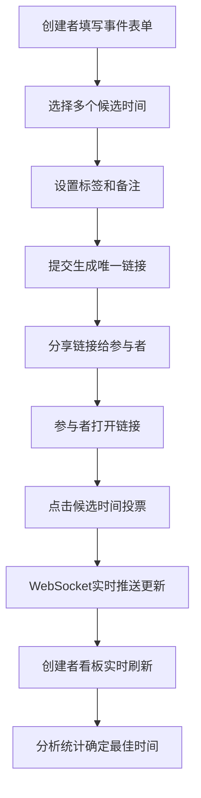

## 1. 产品概述

团队日程投票系统，帮助团队快速找到共同空闲的会议时间，避免在群里反复沟通。用户可以创建多候选时间的投票事件，参与者通过链接投票，创建者实时查看统计结果。

- 核心价值：将日程协调时间从数小时缩短至数分钟
- 目标用户：项目团队、兴趣小组、活动组织者

## 2. 核心功能

### 2.1 用户角色

| 角色 | 参与方式 | 核心权限 |
|------|----------|----------|
| 事件创建者 | 创建投票事件 | 管理事件、查看统计看板、分享链接 |
| 参与者 | 通过邀请链接访问 | 对候选时间投票（有空/犹豫/没空）、查看他人投票状态 |

### 2.2 功能模块

1. **创建事件页**：表单输入标题、候选时间、标签、备注，生成分享链接
2. **投票页**：日历视图展示候选时间，点击切换投票状态，实时同步
3. **统计看板**：柱状图+饼图展示投票分布，标签筛选，暗色主题切换

### 2.3 页面详情

| 页面名称 | 模块名称 | 功能描述 |
|----------|----------|----------|
| 创建事件页 | 表单模块 | 标题输入、多时间段选择（精确到小时）、标签选择、备注输入 |
| 创建事件页 | 链接生成 | 提交后生成唯一分享链接，支持一键复制 |
| 投票页 | 日历网格 | 月视图展示候选时间，颜色区分投票状态，悬停高亮 |
| 投票页 | 状态切换 | 点击循环切换三种状态，缩放动画+震动反馈 |
| 投票页 | 移动端适配 | 小屏幕自动切换为列表视图 |
| 统计看板 | 数据可视化 | 柱状图展示各时间段参与人数，饼图展示整体状态分布 |
| 统计看板 | 筛选功能 | 按标签筛选投票记录，实时更新图表 |
| 统计看板 | 主题切换 | 明/暗主题切换，背景和文字颜色渐变过渡 |

## 3. 核心流程

创建者填写事件信息 → 设置多个候选时间 → 提交生成分享链接 → 发送链接给参与者 → 参与者打开链接投票 → 创建者实时查看统计结果 → 找到最优会议时间

## 4. 用户界面设计

### 4.1 设计风格

- **主色调**：深蓝色 `#1e3a8a`，薄荷绿 `#34d399`
- **状态色**：有空（薄荷绿 `#10b981`）、犹豫（琥珀黄 `#f59e0b`）、没空（中性灰 `#6b7280`）
- **按钮样式**：圆角 12px，悬停阴影，点击波纹效果
- **字体**：标题用 "DM Serif Display"，正文用 "IBM Plex Sans"
- **布局风格**：卡片式布局，顶部固定导航栏，内容区居中最大宽度 1200px
- **图标**：使用 lucide-react 图标库

### 4.2 页面设计概述

| 页面名称 | 模块名称 | UI 元素 |
|----------|----------|----------|
| 创建事件页 | Hero 区 | 大标题、副标题、渐变色背景装饰 |
| 创建事件页 | 表单卡片 | 阴影卡片，输入框带聚焦动效，时间选择器带日历弹出层 |
| 投票页 | 日历头部 | 月份切换按钮（左/右箭头），当前月份居中显示，周几表头 |
| 投票页 | 日历格子 | 候选时间高亮边框，悬停放大 1.05 倍，点击缩放 0.95 弹性动画 |
| 统计看板 | 图表容器 | 卡片分组，柱状图高度动画，饼图扇区悬停突出 |
| 统计看板 | 主题切换 | 右上角切换按钮，点击带 300ms 颜色渐变过渡 |

### 4.3 响应式设计

- 桌面端（>1024px）：多列日历网格，双栏图表布局
- 平板端（768-1024px）：单列紧凑日历，图表堆叠布局
- 移动端（<768px）：日历切换为时间列表，图表单列显示，触摸区域 ≥44px

### 4.4 动效规范

- 页面加载：元素 staggered 渐入，延迟 100ms 递增
- 状态切换：点击时 scale(0.95) → scale(1.05) → scale(1)，总时长 200ms
- 日历翻页：旧页面滑出（translateX ±100%），新页面滑入，60fps 动画
- 主题切换：CSS variables 过渡，时长 300ms，ease-in-out 缓动
- 数据更新：图表数据点弹性动画，新数据从底部升起
