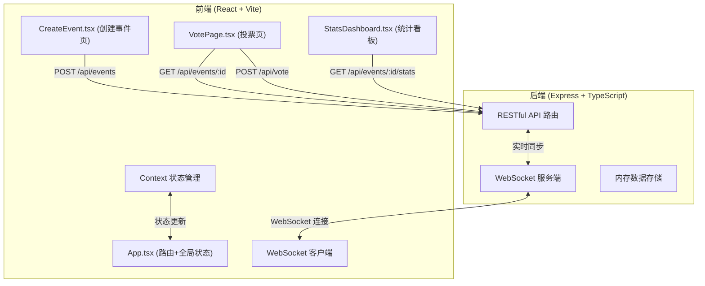
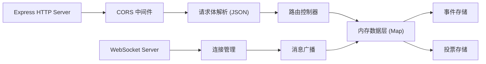
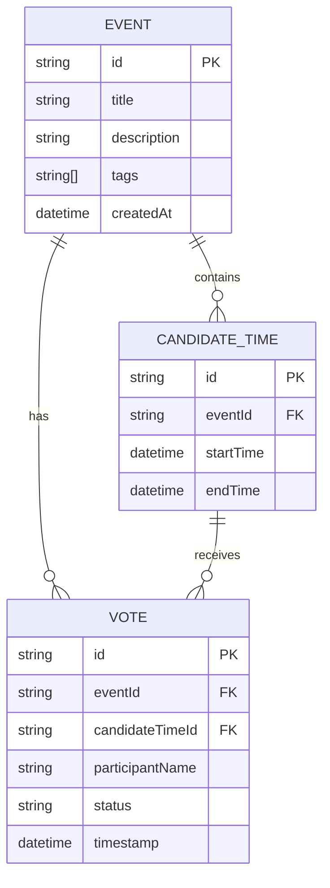

## 1. 架构设计



## 2. 技术栈说明

- **前端**：React 18 + TypeScript 5 + Vite 5 + React Router 6
- **状态管理**：React Context + useReducer
- **图表**：Recharts 2.12
- **日期工具**：date-fns 3.6
- **后端**：Express 4.19 + TypeScript 5 + ws 8.17
- **跨域**：cors 2.8
- **ID 生成**：uuid 9.0
- **构建工具**：Vite 5（前端），ts-node 10（后端）

## 3. 路由定义

| 前端路由 | 页面/组件 | 说明 |
|----------|----------|------|
| `/` | CreateEvent | 创建事件表单页 |
| `/vote/:eventId` | VotePage | 投票页面 |
| `/stats/:eventId` | StatsDashboard | 统计看板 |

| 后端 API | 方法 | 说明 |
|----------|------|------|
| `/api/events` | POST | 创建新投票事件 |
| `/api/events/:id` | GET | 获取事件详情 |
| `/api/vote` | POST | 提交投票 |
| `/api/events/:id/stats` | GET | 获取统计数据 |

## 4. API 数据类型定义

```typescript
// 投票状态类型
type VoteStatus = 'available' | 'hesitant' | 'unavailable';

// 候选时间
interface CandidateTime {
  id: string;
  startTime: string; // ISO 8601
  endTime: string;
}

// 投票记录
interface Vote {
  id: string;
  eventId: string;
  candidateTimeId: string;
  participantName: string;
  status: VoteStatus;
  timestamp: string;
}

// 事件
interface Event {
  id: string;
  title: string;
  description: string;
  tags: string[];
  candidateTimes: CandidateTime[];
  createdAt: string;
}

// 统计数据
interface TimeSlotStats {
  candidateTimeId: string;
  startTime: string;
  available: number;
  hesitant: number;
  unavailable: number;
}

interface StatsResponse {
  event: Event;
  timeSlotStats: TimeSlotStats[];
  totalParticipants: number;
  statusDistribution: {
    available: number;
    hesitant: number;
    unavailable: number;
  };
}
```

## 5. 后端服务架构



## 6. 数据模型

### 6.1 实体关系图



### 6.2 内存存储设计

```typescript
// 后端内存存储
const events = new Map<string, Event>();
const votes = new Map<string, Vote[]>(); // eventId -> votes array

// WebSocket 连接管理
const clients = new Map<string, WebSocket[]>(); // eventId -> connected clients
```

## 7. 性能优化策略

- **首次渲染**：代码分割、资源预加载、关键 CSS 内联
- **日历动画**：使用 CSS transform 而非 layout 属性，GPU 加速
- **投票响应**：乐观 UI 更新，先更新本地状态再确认后端
- **WebSocket**：批量消息处理，防抖合并高频更新
- **图表渲染**：Recharts 按需渲染，数据变化时局部更新
