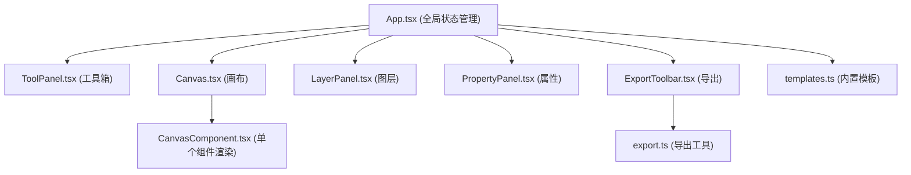

## 1. 架构设计

本项目为纯前端单页应用，采用React组件化架构，通过props和回调函数实现组件间通信。状态集中在App组件管理，各功能组件通过单向数据流接收状态和触发更新。



## 2. 技术描述

- **前端框架**：React 18 + TypeScript 5 + Vite 5
- **拖拽功能**：react-dnd + react-dnd-html5-backend
- **图片导出**：原生Canvas API + html2canvas
- **ZIP打包**：jszip
- **文件下载**：file-saver
- **样式方案**：CSS Modules + CSS Variables
- **状态管理**：React useState + useReducer（本地状态）
- **性能优化**：React.memo + useMemo + useCallback

## 3. 目录结构

```
src/
├── App.tsx                    # 主应用组件，全局状态管理
├── main.tsx                   # 应用入口
├── index.css                  # 全局样式和CSS变量
├── types/
│   └── index.ts               # TypeScript类型定义
├── components/
│   ├── Canvas.tsx             # 画布组件
│   ├── CanvasComponent.tsx    # 单个画布组件渲染
│   ├── ToolPanel.tsx          # 工具箱面板
│   ├── LayerPanel.tsx         # 图层管理面板
│   ├── PropertyPanel.tsx      # 属性编辑面板
│   └── ExportToolbar.tsx      # 导出工具栏
├── utils/
│   ├── export.ts              # 导出工具函数
│   └── templates.ts           # 内置模板数据
└── hooks/
    └── useCanvasDrag.ts       # 画布拖拽自定义Hook
```

## 4. 核心数据模型

### 4.1 画布组件类型

```typescript
type ComponentType = 'text' | 'image' | 'rect' | 'circle';

interface BaseComponent {
  id: string;
  type: ComponentType;
  x: number;
  y: number;
  width: number;
  height: number;
  rotation: number;
  opacity: number;
  visible: boolean;
  locked: boolean;
  name: string;
}

interface TextComponent extends BaseComponent {
  type: 'text';
  content: string;
  fontSize: number;
  fontFamily: string;
  fontWeight: 'normal' | 'bold';
  fontStyle: 'normal' | 'italic';
  textDecoration: 'none' | 'underline';
  lineHeight: number;
  textAlign: 'left' | 'center' | 'right';
  color: string;
  backgroundColor: string;
}

interface ImageComponent extends BaseComponent {
  type: 'image';
  src: string;
}

interface RectComponent extends BaseComponent {
  type: 'rect';
  fill: string;
  stroke: string;
  strokeWidth: number;
  borderRadius: number;
}

interface CircleComponent extends BaseComponent {
  type: 'circle';
  fill: string;
  stroke: string;
  strokeWidth: number;
}

type CanvasComponent = TextComponent | ImageComponent | RectComponent | CircleComponent;
```

### 4.2 模板和导出配置

```typescript
interface Template {
  id: string;
  name: string;
  thumbnail: string;
  canvasWidth: number;
  canvasHeight: number;
  components: CanvasComponent[];
}

interface ExportSize {
  id: string;
  name: string;
  width: number;
  height: number;
  selected: boolean;
}

interface CanvasState {
  width: number;
  height: number;
  components: CanvasComponent[];
  selectedId: string | null;
  zoom: number;
  panX: number;
  panY: number;
}
```

## 5. 数据流设计

### 5.1 组件添加流程
1. ToolPanel接收用户点击/拖拽
2. 回调通知App添加新组件
3. App更新components数组
4. Canvas接收新状态并重新渲染

### 5.2 属性更新流程
1. PropertyPanel接收用户输入
2. 回调通知App更新指定组件属性
3. App更新对应组件数据
4. Canvas和LayerPanel同步刷新

### 5.3 导出流程
1. ExportToolbar获取导出尺寸列表
2. 调用export.ts中的exportToZip函数
3. 遍历尺寸，逐一生成Canvas并转换为Blob
4. 使用JSZip打包所有图片
5. 触发浏览器下载ZIP文件

## 6. 性能优化策略

### 6.1 渲染性能
- 使用React.memo包装CanvasComponent，避免不必要重渲染
- 组件拖拽使用transform: translate而非top/left，启用GPU加速
- 缩放操作使用CSS transform: scale
- 30个组件同时存在时，单次重渲染控制在16ms以内

### 6.2 导出性能
- 使用OffscreenCanvas进行离屏渲染（如浏览器支持）
- 图片导出使用toBlob而非toDataURL，减少内存占用
- 多尺寸导出采用队列处理，避免阻塞主线程
- 1080x1920单张导出控制在2秒以内

### 6.3 内存管理
- 图片组件使用object URL，及时调用revokeObjectURL释放
- 导出完成后清理所有临时Canvas对象
- 大图片限制尺寸，自动压缩处理

## 7. 性能指标

| 指标 | 目标值 | 测量方式 |
|------|--------|----------|
| 单张1080x1920导出时间 | ≤2秒 | 从点击导出到生成Blob |
| 30个组件拖拽帧率 | ≥60FPS | Chrome DevTools Performance |
| 首屏加载时间 | ≤3秒 | LCP指标 |
| 打包后体积 | ≤500KB | gzip压缩后 |
