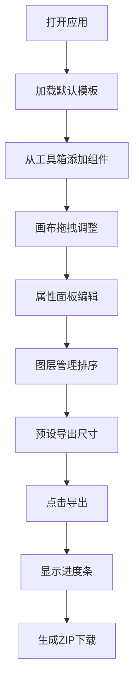

## 1. 产品概述

在线海报生成器是一款专为电商运营团队设计的可视化海报制作工具，解决大促活动期间快速制作多尺寸海报的需求。用户通过拖拽组件、调整参数即可实时预览效果，支持批量导出不同尺寸的海报图片。

- 核心价值：降低设计门槛，提高运营效率，支持批量生成多尺寸版本
- 目标用户：电商运营人员、市场推广人员、新媒体编辑
- 市场价值：在618、双11等大促场景下，将海报制作时间从数小时缩短至几分钟

## 2. 核心功能

### 2.1 用户角色

| 角色 | 注册方式 | 核心权限 |
|------|----------|----------|
| 普通用户 | 无需注册，直接使用 | 制作、编辑、导出海报，保存和加载模板 |

### 2.2 功能模块

1. **画布编辑区**：组件拖拽放置、实时预览、缩放移动、网格背景
2. **工具箱面板**：文本、图片、矩形、圆形组件库，内置模板选择
3. **属性编辑面板**：位置、大小、旋转、颜色、透明度、文本样式调整
4. **图层管理面板**：图层排序、可见性控制、锁定、删除
5. **导出功能**：多尺寸预设、批量导出、ZIP打包、进度显示
6. **模板管理**：保存为JSON模板、加载模板、5个内置模板

### 2.3 页面详情

| 页面名称 | 模块名称 | 功能描述 |
|---------|----------|----------|
| 主编辑页 | 工具箱面板 | 展示可拖拽组件（文本、图片、矩形、圆形）和内置模板列表，点击添加组件到画布中心 |
| 主编辑页 | 画布区域 | 浅灰色网格背景，支持组件拖拽移动、缩放、旋转，选中显示蓝色边框和手柄 |
| 主编辑页 | 属性面板 | 选中组件后显示属性编辑项，实时更新组件样式 |
| 主编辑页 | 图层面板 | 显示所有组件列表，支持拖拽排序、锁定、删除、可见性切换、透明度调整 |
| 主编辑页 | 导出工具栏 | 预设尺寸管理、导出按钮、导出进度条、ZIP下载 |
| 主编辑页 | 模板管理 | 保存当前画布为JSON模板、加载本地模板文件 |

## 3. 核心流程

### 3.1 海报制作流程

用户打开应用 → 自动加载默认模板 → 从工具箱拖拽/点击添加组件 → 在画布上调整位置和大小 → 在属性面板编辑样式 → 在图层面板管理图层顺序 → 预设导出尺寸 → 点击导出按钮 → 显示导出进度 → 自动下载ZIP包

### 3.2 模板复用流程

用户调整好画布内容 → 点击保存模板 → 下载JSON文件 → 下次使用时点击加载模板 → 选择JSON文件 → 画布自动恢复所有组件配置

## 4. 用户界面设计

### 4.1 设计风格

- **主色调**：优雅深蓝色 `#1A237E`，用于导航栏、按钮、选中边框
- **点缀色**：温暖橙色 `#FF6F00`，用于导出按钮、进度条、重要提醒
- **中性色**：浅灰 `#F5F5F5` 背景、中灰 `#E0E0E0` 网格线、深灰 `#333333` 文字
- **按钮风格**：圆角4px，导出按钮有弹跳动画，悬停有轻微上浮效果
- **字体**：标题使用 'Playfair Display' 衬线字体，正文使用 'Noto Sans SC' 无衬线字体
- **布局风格**：三栏布局，卡片式组件，精致阴影和过渡动画
- **图标风格**：线性图标，与文字颜色一致，大小统一16px

### 4.2 页面设计概述

| 页面名称 | 模块名称 | UI元素 |
|---------|----------|--------|
| 主编辑页 | 工具箱面板 | 宽度240px，深蓝顶栏，组件卡片式设计，悬停上浮+阴影，半透明拖拽预览 |
| 主编辑页 | 画布区域 | 白色画布，浅灰网格（间隔20px），选中组件蓝色边框+8个缩放手柄，支持滚轮缩放 |
| 主编辑页 | 属性面板 | 宽度300px，分组表单，实时数值输入，颜色选择器，滑块控件 |
| 主编辑页 | 图层面板 | 宽度300px，列表项拖拽排序，每行包含：可见性开关、锁定按钮、名称、透明度滑块、删除按钮 |
| 主编辑页 | 导出工具栏 | 固定底部，多尺寸标签，橙色渐变导出按钮，弹跳动画，渐变色进度条 |
| 主编辑页 | 响应式工具栏 | 宽度<1024px时，工具箱转为顶部浮动栏，属性/图层面板转为底部可切换标签栏 |

### 4.3 响应式设计

- **桌面端（≥1024px）**：左工具箱240px + 中间画布自适应 + 右面板300px
- **平板端（768px-1023px）**：顶部浮动工具箱（可折叠），底部浮动属性/图层面板（标签切换），画布居中显示
- **移动端（<768px）**：顶部工具栏图标化，画布全屏显示，底部抽屉式面板，支持触摸拖拽

### 4.4 交互与动画

- **组件悬停**：工具箱卡片向上微移2px，阴影加深
- **拖拽预览**：半透明（opacity: 0.5）的组件占位跟随鼠标
- **选中反馈**：蓝色边框 + 8个白色圆形缩放手柄
- **导出按钮**：循环轻微弹跳动画（scale: 1.0 → 1.05 → 1.0）
- **进度条**：深蓝到橙色的线性渐变，平滑过渡
- **面板切换**：300ms ease-in-out 滑入滑出动画
