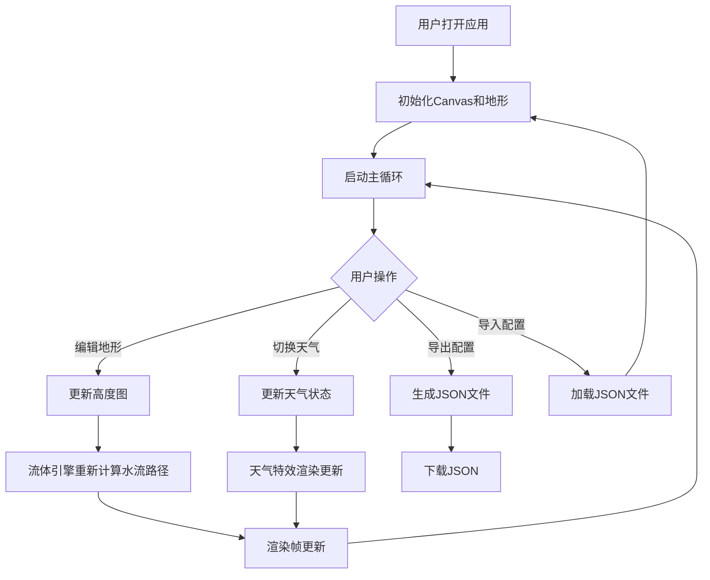

## 1. 产品概述

实时水体流动模拟器是一款基于浏览器 Canvas 2D 的交互式水体仿真应用，旨在解决静态水体缺乏真实感和交互性的问题。用户可以通过编辑地形来引导水流路径，观察河流弯曲流动、湖泊涟漪扩散和瀑布垂直下落等自然水体效果，同时体验天气系统对水体的动态影响。

- 目标用户：地理仿真爱好者、游戏开发者、教育教学场景
- 核心价值：提供零门槛的实时水体交互体验，无需安装任何软件即可在浏览器中运行

## 2. 核心功能

### 2.1 功能模块

1. **地形编辑页面**：地形高度图网格编辑、升高/降低/平滑操作、鼠标交互
2. **流体模拟页面**：粒子系统流体模拟、河流/湖泊/瀑布效果渲染、深度渐变着色
3. **天气系统页面**：晴天/雨天/雪天切换、雨滴溅射、积雪覆盖、平滑过渡动画
4. **性能监控页面**：FPS、粒子数量、网格更新耗时实时显示
5. **导出导入页面**：地形和水体状态 JSON 导出/导入

### 2.2 页面详情

| 页面名称 | 模块名称 | 功能描述 |
|---------|---------|---------|
| 主画布 | 地形编辑 | 点击拖拽升高/降低地形，平滑地形，水流自动沿低洼处流动 |
| 主画布 | 流体模拟 | 粒子系统驱动的水流模拟，支持河流弯曲、湖泊涟漪、瀑布下落 |
| 主画布 | 天气系统 | 晴天/雨天/雪天模式切换，雨天增加流量和溅射，雪天覆盖积雪 |
| 顶部工具栏 | 控制面板 | 地形工具按钮、天气切换按钮、导出导入按钮，毛玻璃效果 |
| 右侧边栏 | 性能面板 | FPS、粒子总数、网格更新耗时，等宽字体，数值闪烁反馈 |

## 3. 核心流程

## 4. 用户界面设计

### 4.1 设计风格

- 主色调：深蓝（#0a1628）至墨绿（#0d2b1a）渐变背景
- 辅助色：浅蓝（#4fc3f7）高亮、深蓝（#1a237e）阴影
- 按钮样式：半透明毛玻璃效果（backdrop-filter: blur），悬浮时亮度提高10%，0.2秒淡入动画
- 字体：等宽字体（JetBrains Mono / Consolas）用于数值显示，无衬线字体用于按钮标签
- 布局：Flex 布局，顶部工具栏 + 中心画布（80%面积）+ 右侧边栏
- 图标风格：简洁线条图标

### 4.2 页面设计概览

| 页面名称 | 模块名称 | UI元素 |
|---------|---------|--------|
| 顶部工具栏 | 地形工具组 | 升高按钮、降低按钮、平滑按钮，毛玻璃背景 |
| 顶部工具栏 | 天气切换组 | 晴天/雨天/雪天三个切换按钮，毛玻璃背景 |
| 顶部工具栏 | 导出导入组 | 导出JSON按钮、导入JSON按钮 |
| 右侧边栏 | 性能面板 | FPS数值、粒子总数、网格更新耗时，等宽字体 |
| 中心画布 | 地形网格 | 网格线、高度渐变色、鼠标滚轮缩放和平移 |

### 4.3 响应式设计

- 桌面优先设计，最小宽度 960px
- 低于 960px 时侧边栏自动隐藏为图表图标下拉菜单
- 地形网格区域占页面中心 80% 面积
- 缩放和平移交互适配不同屏幕尺寸

### 4.4 交互反馈

- 地形修改时粒子颜色短暂变亮 0.5 秒
- 天气切换时水体透明度渐变（2-3秒过渡）
- 数值更新时数字有 0.3 秒颜色闪烁反馈
- 按钮悬浮时背景亮度提高 10%，0.2 秒淡入动画
