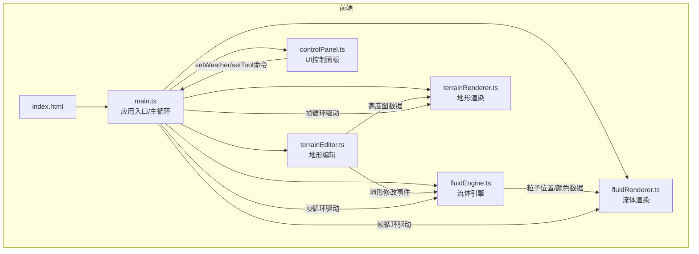
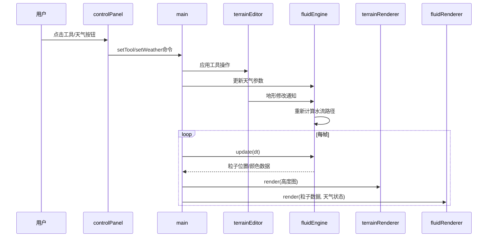

## 1. 架构设计

## 2. 技术说明

- 前端框架：纯 TypeScript + Canvas 2D API（无外部游戏引擎或物理库）
- 构建工具：Vite
- 语言：TypeScript（严格模式，target ES2020）
- 运行时：现代浏览器（Chrome 80+, Firefox 75+, Edge 80+）
- 包管理：npm

## 3. 文件结构

| 文件路径 | 职责 |
|---------|------|
| package.json | 项目依赖和脚本配置 |
| vite.config.js | Vite 构建配置，Canvas 兼容设置 |
| tsconfig.json | TypeScript 严格模式配置，target ES2020 |
| index.html | 入口页面，引入 main.ts |
| src/main.ts | 应用入口，初始化 Canvas、事件绑定、主循环，管理模块间数据流 |
| src/fluid/fluidEngine.ts | 粒子系统、水流模拟算法、地形碰撞、流向计算 |
| src/fluid/fluidRenderer.ts | 水流/涟漪/瀑布特效绘制、粒子纹理、天气特效渲染 |
| src/terrain/terrainEditor.ts | 地形高度图管理、升高/降低/平滑操作、地形修改通知 |
| src/terrain/terrainRenderer.ts | 地形网格绘制、高度渐变色彩、鼠标交互、缩放平移变换 |
| src/ui/controlPanel.ts | 顶部工具栏和性能面板、按钮事件绑定、命令输出 |

## 4. 核心算法

### 4.1 流体模拟算法

- 基于粒子的流体模拟：每个粒子具有位置(x,y)、速度(vx,vy)、生命周期、深度属性
- 地形碰撞检测：粒子位置映射到高度图网格，根据高度差计算流向
- 河流模拟：沿地形梯度方向施加重力分量驱动粒子流动
- 湖泊模拟：低洼区域粒子减速并产生涟漪扩散效果
- 瀑布模拟：地形高度突变区域粒子增加垂直速度分量

### 4.2 粒子管理

- 最大粒子数：10000
- 粒子合并策略：当粒子数超限时，合并远处（距视口中心远）的粒子
- 粒子池：预分配粒子数组，避免运行时 GC

### 4.3 天气系统

- 晴天：默认状态，正常水流
- 雨天：增加粒子生成速率，添加雨滴粒子（从顶部落下），水面溅射效果
- 雪天：添加雪花粒子，非水体区域逐渐覆盖白色积雪层
- 过渡动画：2-3 秒渐变切换，使用插值因子控制特效透明度

## 5. 性能目标

| 指标 | 目标值 |
|------|--------|
| 帧率（10000粒子） | ≥ 60 FPS |
| 地形网格更新响应 | < 50ms |
| 天气切换动画 | 无卡顿 |
| 粒子合并触发阈值 | 10000 个 |

## 6. 数据流

