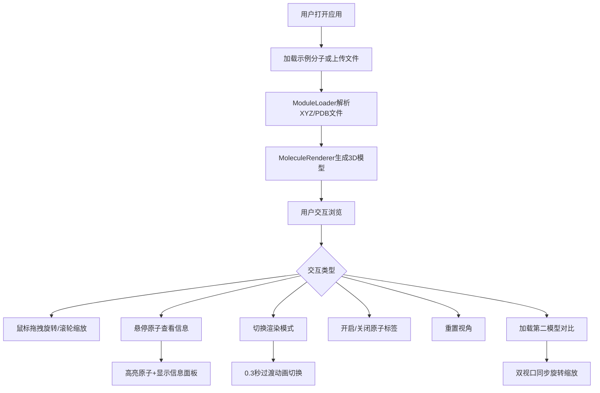

## 1. 产品概述

三维分子结构交互浏览器是一款面向化学教师和学生的Web应用，支持在浏览器中加载、旋转查看复杂分子模型，直观理解原子排列和化学键。支持XYZ/PDB格式文件加载，提供多种渲染模式、原子高亮交互和多模型并排对比功能。

- 目标用户：化学教师、化学专业学生、科研人员
- 核心价值：无需安装桌面软件，浏览器中即可实时交互式浏览分子三维结构

## 2. 核心功能

### 2.1 功能模块

1. **3D分子渲染视口**：Three.js渲染的分子模型，原子用不同颜色球体表示，化学键用半透明圆柱体连接，支持鼠标拖拽旋转与滚轮缩放，旋转有平滑惯性阻尼
2. **底部控制栏**：文件上传按钮、渲染模式切换（球棍/空间填充/线框）、原子标签开关、重置视角按钮，模式切换带0.3秒过渡动画
3. **侧边信息面板**：鼠标悬停原子时高亮该原子及相邻化学键（半透明发光），面板显示元素类型、坐标、相邻原子、键长，原子上方出现跟随鼠标的小标签
4. **多模型对比**：同时加载两个分子并排显示在左右视口中，两个视口同步旋转角度和缩放比例

### 2.2 页面详情

| 页面名称 | 模块名称 | 功能描述 |
|----------|----------|----------|
| 主视口 | 3D渲染区 | Three.js场景渲染原子球体和键圆柱体，OrbitControls旋转缩放带阻尼 |
| 主视口 | 底部控制栏 | 文件上传、模式切换（球棍/空间填充/线框）、标签开关、重置视角 |
| 主视口 | 侧边信息面板 | 悬停原子高亮+详情展示（元素、坐标、相邻原子、键长） |
| 对比模式 | 双视口布局 | 左右并排显示两个分子模型，同步旋转缩放 |

## 3. 核心流程

## 4. 用户界面设计

### 4.1 设计风格

- 主色调：深蓝灰背景（#0a0f1a）搭配网格纹理
- 辅助色：淡蓝色渐变高亮光晕（#4fc3f7 → #0288d1）
- 按钮样式：圆角半透明毛玻璃按钮，hover时边框发光
- 字体：JetBrains Mono（数据标签）+ Outfit（UI文本）
- 布局风格：全屏3D视口 + 浮动控制栏 + 侧边信息面板
- 图标风格：线性简约图标

### 4.2 页面设计概述

| 页面名称 | 模块名称 | UI元素 |
|----------|----------|--------|
| 主视口 | 3D渲染区 | 全屏深蓝灰背景+网格纹理，原子球体+键圆柱体，暗角渐晕 |
| 主视口 | 底部控制栏 | 毛玻璃半透明条（模糊度8px），圆角按钮组，浮动居中 |
| 主视口 | 侧边信息面板 | 右侧毛玻璃面板，原子详情卡片，淡蓝色发光边框 |
| 对比模式 | 双视口 | 左右分割线，各自独立渲染，顶部标签显示模型名称 |

### 4.3 响应式设计

- 桌面端：全屏视口 + 底部控制栏 + 右侧信息面板
- 移动端：控制栏折叠为右下角浮动菜单按钮，点击展开菜单；信息面板改为底部抽屉式弹出

### 4.4 3D场景设计

- 环境：深色背景带网格线纹理，提供空间参考感
- 光照：环境光（强度0.4）+ 两个方向光（强度0.6，不同角度）+ 点光源跟随鼠标
- 相机：透视相机（FOV 60°），初始距离适配分子包围盒
- 交互：OrbitControls，enableDamping=true，dampingFactor=0.08
- 高亮效果：原子悬停时UnrealBloomPass后处理发光 + 半透明光晕层
- 性能预算：2000原子+5000键保持45FPS以上，使用InstancedMesh批量渲染
