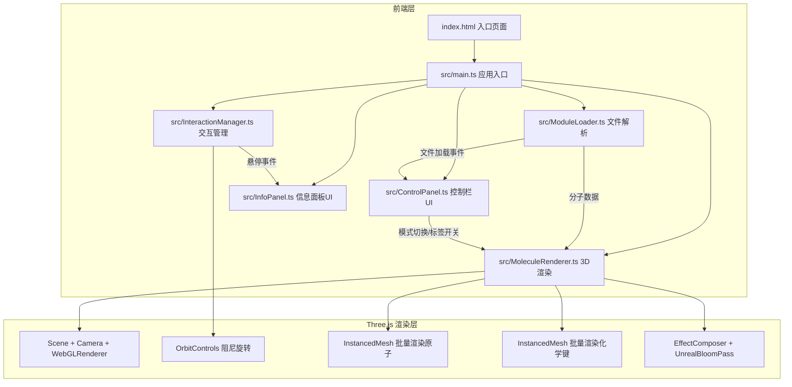

## 1. 架构设计



## 2. 技术说明

- 前端：TypeScript + Three.js + Vite
- 初始化工具：Vite（vanilla-ts模板手动搭建）
- 后端：无（纯前端应用，文件本地读取解析）
- 数据：用户上传的XYZ/PDB文件本地解析

### 2.1 核心依赖

| 依赖 | 版本 | 用途 |
|------|------|------|
| three | ^0.170.0 | 3D渲染引擎 |
| @types/three | ^0.170.0 | Three.js类型定义 |
| vite | ^6.0.0 | 构建开发工具 |
| typescript | ^5.7.0 | 类型安全 |

## 3. 模块职责定义

| 模块文件 | 职责 |
|----------|------|
| src/main.ts | 初始化Three.js场景/相机/渲染器，创建各模块实例，启动渲染循环，管理多视口布局 |
| src/ModuleLoader.ts | 读取XYZ/PDB文件文本，解析为结构化分子数据（原子数组+键数组），自动推断化学键 |
| src/MoleculeRenderer.ts | 根据分子数据生成InstancedMesh原子球体和键圆柱体，管理三种渲染模式切换和0.3秒过渡动画 |
| src/InteractionManager.ts | 管理OrbitControls旋转缩放（阻尼），Raycaster检测原子悬停，触发高亮和标签显示事件 |
| src/ControlPanel.ts | 渲染底部控制栏UI，处理文件上传/模式切换/标签开关/重置视角，通过EventTarget与渲染模块通信 |
| src/InfoPanel.ts | 渲染侧边信息面板，接收悬停事件显示原子详情，管理多模型对比的双视口布局切换 |

## 4. 数据结构定义

### 4.1 原子数据

```typescript
interface AtomData {
  index: number;
  element: string;
  x: number;
  y: number;
  z: number;
}
```

### 4.2 化学键数据

```typescript
interface BondData {
  atomIndex1: number;
  atomIndex2: number;
  order: number;
  length: number;
}
```

### 4.3 分子数据

```typescript
interface MoleculeData {
  atoms: AtomData[];
  bonds: BondData[];
  boundingBox: { min: Vector3; max: Vector3 };
  center: Vector3;
}
```

### 4.4 渲染模式

```typescript
type RenderMode = 'ball-and-stick' | 'space-filling' | 'wireframe';
```

### 4.5 事件系统

```typescript
type AppEventType =
  | 'file-loaded'
  | 'mode-changed'
  | 'labels-toggled'
  | 'view-reset'
  | 'atom-hovered'
  | 'atom-unhovered'
  | 'compare-mode-toggled';
```

## 5. 性能策略

- **InstancedMesh批量渲染**：所有原子使用一个InstancedMesh，所有化学键使用一个InstancedMesh，大幅减少DrawCall
- **LOD简化**：远距离时减少球体段数
- **Raycaster优化**：仅在鼠标移动时检测，使用节流（每帧最多一次）
- **后处理选择性应用**：UnrealBloom仅在悬停原子时对高亮层生效
- **视口同步**：对比模式下两个渲染器共享同一动画循环，通过矩阵同步旋转
