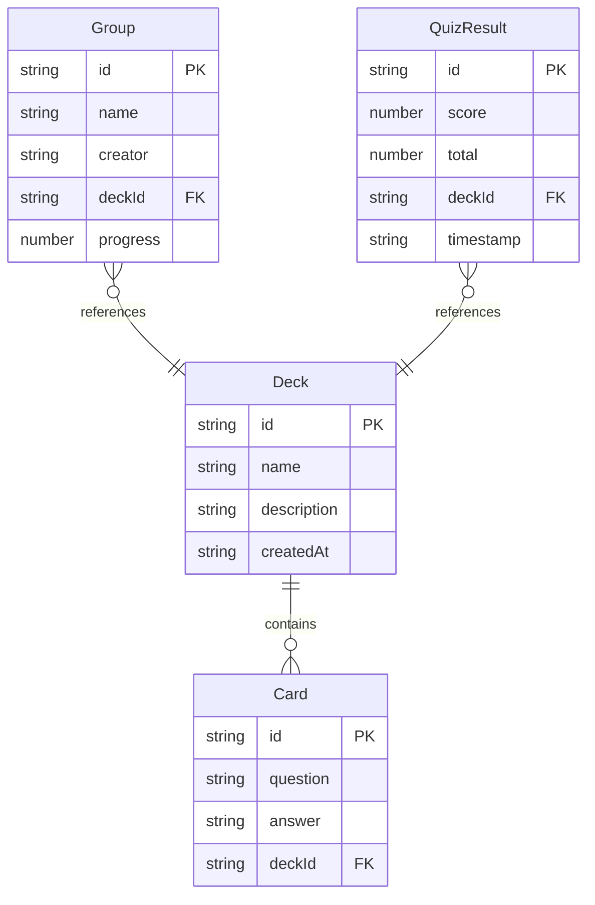

## 1. 架构设计

```mermaid
graph TB
    "Frontend[前端 React + TypeScript + Vite]" --> "Proxy[Vite Dev Proxy :5173]"
    "Proxy" --> "Backend[Express Server :3001]"
    "Backend" --> "Routes[API Routes]"
    "Routes" --> "DecksRoute[/api/decks]"
    "Routes" --> "GroupsRoute[/api/groups]"
    "Routes" --> "QuizRoute[/api/quiz/random]"
    "Routes" --> "DashboardRoute[/api/dashboard]"
    "DecksRoute" --> "MemoryStore[内存数据存储]"
    "GroupsRoute" --> "MemoryStore"
    "QuizRoute" --> "MemoryStore"
    "DashboardRoute" --> "MemoryStore"
```

## 2. 技术说明

- 前端：React@18 + TypeScript + TailwindCSS@3 + Vite
- 初始化工具：vite-init (react-express-ts模板)
- 后端：Express@4 (ESM + TypeScript)
- 数据库：内存数据存储（使用数组/Map，无需外部数据库）
- 状态管理：Zustand
- 图表库：Recharts
- 拖拽：@dnd-kit/core + @dnd-kit/sortable
- 图标：lucide-react

## 3. 路由定义

| 路由 | 用途 |
|------|------|
| / | 首页仪表盘，统计卡片和学习趋势图 |
| /decks | 闪卡管理，创建和管理闪卡组及闪卡 |
| /groups | 学习小组，浏览和加入/离开小组 |
| /quiz | 测试页面，选择闪卡组进行限时测试 |

## 4. API定义

### 4.1 闪卡组 API

| 方法 | 路径 | 请求体 | 响应 |
|------|------|--------|------|
| GET | /api/decks | - | Deck[] 所有闪卡组 |
| POST | /api/decks | { name, description } | Deck 新建的闪卡组 |
| DELETE | /api/decks/:id | - | { success: true } |
| POST | /api/decks/:id/cards | { question, answer } | Card 新建的闪卡 |
| DELETE | /api/decks/:deckId/cards/:cardId | - | { success: true } |
| PUT | /api/decks/:id/cards/reorder | { cardIds: string[] } | Deck 更新排序后的闪卡组 |

### 4.2 学习小组 API

| 方法 | 路径 | 请求体 | 响应 |
|------|------|--------|------|
| GET | /api/groups | - | Group[] 所有小组 |
| POST | /api/groups | { name, creator } | Group 新建的小组 |
| POST | /api/groups/:id/join | { userId } | Group 更新后的小组 |
| POST | /api/groups/:id/leave | { userId } | Group 更新后的小组 |

### 4.3 测试 API

| 方法 | 路径 | 请求体 | 响应 |
|------|------|--------|------|
| GET | /api/quiz/random?deckId=xxx&count=10 | - | Card[] 随机闪卡 |
| POST | /api/quiz/result | { score, total, deckId } | { success: true } 记录测试结果 |

### 4.4 仪表盘 API

| 方法 | 路径 | 请求体 | 响应 |
|------|------|--------|------|
| GET | /api/dashboard | - | { totalCards, totalGroups, avgScore, weeklyStats } |

### 4.5 TypeScript 类型定义

```typescript
interface Deck {
  id: string;
  name: string;
  description: string;
  cards: Card[];
  createdAt: string;
}

interface Card {
  id: string;
  question: string;
  answer: string;
}

interface Group {
  id: string;
  name: string;
  creator: string;
  members: string[];
  deckId: string;
  progress: number;
}

interface DashboardData {
  totalCards: number;
  totalGroups: number;
  avgScore: number;
  weeklyStats: { date: string; minutes: number }[];
}

interface QuizResult {
  score: number;
  total: number;
  deckId: string;
  timestamp: string;
}
```

## 5. 服务端架构图

```mermaid
graph LR
    "Client[前端客户端]" --> "Server[Express Server]"
    "Server" --> "DecksRouter[decks路由]"
    "Server" --> "GroupsRouter[groups路由]"
    "Server" --> "QuizRouter[quiz路由]"
    "Server" --> "DashboardRouter[dashboard路由]"
    "DecksRouter" --> "DataStore[内存数据存储]"
    "GroupsRouter" --> "DataStore"
    "QuizRouter" --> "DataStore"
    "DashboardRouter" --> "DataStore"
```

## 6. 数据模型

### 6.1 数据模型定义



### 6.2 初始数据

内存中预置以下示例数据：
- 2个闪卡组（英语词汇、JavaScript基础），每组5张闪卡
- 2个学习小组（英语角、前端学习组）
- 7天的学习时长数据（用于折线图展示）
- 10条测试结果记录（用于计算平均分）
