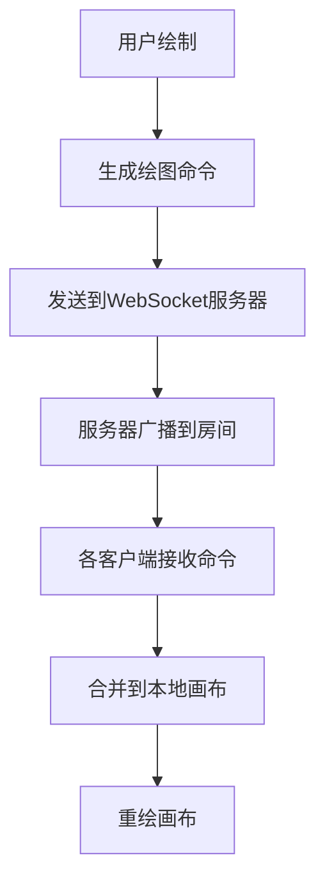

## 1. 产品概述

在线协作白板应用，让团队成员可以实时在共享画板上绘制、添加便签和图片，支持撤销/重做和导出图片功能。

- 主要目的：提供多人实时协作绘图平台，支持远程团队头脑风暴、设计评审、教学等场景
- 目标用户：远程团队、教育工作者、设计师、项目经理
- 核心价值：打破地理限制，实现高效的视觉化协作沟通

## 2. 核心特性

### 2.1 用户角色

| 角色 | 注册方式 | 核心权限 |
|------|----------|----------|
| 协作用户 | 匿名加入房间 | 绘制、添加便签/图片、撤销/重做、导出、聊天 |

### 2.2 功能模块

1. **画布区域**：SVG绘图区域，支持自由笔触、矩形、圆形、便签、图片
2. **工具栏**：工具选择、颜色选择器、笔触大小滑块、撤销/重做、导出、分享
3. **协作者面板**：在线用户列表、用户颜色标识、聊天功能
4. **实时同步**：WebSocket命令队列，300ms内同步所有用户操作

### 2.3 页面详情

| 页面名称 | 模块名称 | 功能描述 |
|---------|----------|----------|
| 主页面 | 画布区域 | 70%宽度，SVG绘图，支持鼠标事件生成绘图命令 |
| 主页面 | 工具栏 | 30%宽度右侧面板，提供笔、矩形、圆形、便签、图片上传工具 |
| 主页面 | 协作者面板 | 右侧面板底部，显示在线用户列表和聊天功能 |

## 3. 核心流程

### 用户加入房间流程
用户访问应用 → 自动分配用户ID和颜色 → 连接WebSocket → 加入默认房间 → 接收历史绘图数据 → 开始协作

### 绘图同步流程
用户绘制 → 本地生成绘图命令 → 发送到WebSocket服务器 → 服务器广播给所有房间用户 → 各客户端接收命令 → 合并到本地画布 → 重绘画布

## 4. 用户界面设计

### 4.1 设计风格
- **主色调**：深蓝色(#1a2332)作为背景，白色(#ffffff)作为文字和面板背景
- **强调色**：蓝色(#4a90d9)用于选中状态和交互元素
- **按钮风格**：圆角卡片设计，8px圆角，选中时高亮为蓝色
- **字体**：使用现代无衬线字体，保持清晰易读
- **布局风格**：左右分栏布局，左侧画布70%，右侧工具栏30%
- **动画**：所有交互操作0.2秒ease-out过渡

### 4.2 页面设计概览

| 页面名称 | 模块名称 | UI元素 |
|---------|----------|--------|
| 主页面 | 画布区域 | SVG元素、选中边框(亮蓝色虚线)、控制点(白色8px圆点)、便签(淡黄#fff3cd) |
| 主页面 | 工具栏 | 工具按钮(圆角8px)、颜色选择器、笔触滑块、撤销/重做按钮、导出按钮 |
| 主页面 | 协作者面板 | 用户头像(名字首字母)、颜色圆点、聊天输入框 |

### 4.3 响应式设计
- **桌面端(≥768px)**：左右布局，画布70%，工具栏30%
- **移动端(<768px)**：工具栏折叠到底部可展开抽屉，画布占满全屏
- **触摸优化**：按钮最小尺寸44px，支持触摸拖拽绘制

### 4.4 视觉细节
- **图形选中**：亮蓝色(#4a90d9)虚线边框，8px直径白色控制点
- **便签**：默认#fff3cd淡黄背景，#333文字，编辑时有微弱投影
- **图片上传**：虚线框拖拽区域，悬停时边框变蓝
- **过渡动画**：所有选中、拖拽、按钮点击0.2秒ease-out
- **禁用状态**：按钮变灰，cursor: not-allowed
