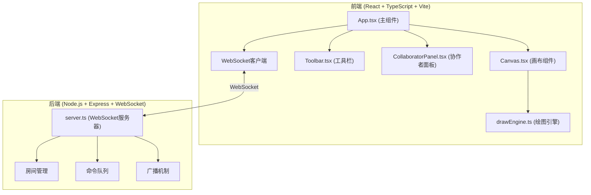
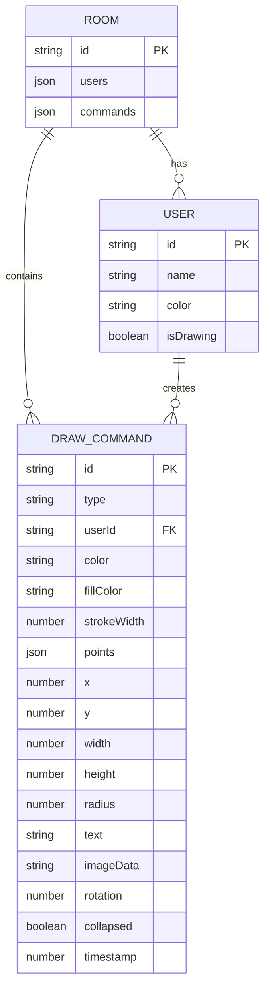

## 1. 架构设计



## 2. 技术栈说明

- **前端**：React 18 + TypeScript + Vite 5
- **状态管理**：React useState/useReducer + 自定义hooks
- **绘图技术**：SVG (支持矢量图形、选择、变换)
- **实时通信**：ws (WebSocket库)
- **后端**：Express 4 + ws
- **构建工具**：Vite 5
- **包管理器**：npm

## 3. 项目文件结构

```
├── package.json              # 项目依赖和脚本
├── index.html                # 入口HTML
├── tsconfig.json             # TypeScript配置
├── vite.config.js            # Vite配置(含WebSocket代理)
├── server.ts                 # WebSocket服务器
└── src/
    ├── App.tsx              # 主组件
    ├── main.tsx             # React入口
    ├── index.css            # 全局样式
    ├── canvas/
    │   ├── Canvas.tsx       # 画布组件
    │   └── drawEngine.ts    # 绘图引擎
    └── ui/
        ├── Toolbar.tsx      # 工具栏
        └── CollaboratorPanel.tsx  # 协作者面板
```

## 4. 核心类型定义

```typescript
// 绘图命令类型
interface Point {
  x: number;
  y: number;
  pressure?: number;
}

interface DrawCommand {
  id: string;
  type: 'pen' | 'rectangle' | 'circle' | 'sticky' | 'image';
  userId: string;
  points?: Point[];
  x?: number;
  y?: number;
  width?: number;
  height?: number;
  radius?: number;
  color: string;
  fillColor: string;
  strokeWidth: number;
  text?: string;
  imageData?: string;
  rotation?: number;
  collapsed?: boolean;
  timestamp: number;
}

// 用户类型
interface User {
  id: string;
  name: string;
  color: string;
  isDrawing: boolean;
  currentPath?: Point[];
}

// 房间类型
interface Room {
  id: string;
  users: Map<string, User>;
  commands: DrawCommand[];
}

// WebSocket消息类型
type WSMessage = 
  | { type: 'join'; roomId: string; userId: string; userName: string }
  | { type: 'draw'; command: DrawCommand }
  | { type: 'undo'; userId: string; commandId: string }
  | { type: 'redo'; userId: string; commandId: string }
  | { type: 'cursor'; userId: string; position: Point }
  | { type: 'chat'; userId: string; message: string }
  | { type: 'users'; users: User[] };
```

## 5. 核心API定义

### WebSocket事件

| 事件类型 | 发送方向 | 描述 |
|---------|----------|------|
| join | 客户端→服务器 | 用户加入房间 |
| draw | 客户端→服务器 | 发送绘图命令 |
| draw | 服务器→客户端 | 广播绘图命令 |
| undo | 客户端→服务器 | 撤销命令 |
| redo | 客户端→服务器 | 重做命令 |
| cursor | 客户端→服务器 | 光标位置同步 |
| users | 服务器→客户端 | 用户列表更新 |
| chat | 双向 | 聊天消息 |

## 6. 性能优化策略

### 6.1 前端性能
- **局部重绘**：仅重绘受影响的SVG元素，而非整个画布
- **命令合并**：将连续的笔触点合并为单个path元素
- **虚拟列表**：当元素超过1000个时，考虑虚拟化渲染
- **requestAnimationFrame**：所有动画和重绘使用RAF调度
- **debounce**：光标位置和聊天输入使用防抖

### 6.2 后端性能
- **内存房间**：房间数据存储在内存中，定期清理空闲房间
- **批量广播**：100ms内的命令批量广播，减少网络开销
- **命令队列**：保证命令顺序执行，使用单调递增时间戳
- **心跳检测**：30秒心跳超时自动断开连接

## 7. 数据模型

### 绘图命令数据模型



## 8. 安全考虑

1. **输入验证**：所有WebSocket消息进行类型和长度验证
2. **XSS防护**：便签文本进行HTML转义，图片数据进行格式验证
3. **文件上传限制**：图片最大5MB，仅支持PNG/JPG/WebP
4. **房间隔离**：不同房间用户无法互相访问数据
5. **速率限制**：单用户每秒最多发送10条消息
