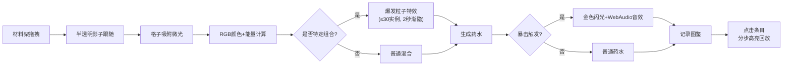

## 1. 产品概述
魔法工坊元素融合与药水调配应用，为传统RPG游戏提供具备真实实验感的炼金配方系统。玩家通过拖拽材料到工作台，触发元素反应生成药水，所有配方自动记录到图鉴中。
- 主要目的：解决RPG配方系统死板、缺少实验感的问题
- 目标用户：RPG游戏玩家、炼金模拟爱好者

## 2. 核心特性

### 2.1 功能模块
1. **工坊核心场景**：3D透视工坊，含工作台（2x3格子）、材料架（4种材料）、炼金釜三区域
2. **元素反应系统**：RGB颜色混合+能量值计算，特定组合触发粒子特效
3. **药水生成系统**：颜色混合药水瓶、CSS发光动画、悬停属性面板、稀有度暴击机制
4. **配方图鉴系统**：羊皮纸风格可折叠面板、元素分组、制作步骤动画回放

### 2.2 页面详情
| 页面名称 | 模块名称 | 功能描述 |
|-----------|-------------|---------------------|
| 主界面 | 工坊场景 | 3D CSS透视布局，拖拽材料交互，粒子特效爆发 |
| 主界面 | 材料架 | 4种元素材料展示，emoji+CSS滤镜着色，浮动动画 |
| 主界面 | 炼金釜 | 粒子特效渲染，药水成品生成与发光效果 |
| 主界面 | 图鉴面板 | 羊皮纸折叠抽屉，配方列表，点击播放制作动画 |
| 移动端 | 标签切换 | <768px时工坊/图鉴全屏标签页切换 |

## 3. 核心流程
玩家从材料架拖拽材料→半透明影子跟随→吸附到工作台格子（微光反馈）→材料组合触发实时反应→炼金釜爆发粒子特效（2秒渐隐、≤30实例）→生成药水（颜色混合、发光、稀有度暴击金色闪光+音效）→成品药水记录到图鉴→点击图鉴条目分步高亮回放制作过程

## 4. 用户界面设计

### 4.1 设计风格
- **主色调**：煤炭黑(#1a1a1a)、琥珀金(#d4a017)、魔法紫(#6b3fa0)
- **背景**：深褐色羊皮纸纹理
- **字体**：展示字体用Cinzel Decorative（手写童话风），正文字体用Crimson Text
- **工作台**：木纹渐变背景+CSS倒影
- **按钮**：圆角+hover放大1.05倍+阴影加深
- **图标**：emoji元素放大+CSS滤镜着色（火焰橙、冰霜蓝、雷电黄、生命绿）

### 4.2 页面布局
| 区域 | 占比 | 元素 |
|-----------|-------------|-------------|
| 工坊区域 | 左侧80% | 材料架（上）、工作台（中）、炼金釜（下）|
| 图鉴面板 | 右侧抽屉 | 折叠/展开（高度过渡+旋转动画）、羊皮纸底色 |
| 响应式 | <768px | 全屏标签页切换，工坊Tab/图鉴Tab |

### 4.3 性能要求
- 拖拽交互FPS≥50
- 粒子特效同时活跃实例≤30个
