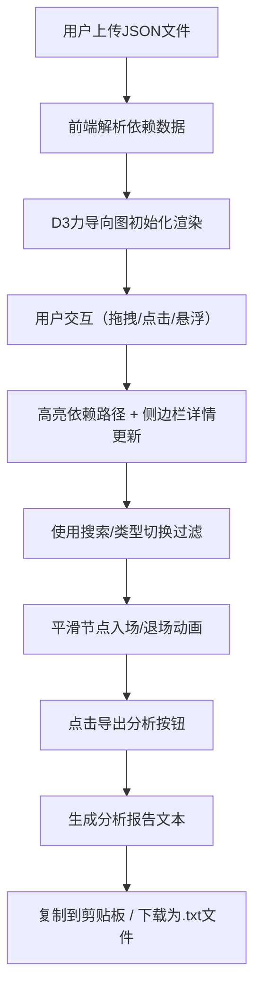

## 1. 产品概述

代码逻辑依赖关系可视化工具，帮助开发者在重构或理解遗留项目时，快速理清模块间调用链路与依赖结构。

- 核心目标：将抽象的代码依赖关系转化为直观的交互式力导向图，提供筛选、高亮、分析报告等功能
- 目标用户：软件工程师、架构师、技术负责人
- 产品价值：降低大型代码库的理解成本，提前识别循环依赖和关键模块，提升重构效率

## 2. 核心功能

### 2.1 用户角色

| 角色 | 注册方式 | 核心权限 |
|------|----------|----------|
| 开发者 | 无需注册 | 上传依赖JSON、查看依赖图、筛选节点、导出分析报告 |

### 2.2 功能模块

1. **主依赖图视图**：力导向布局、节点拖拽、连线渲染、右键菜单
2. **模块详情面板**：选中模块详情、上下游依赖列表、影响范围统计
3. **过滤控制栏**：模块名搜索、依赖类型切换
4. **分析报告模块**：一键生成依赖分析报告、复制/下载功能
5. **数据导入模块**：JSON文件上传解析、示例数据加载

### 2.3 页面详情

| 页面名称 | 模块名称 | 功能描述 |
|----------|----------|----------|
| 主页面 | 文件上传区 | 支持拖放或点击上传依赖JSON文件，提供示例数据快速体验 |
| 主页面 | 过滤控制栏 | 搜索框按模块名筛选、依赖类型切换按钮（全部/内部/外部） |
| 主页面 | 力导向图区域 | D3.js力导向布局，节点可拖拽、悬浮放大、点击高亮路径 |
| 主页面 | 侧边详情面板 | 选中模块的基本信息、上游依赖列表、下游依赖列表、统计指标 |
| 主页面 | 分析报告弹窗 | 展示模块总数、最大依赖深度、环形依赖数量、关键模块列表，支持复制/下载 |

## 3. 核心流程

用户上传依赖JSON文件 → 前端解析模块与依赖关系 → D3力导向图渲染节点与连线 → 用户点击节点高亮上下游路径 → 侧边栏展示详情 → 用户使用搜索/类型切换过滤视图 → 点击导出分析生成报告 → 复制或下载报告文本

## 4. 用户界面设计

### 4.1 设计风格

- **主色调**：暗蓝灰背景（#0f1624 / #1a2332），节点渐变青蓝色（#00d4ff → #8b5cf6 青蓝到紫色过渡）
- **强调色**：循环引用红色（#ff4757）带脉冲动画，直接引用半透明白（rgba(255,255,255,0.35)），间接引用更淡（rgba(255,255,255,0.15)）
- **按钮样式**：圆角玻璃质感半透明（backdrop-filter: blur(8px)，border: 1px solid rgba(255,255,255,0.1)）
- **字体**：标题使用 JetBrains Mono（等宽编程字体），正文使用 Inter
- **布局风格**：左侧响应式主图区（占 70%~75% 宽度），右侧固定 360px 侧边栏
- **动效风格**：节点拖拽弹性回弹（d3.forceSimulation 的 velocityDecay）、节点入场透明度+缩放过渡、连线脉冲（stroke-dashoffset 动画）、右键菜单淡入（opacity 0→1 + translateY）

### 4.2 页面设计概览

| 页面名称 | 模块名称 | UI元素 |
|----------|----------|--------|
| 主页面 | 顶部工具栏 | 玻璃质感按钮：上传文件、加载示例、导出分析；搜索输入框、类型切换标签 |
| 主页面 | 主图区域 | 暗蓝灰渐变背景 + 细腻噪点纹理；节点带微光晕（drop-shadow）和悬浮放大（scale 1.15）；连线半透明细线，循环引用红色带流动虚线动画 |
| 主页面 | 侧边详情 | 半透明卡片式布局；模块名大字展示；上下游依赖分组列表带缩进；统计数字使用大号字体+渐变颜色 |
| 主页面 | 右键菜单 | 暗色背景+发光边框；两项：查看依赖详情、复制模块名；淡入动画 |
| 主页面 | 报告弹窗 | 模态玻璃面板；代码块样式展示报告文本；复制/下载按钮 |

### 4.3 响应式

- Desktop-first 设计，主图区域 flex:1 自适应宽度
- 侧边栏固定宽度 360px，小屏可折叠为抽屉式
- 节点最小半径 12px，保证在密集图中仍可点击
- 搜索框与按钮在窄屏自动换行堆叠

### 4.4 性能优化

- D3 forceSimulation 仅在数据变化时重启，拖拽时局部更新
- 使用 SVG <g> 分组与 transform 属性，避免全量重绘
- 过滤动画使用 opacity 而非 display:none，利用 GPU 合成
- 100 节点以内目标 60fps，requestAnimationFrame 平滑更新
