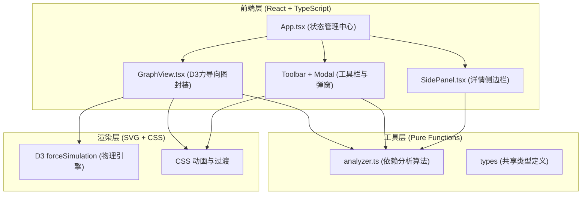

## 1. 架构设计



## 2. 技术说明

- **前端框架**：React@18 + TypeScript@5
- **构建工具**：Vite@5 + @vitejs/plugin-react
- **力导向图引擎**：d3@7（使用 forceSimulation / forceLink / forceManyBody / forceCenter）
- **唯一标识**：uuid@9
- **样式方案**：原生 CSS + CSS Variables（深色主题变量），不使用第三方 UI 库
- **后端**：无（纯前端应用，数据由用户上传 JSON 文件）
- **数据格式**：用户自定义 JSON Schema，包含模块名、引用子模块数组、依赖类型字段

## 3. 路由定义

| 路由 | 用途 |
|------|------|
| / | 主应用单页面（无路由切换） |

单页应用，全部组件挂载于根路由。

## 4. 数据模型与类型定义

### 4.1 核心类型

```typescript
// src/utils/types.ts（内联于 analyzer.ts 或单独文件）
type DependencyType = 'internal' | 'external';

interface ModuleDependency {
  name: string;           // 被引用的子模块名
  type: DependencyType;   // 依赖类型：内部/外部
}

interface ModuleNode {
  name: string;                     // 模块唯一名称
  dependencies: ModuleDependency[]; // 本模块引用的子模块
}

// 用户上传 JSON 的根结构
interface ProjectDependencyData {
  modules: ModuleNode[];
}

// D3 运行时节点（含力导向布局坐标）
interface GraphNode extends d3.SimulationNodeDatum {
  id: string;           // 同模块名
  name: string;
  depth: number;        // 依赖层级深度，用于颜色渐变
  isExternal?: boolean; // 是否为外部库（无 outgoing 依赖）
}

// D3 运行时连线
interface GraphLink extends d3.SimulationLinkDatum<GraphNode> {
  source: string | GraphNode;
  target: string | GraphNode;
  type: DependencyType;
  isCircular?: boolean; // 是否为循环引用
  isDirect?: boolean;   // 相对于选中节点是否为直接引用
}

// 选中节点的分析结果
interface ModuleAnalysis {
  name: string;
  directUpstream: string[];    // 直接上游（引用它的模块）
  directDownstream: string[];  // 直接下游（它引用的模块）
  allUpstream: string[];       // 所有上游（含间接）
  allDownstream: string[];     // 所有下游（含间接）
  depth: number;               // 本模块深度
  impactScore: number;         // 影响分数 = 下游总数
  circularPaths: string[][];   // 经过此模块的循环路径
}

// 分析报告
interface AnalysisReport {
  totalModules: number;
  maxDependencyDepth: number;
  circularDependencyCount: number;
  circularPaths: string[][];
  keyModules: { name: string; impactScore: number; depth: number }[];
}
```

## 5. 核心算法说明（analyzer.ts）

1. **构建邻接表**：从 `ModuleNode[]` 构建 `Map<string, Set<string>>` 的正向（谁→谁）与反向（被谁引用）邻接表。
2. **计算依赖深度**：从入度为 0 的根节点出发进行 BFS，为每个节点分配最小层级，外部库节点深度统一为 0。
3. **循环引用检测**：基于 DFS 三色标记算法（白/灰/黑），记录所有 back edge，输出循环路径。
4. **上下游追溯**：给定模块名，BFS 正向图得全量下游，BFS 反向图得全量上游；直接邻居从邻接表 O(1) 读取。
5. **关键模块识别**：`impactScore = 下游模块数 + 上游模块数 * 0.5`，按分数降序取 Top 5。
6. **报告生成**：基于以上数据拼接结构化文本。

## 6. GraphView 组件交互设计

- **拖拽**：使用 `d3.drag()` 绑定 `start/drag/end` 事件，start 时 `simulation.alphaTarget(0.3).restart()`，end 时 `alphaTarget(0)`，节点 `fx/fy` 固定后在 `velocityDecay=0.4` 下自然回弹。
- **高亮路径**：点击节点时计算上下游集合，对连线按 `(isDirect? isCircular?)` 分类设置 stroke 颜色与宽度，非相关节点与连线 opacity 降到 0.1。
- **过滤**：搜索匹配节点放大 r 到 1.3 倍，其余降到 0.5 opacity；类型切换时不匹配类型的连线淡出，节点保持可见（若节点含任意匹配类型的依赖则保留）。
- **右键菜单**：`contextmenu` 事件 `preventDefault()`，计算鼠标坐标后绝对定位渲染菜单，点击外部区域关闭。
- **入场退场动画**：过滤或首次加载时对 `nodeElements` 使用 `.transition().duration(400).attr('opacity', v).attr('r', r)`，连线类似处理。

## 7. 文件结构

```
e:\solo\VersionFastPro\tasks\auto3
├── .trae/documents/
│   ├── PRD.md
│   └── architecture.md
├── package.json
├── vite.config.js
├── tsconfig.json
├── index.html
└── src/
    ├── main.tsx
    ├── App.tsx
    ├── GraphView.tsx
    ├── SidePanel.tsx
    ├── styles/
    │   └── global.css
    └── utils/
        └── analyzer.ts
```
