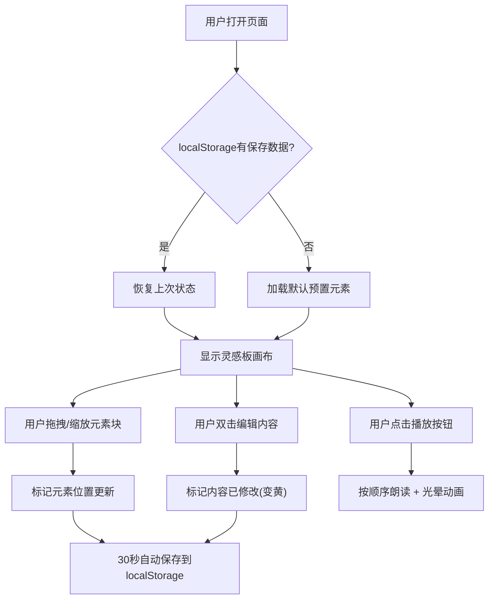

## 1. 产品概述

音乐人协作词曲灵感板是一个面向音乐创作者的纯前端协作工具，允许用户在共享的无限画布上通过拖拽、拼贴音乐元素块来即兴创作旋律和歌词。

- 目标用户：独立音乐人、词曲作者、乐队成员
- 核心价值：提供视觉化、游戏化的创作体验，降低词曲创作的门槛，激发灵感

## 2. 核心功能

### 2.1 用户角色
| 角色 | 注册方式 | 核心权限 |
|------|---------|---------|
| 音乐创作者 | 无需注册，直接使用 | 创建、编辑、播放灵感板内容 |

### 2.2 功能模块
1. **灵感板画布**：无限滚动画布，预置音乐元素块，拖拽缩放交互
2. **元素块编辑**：双击编辑内容，已修改标记
3. **朗读播放**：按空间顺序朗读元素内容，播放动画效果
4. **导航与缩放**：小导航图显示全局视图，Ctrl+滚轮缩放
5. **自动保存**：每30秒自动保存到 localStorage，刷新恢复

### 2.3 页面详情
| 页面名称 | 模块名称 | 功能描述 |
|---------|---------|---------|
| 灵感板主页面 | 画布区域 | 无限滚动画布，显示所有音乐元素块，支持拖拽移动 |
| 灵感板主页面 | 预置元素块 | C大调音阶、I-V-vi-IV和弦进程、四句歌词模板 |
| 灵感板主页面 | 元素块编辑 | 双击进入编辑模式，修改后自动标记为淡黄色 |
| 灵感板主页面 | 播放按钮 | 位于右上角，按从左到右、从上到下顺序朗读所有元素 |
| 灵感板主页面 | 呼吸光晕动画 | 朗读时当前元素块显示脉冲光晕效果 |
| 灵感板主页面 | 导航小图 | 位于左下角，显示画布整体缩放比例和视口位置 |
| 灵感板主页面 | 自动保存 | 每30秒保存状态到 localStorage，页面加载时自动恢复 |

## 3. 核心流程

用户打开页面后，自动加载上次保存的灵感板状态（若无则加载默认预置元素）。用户可以自由拖拽元素块调整位置，双击修改内容，点击播放按钮听朗读预览。系统每30秒自动保存所有修改，刷新页面后状态完整恢复。

## 4. 用户界面设计

### 4.1 设计风格
- **主色调**：暗蓝灰 #1a1a2e（背景）
- **点缀色**：珊瑚粉 #ff6b6b（强调、按钮、光晕）
- **修改标记色**：淡黄色 #fff3cd（已编辑元素块背景）
- **卡片风格**：圆角 12px，多层阴影，悬浮上移 4px
- **拖拽效果**：拖拽时元素块微微倾斜 3°
- **背景**：细微网格线（rgba(255,255,255,0.03)）
- **字体**：现代无衬线字体，标题加粗，正文中等字重

### 4.2 页面设计概述
| 页面名称 | 模块名称 | UI元素 |
|---------|---------|-------|
| 灵感板主页面 | 画布背景 | #1a1a2e 纯色 + 细网格线图案 |
| 灵感板主页面 | 元素卡片 | 圆角12px，深色卡片背景，阴影，hover上移4px，拖拽倾斜3° |
| 灵感板主页面 | 播放按钮 | 右上角，珊瑚粉圆形按钮，播放图标，hover放大 |
| 灵感板主页面 | 导航小图 | 左下角，半透明深色背景，白色边框，显示视口矩形 |
| 灵感板主页面 | 编辑状态 | 淡黄色背景，边框高亮 |
| 灵感板主页面 | 播放动画 | 珊瑚粉光晕脉冲，box-shadow 动画 |

### 4.3 响应性
- 桌面端优先设计，支持宽屏显示
- 画布区域自适应窗口大小
- 元素块最小尺寸限制，防止缩放过度不可见

### 4.4 性能要求
- 拖拽和缩放时 FPS ≥ 50
- 使用 CSS transform 进行位置和缩放变换，触发 GPU 加速
- 避免频繁的 DOM 重排重绘
