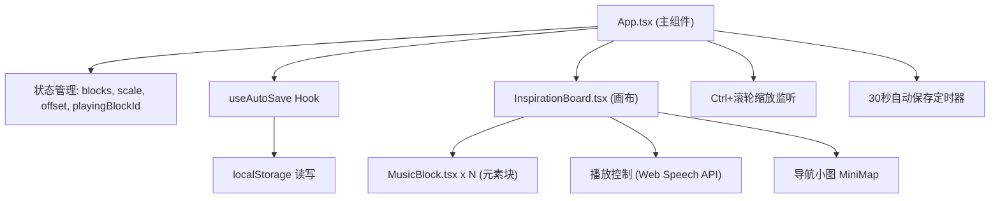

## 1. 架构设计



## 2. 技术描述

- **前端框架**：React 18 + TypeScript
- **构建工具**：Vite 5
- **状态管理**：React useState/useRef（轻量级，无需额外库）
- **样式方案**：CSS Modules / 内联样式（避免引入 Tailwind，保持项目轻量化）
- **语音合成**：Web Speech API (SpeechSynthesis)
- **持久化存储**：localStorage
- **唯一ID**：uuid 库

## 3. 路由定义

| 路由 | 用途 |
|-----|------|
| / | 灵感板主页面（单页应用，无其他路由） |

## 4. 文件结构

```
├── package.json          # 项目依赖与脚本
├── vite.config.js        # Vite 配置
├── tsconfig.json         # TypeScript 配置
├── index.html            # HTML 入口
└── src/
    ├── App.tsx           # 主组件，状态管理
    ├── InspirationBoard.tsx  # 画布组件
    ├── MusicBlock.tsx    # 单个元素块组件
    └── useAutoSave.ts    # 自动保存 Hook
```

## 5. 数据模型

### 5.1 类型定义

```typescript
interface MusicBlockData {
  id: string;
  type: 'scale' | 'chord' | 'lyrics';
  content: string;
  x: number;
  y: number;
  width: number;
  height: number;
  isModified: boolean;
}

interface BoardState {
  blocks: MusicBlockData[];
  scale: number;
  offsetX: number;
  offsetY: number;
}
```

### 5.2 初始数据

```typescript
const defaultBlocks: MusicBlockData[] = [
  {
    id: uuid(),
    type: 'scale',
    content: 'C大调音阶: C D E F G A B',
    x: 100,
    y: 100,
    width: 220,
    height: 100,
    isModified: false,
  },
  {
    id: uuid(),
    type: 'chord',
    content: 'I-V-vi-IV: C - G - Am - F',
    x: 400,
    y: 100,
    width: 240,
    height: 100,
    isModified: false,
  },
  {
    id: uuid(),
    type: 'lyrics',
    content: '第一句：迎着阳光出发\n第二句：梦想在远方\n第三句：风拂过脸庞\n第四句：心中有光',
    x: 250,
    y: 280,
    width: 280,
    height: 160,
    isModified: false,
  },
];
```

## 6. 核心实现要点

### 6.1 拖拽实现
- 使用鼠标事件 (mousedown/mousemove/mouseup)
- 通过 CSS transform: translate(x, y) 更新位置
- 拖拽时添加 rotate(3deg) 倾斜效果
- 计算时考虑画布缩放比例 (scale)

### 6.2 缩放实现
- 监听 wheel 事件，判断 Ctrl 键按下
- 以鼠标位置为缩放中心
- scale 范围限制在 0.25 ~ 4.0 之间

### 6.3 播放逻辑
- 将元素块按 y 坐标分组（行），每组内按 x 坐标排序
- 使用 SpeechSynthesis API 依次朗读
- 朗读时设置 playingBlockId，触发 CSS 动画
- 每段朗读间隔适当延迟

### 6.4 呼吸光晕动画
- 使用 CSS @keyframes 定义 box-shadow 脉冲动画
- 当块 ID 匹配 playingBlockId 时应用动画类

### 6.5 自动保存
- useAutoSave Hook 封装保存/恢复逻辑
- setInterval 每 30 秒触发保存
- localStorage key: 'music_inspiration_board_state'
