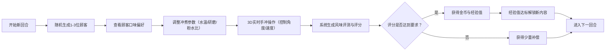

## 1. 产品概述

本项目是一款线上模拟经营手冲咖啡馆的互动Web应用，用户扮演咖啡馆主，通过精准控制手冲咖啡的制作过程来满足虚拟顾客的口味偏好，赚取金币并解锁新设备与咖啡豆。

- 核心价值：结合3D互动体验与经营策略玩法，让用户在趣味中学习手冲咖啡知识
- 目标用户：咖啡爱好者、模拟经营游戏玩家

## 2. 核心功能

### 2.1 用户角色
| 角色 | 注册方式 | 核心权限 |
|------|----------|----------|
| 咖啡馆主 | 无需注册，直接进入 | 冲煮咖啡、服务顾客、升级设备、解锁咖啡豆 |

### 2.2 功能模块
1. **咖啡冲煮实验室**：3D手冲场景、实时参数控制、水流粒子模拟、风味评分
2. **咖啡馆经营**：顾客队列管理、口味偏好匹配、回合制经营、金币与经验系统
3. **设备与成长系统**：咖啡豆解锁、温控设备升级、配方参数调整

### 2.3 页面详情
| 页面名称 | 模块名称 | 功能描述 |
|----------|----------|----------|
| 主界面 | 3D冲煮场景 | Three.js渲染手冲壶与滤杯，粒子系统模拟水流，滑块控制注水角度和速度 |
| 主界面 | 设备状态面板 | 左侧实时显示水温、研磨度、粉水比参数 |
| 主界面 | 顾客队列面板 | 右侧显示1-3位顾客及口味偏好气泡 |
| 主界面 | 风味评测面板 | 冲煮完成后显示五维雷达图和综合评分 |
| 主界面 | 成长系统 | 顶部显示金币、经验值、解锁进度 |

## 3. 核心流程

## 4. 用户界面设计

### 4.1 设计风格
- **主色调**：暖棕色（#8B4513）- 代表咖啡与木质质感
- **辅助色**：奶油色（#FFFDD0）- 营造温馨氛围
- **点缀色**：金色（#FFD700）- S级评分特效
- **按钮风格**：拟物化设计，圆角8px，悬停有按压力反馈（scale: 0.97 + 内阴影）
- **字体**：标题使用衬线字体（Playfair Display），正文使用无衬线字体（Noto Sans SC）
- **背景**：微妙的纸张纹理叠加渐变，营造手账/菜单质感
- **图标风格**：线性图标，咖啡相关元素

### 4.2 页面设计概述
| 页面名称 | 模块名称 | UI元素 |
|----------|----------|--------|
| 主界面 | 3D冲煮场景 | 居中布局，暖光环境，手冲壶可拖拽，水流粒子，涟漪效果 |
| 主界面 | 设备状态面板 | 左侧固定宽度，卡片式布局，实时数据仪表样式 |
| 主界面 | 顾客队列面板 | 右侧固定宽度，顾客头像+气泡对话框式偏好显示 |
| 主界面 | 风味评测 | 半透明浮层，五边形雷达图，金色粒子特效（S级） |
| 主界面 | 顶部状态栏 | 金币、经验值进度条，解锁咖啡豆图标 |

### 4.3 响应式
- **桌面端**：三栏布局（左设备面板 | 中3D场景 | 右顾客面板）
- **移动端**：竖排单列布局（顶部状态 → 3D场景 → 设备控制 → 顾客队列）
- **触摸优化**：滑块增大可点击区域，按钮最小44x44px，拖拽支持触摸事件

### 4.4 3D场景指导
- **环境与氛围**：暖色调聚光灯模拟咖啡馆环境光，浅米色背景，柔和阴影
- **光照设置**：主光源从45度角照射，环境光强度0.6，添加轻微泛光效果
- **相机设置**：透视相机，初始位置俯视30度，可缩放但限制在合理范围
- **构图与焦点**：手冲壶与滤杯位于场景中心，咖啡杯在下方承接
- **交互与动画**：注水角度控制壶的旋转，速度控制粒子发射率，点击开始/停止注水
- **后期处理**：轻微 bloom 效果增强质感，色彩分级偏暖
- **性能预算**：粒子总数 ≤ 800，帧率 ≥ 45fps，模型使用低多边形

## 5. 性能与交互要求
- 3D场景渲染帧率稳定在45fps以上
- 所有组件交互反馈延迟不超过100ms
- 粒子系统数量严格控制在800以内
- 响应式切换动画平滑过渡
