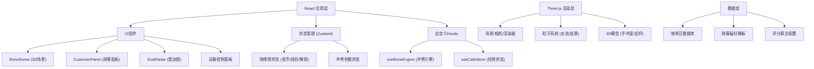

## 1. 架构设计



## 2. 技术描述

- **前端框架**：React 18 + TypeScript
- **构建工具**：Vite 5.x
- **3D渲染**：Three.js 0.160.x + @types/three
- **状态管理**：Zustand 4.x
- **样式方案**：CSS-in-JS + CSS Variables（主题系统）
- **初始化方式**：Vite React TypeScript 模板

## 3. 目录结构

```
src/
├── modules/
│   ├── coffee-lab/
│   │   ├── components/
│   │   │   └── BrewScene.tsx        # 3D冲煮场景组件
│   │   └── hooks/
│   │       └── useBrewEngine.ts     # 冲煮引擎逻辑
│   └── cafe-simulation/
│       ├── components/
│       │   └── CustomerPanel.tsx    # 顾客队列面板
│       └── hooks/
│           └── useCafeStore.ts      # 咖啡馆状态管理
├── shared/
│   ├── components/
│   │   └── EvalRadar.tsx            # 风味雷达图组件
│   └── styles/
│       └── theme.ts                 # 主题配置与CSS
├── App.tsx                          # 主应用组件
├── main.tsx                         # 应用入口
└── index.css                        # 全局样式
```

## 4. 核心数据模型

### 4.1 风味评分
```typescript
interface FlavorProfile {
  acidity: number;      // 酸度 0-100
  bitterness: number;   // 苦度 0-100
  body: number;         // 醇厚度 0-100
  sweetness: number;    // 甜度 0-100
  aftertaste: number;   // 回甘 0-100
}

interface BrewResult {
  score: 'S' | 'A' | 'B' | 'C' | 'D';
  numericScore: number;
  flavor: FlavorProfile;
  matchScore: number;   // 与目标口味匹配度
}
```

### 4.2 冲煮参数
```typescript
interface BrewParams {
  waterTemp: number;        // 水温 80-100°C
  grindSize: number;        // 研磨度 1-10
  coffeeWaterRatio: number; // 粉水比 1:10 - 1:20
  pourAngle: number;        // 注水角度 0-90°
  pourSpeed: number;        // 注水速度 0-10
}
```

### 4.3 顾客与经营
```typescript
interface Customer {
  id: string;
  name: string;
  avatar: string;
  preference: Partial<FlavorProfile>;
  patience: number;
  reward: { coins: number; exp: number };
}

interface CafeState {
  coins: number;
  experience: number;
  level: number;
  unlockedBeans: string[];
  currentRound: number;
  customers: Customer[];
  currentBean: string;
}
```

## 5. 关键算法

### 5.1 风味评分算法
- 水温曲线匹配度：实际水温与最佳水温曲线的偏差积分
- 注水均匀度：基于注水位置分布的方差计算
- 流速稳定性：水流速度的标准差
- 萃取时间：总注水时间与推荐时间的匹配度

### 5.2 粒子系统优化
- 对象池复用粒子，避免频繁GC
- 粒子数量动态上限800
- 距离剔除：远离视图的粒子不渲染
- 简化着色器计算

## 6. 性能优化策略
1. Three.js 开启 `antialias: false`，使用 `powerPreference: "high-performance"`
2. Vite 配置 `optimizeDeps` 预构建 three
3. 使用 `requestAnimationFrame` 统一动画循环
4. React 组件使用 `React.memo` 避免不必要重渲染
5. Zustand 状态选择器精确订阅
6. 粒子更新使用 TypedArray 批量操作
