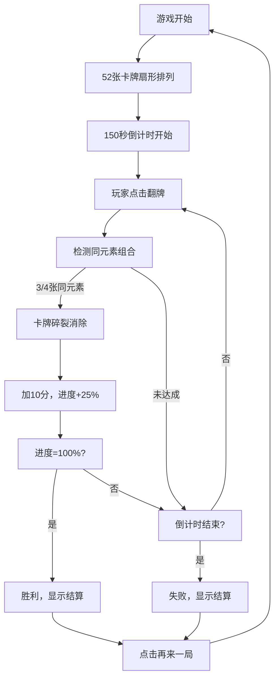

## 1. 产品概述
"纸牌幻境"是一款单人卡牌策略游戏，玩家通过翻开并收集不同元素属性的卡牌来凑齐组合，在限时内完成4组特定牌组以通过关卡。游戏融合了记忆、策略和运气元素，提供沉浸式的魔幻卡牌体验。

- **主要目的**：通过翻开卡牌收集元素组合，在限时内完成目标，提供休闲益智的游戏体验
- **目标用户**：喜欢卡牌游戏、益智类游戏的玩家，年龄覆盖12-45岁
- **产品价值**：操作简单但富有策略性，精美的动画效果和沉浸式的暗色魔幻主题，适合碎片化时间娱乐

## 2. 核心功能

### 2.1 用户角色
| 角色 | 注册方式 | 核心权限 |
|------|----------|----------|
| 玩家 | 无需注册，直接进入 | 完整游戏体验，包括翻牌、计分、重玩 |

### 2.2 功能模块
1. **游戏主界面**：卡牌展示区、计分板、倒计时器、进度条
2. **卡牌系统**：52张4元素卡牌、翻转动画、元素特效、碎裂消除动画
3. **组合检测系统**：自动检测3张同元素或4张同元素组合、消除计分
4. **计时系统**：150秒倒计时、圆形进度环显示、超时判定
5. **进度系统**：彩虹进度条、目标提示、胜利/失败判定
6. **结算系统**：结果面板、最终得分、用时统计、再来一局功能

### 2.3 页面详情
| 页面名称 | 模块名称 | 功能描述 |
|----------|----------|----------|
| 游戏主界面 | 卡牌展示区 | 52张卡牌扇形排列，支持点击翻转，显示元素图标和数字 |
| 游戏主界面 | 计分板 | 左上角显示当前得分，带发光效果和缩放动画 |
| 游戏主界面 | 倒计时器 | 右上角圆形进度环，绿到红渐变，显示剩余时间 |
| 游戏主界面 | 进度条 | 顶部彩虹渐变进度条，显示4组组合完成进度 |
| 游戏主界面 | 提示文字 | 进度条下方显示"距离过关还需X组"提示 |
| 结算面板 | 结果展示 | 显示最终得分、用时、收集组合数 |
| 结算面板 | 再来一局 | 点击按钮重新开始游戏 |

## 3. 核心流程

玩家进入游戏 → 52张卡牌背面朝上扇形排列 → 150秒倒计时开始 → 玩家点击卡牌翻转 → 系统自动检测组合（3张或4张同元素）→ 组合达成时卡牌碎裂消除并加10分 → 进度条更新 → 完成4组组合则胜利 → 倒计时结束未完成则失败 → 显示结算面板 → 点击再来一局重新开始

## 4. 用户界面设计

### 4.1 设计风格
- **主色调**：深紫#3b1f54（卡牌背面）、深蓝渐变背景#1a1a2e→#16213e
- **元素色**：火#ff6b6b、水#4a9eff、风#00d4aa、地#ffd700
- **按钮风格**：圆角12px，浅蓝#4a9eff背景，悬停深蓝#2a6fdf，点击凹陷0.2秒
- **字体**：使用优雅的衬线/无衬线字体组合，数字采用等宽字体
- **布局**：居中卡牌区，左上计分，右上倒计时，顶部进度条
- **图标风格**：SVG绘制元素图标（火焰、水滴、旋风、山峦），线条流畅有魔幻感

### 4.2 页面设计概述
| 页面名称 | 模块名称 | UI元素 |
|----------|----------|--------|
| 游戏主界面 | 卡牌展示区 | 3行18张扇形排列，每张-5°~5°随机旋转，Y轴±2px偏移，背面深紫色带金色装饰，微弱光晕脉动 |
| 游戏主界面 | 卡牌翻转 | 0.5秒书页式翻转动画，ease-out弹性，边缘微光闪烁 |
| 游戏主界面 | 卡牌消除 | 8片碎裂向四周飞出，0.3秒消失，碎片同元素色 |
| 游戏主界面 | 计分板 | 白色30px字体，0-30分蓝色发光，30-60分金色发光，60+虹彩渐变，得分时1.0→1.3→1.0缩放 |
| 游戏主界面 | 倒计时 | 圆形进度环，环宽4px，绿#00d4aa→红#ff6b6b渐变，数字24px白色居中 |
| 游戏主界面 | 进度条 | 彩虹渐变（红橙黄绿青蓝紫），25%步进，完成时亮度1.0→1.5→1.0闪烁 |
| 结算面板 | 背景 | 半透明黑色笼罩全屏，面板0.4秒从上滑入 |
| 结算面板 | 内容 | 最终得分、用时、组合数，"再来一局"按钮 |

### 4.3 响应式
- **桌面端**：标准尺寸，3行18张布局
- **移动端**（<768px）：卡牌缩小70%，4行14张更紧凑布局，触控优化
- **性能**：翻转动画≥50fps，卡顿≤1次/30秒，倒计时更新≤30fps

### 4.4 视觉特效
- **背景**：从#1a1a2e到#16213e的垂直渐变，叠加极淡网格线（#ffffff05，透明度0.05）
- **卡牌光晕**：未翻转卡牌2秒周期微弱脉动（0.3%透明度）
- **翻牌特效**：边缘微光一闪模拟沙沙声
- **进度提示**：文字颜色跟随进度条当前段颜色
