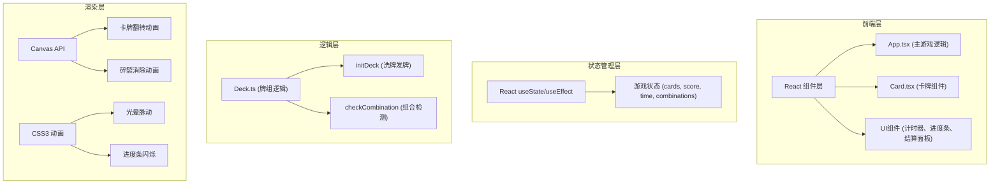

## 1. 架构设计



## 2. 技术描述
- **前端框架**：React 18 + TypeScript
- **构建工具**：Vite 5
- **状态管理**：React useState/useEffect（轻量级游戏状态）
- **动画方案**：CSS3 transforms/transitions + Canvas 2D API
- **样式方案**：原生 CSS（CSS Variables 主题系统）
- **无后端**：纯前端游戏，本地状态管理

## 3. 项目文件结构

```
e:\solo\Pro\tasks\auto5\
├── package.json              # 项目依赖和脚本
├── vite.config.js            # Vite 构建配置
├── tsconfig.json             # TypeScript 配置（严格模式）
├── index.html                # 入口 HTML
└── src\
    ├── App.tsx               # 主组件，游戏状态管理
    ├── Card.tsx              # 卡牌组件，Canvas动画
    ├── Deck.ts               # 牌组逻辑纯函数
    └── style.css             # 全局样式
```

## 4. 核心数据模型

### 4.1 卡牌类型定义

```typescript
type ElementType = 'fire' | 'water' | 'wind' | 'earth';

interface CardData {
  id: number;
  element: ElementType;
  value: number; // 1-10
  isFlipped: boolean;
  isMatched: boolean;
  rotation: number; // -5 ~ 5度
  offsetY: number; // -2 ~ 2px
}

interface GameState {
  cards: CardData[];
  score: number;
  timeLeft: number;
  combinations: number;
  isGameOver: boolean;
  isWin: boolean;
  flippedCards: number[];
}
```

### 4.2 元素配置

| 元素 | 颜色值 | 图标 | 组合条件 |
|------|--------|------|----------|
| fire | #ff6b6b | 火焰SVG | 3张或4张 |
| water | #4a9eff | 水滴SVG | 3张或4张 |
| wind | #00d4aa | 旋风SVG | 3张或4张 |
| earth | #ffd700 | 山峦SVG | 3张或4张 |

## 5. 核心模块设计

### 5.1 Deck.ts - 牌组逻辑模块

```typescript
// 暴露函数
export function initDeck(): CardData[];  // 创建并洗牌，返回52张卡牌
export function checkCombination(
  flippedCards: CardData[],
  allCards: CardData[]
): { matched: boolean; matchedIds: number[]; element: ElementType | null };
```

**职责**：
- `initDeck`：创建52张卡牌（4元素×13张，但值为1-10循环），随机排列，分配旋转和偏移
- `checkCombination`：检测翻开的卡牌中是否有3张或4张同元素，返回匹配结果

### 5.2 Card.tsx - 卡牌组件

**Props**：
```typescript
interface CardProps {
  card: CardData;
  onClick: (id: number) => void;
  index: number;
}
```

**功能**：
- Canvas绘制卡牌正反面
- 实现0.5秒书页式翻转动画（CSS transform + perspective）
- 元素图标SVG渲染
- 碎裂消除动画（Canvas粒子效果）
- 边缘微光特效

### 5.3 App.tsx - 主游戏组件

**状态**：
- `cards`：卡牌数组
- `score`：当前得分
- `timeLeft`：剩余时间（秒）
- `combinations`：已完成组合数
- `gameOver`：游戏结束标志
- `isWin`：胜利标志

**核心逻辑**：
- 150秒倒计时（useEffect + setInterval，节流到30fps）
- 卡牌点击处理
- 组合检测与消除
- 计分与动画触发
- 胜负判定
- 结算面板显示

## 6. 性能优化方案

### 6.1 动画性能
- 使用 CSS `will-change: transform` 提升卡牌渲染性能
- Canvas 动画使用 `requestAnimationFrame` 保证帧率
- 倒计时节流：每帧更新 ≈ 30fps（而非60fps）
- 使用 CSS transforms 而非 top/left 定位

### 6.2 渲染优化
- React.memo 包裹 Card 组件避免不必要重渲染
- 卡牌翻转使用 CSS transition 而非 JS 逐帧动画
- 消除动画仅作用于被消除的卡牌，不影响其他卡牌

### 6.3 布局策略
- **桌面端**：3行 × 18张 = 54个位置，最后2个留空
- **移动端**（<768px）：4行 × 14张 = 56个位置，最后4个留空，卡牌缩放70%
- 使用 CSS Grid 或 Flexbox 配合绝对定位实现扇形排列

## 7. 动画实现方案

### 7.1 卡牌翻转动画
```css
.card-inner {
  transform-style: preserve-3d;
  transition: transform 0.5s cubic-bezier(0.34, 1.56, 0.64, 1);
  transform-origin: bottom;
}
.card.flipped .card-inner {
  transform: rotateX(-180deg);
}
```

### 7.2 碎裂消除动画
- Canvas 绘制8个三角形碎片
- 每个碎片随机方向飞出，带旋转和透明度衰减
- 0.3秒内完成，使用 requestAnimationFrame

### 7.3 倒计时环
- SVG circle + stroke-dasharray 实现进度环
- 颜色通过 CSS 变量从 #00d4aa 渐变到 #ff6b6b

## 8. 响应式断点

| 断点 | 卡牌尺寸 | 布局 |
|------|----------|------|
| ≥768px | 100% | 3行18张 |
| <768px | 70% | 4行14张 |

## 9. 构建与部署

- **开发命令**：`npm run dev`
- **构建命令**：`npm run build`
- **TypeScript 检查**：`npx tsc --noEmit`
- **依赖**：react、react-dom、vite、typescript、@types/react、@types/react-dom
