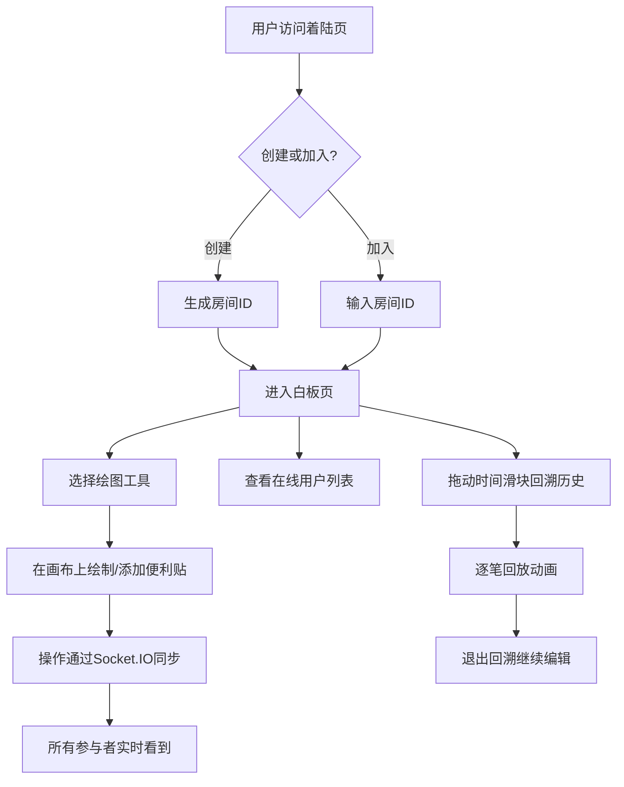

## 1. 产品概述

协作白板是一款面向远程团队的实时头脑风暴协作工具，旨在解决分布式团队在创意讨论时缺乏直观互动和实时同步工具的痛点。通过无限画布、丰富绘图工具、便利贴、历史回溯等核心功能，让远程协作如同面对面般高效自然。

- 目标用户：远程办公团队、设计团队、产品经理、教育工作者
- 核心价值：将线下白板头脑风暴体验完整移植到线上，实现零距离实时协作

## 2. 核心功能

### 2.1 用户角色

| 角色 | 加入方式 | 核心权限 |
|------|----------|----------|
| 协作者 | 输入房间ID加入或创建房间 | 绘图、添加便利贴、查看历史、查看在线用户 |

### 2.2 功能模块

1. **着陆页**：创建/加入房间，房间ID输入
2. **白板页**：无限画布绘图、工具栏、便利贴、用户列表、历史回溯

### 2.3 页面详情

| 页面名称 | 模块名称 | 功能描述 |
|----------|----------|----------|
| 着陆页 | 房间管理 | 创建新房间（生成唯一ID）、加入已有房间（输入ID）、房间ID复制分享 |
| 白板页 | 无限画布 | 支持缩放/平移的Canvas画布，多用户实时绘图同步，光标位置指示 |
| 白板页 | 绘图工具栏 | 铅笔（粗细+颜色）、荧光笔、直线、矩形、圆形、文本标签，工具切换动画 |
| 白板页 | 便利贴 | 可拖拽彩色便利贴，Markdown富文本编辑，缩放旋转，弹性吸附动画 |
| 白板页 | 用户列表 | 在线用户头像+名称，光标位置实时指示器，随机彩色头像 |
| 白板页 | 历史回溯 | 时间滑块查看任意时间点白板快照，逐笔回放动画，回溯时禁用编辑 |
| 白板页 | 缩略图导航 | 右下角缩略图，快速定位画布位置 |

## 3. 核心流程

**主流程**：用户访问着陆页 → 创建或加入房间 → 进入白板页 → 选择绘图工具/添加便利贴 → 实时同步给所有参与者 → 随时回溯历史

**便利贴流程**：用户点击白板空白处 → 生成彩色便利贴 → 双击编辑内容（支持Markdown） → 拖拽移动 → 缩放旋转 → 同步给所有人

**历史回溯流程**：用户拖动时间滑块 → 请求后端快照数据 → 禁用编辑 → 逐笔动画回放 → 松开滑块回到当前状态

## 4. 用户界面设计

### 4.1 设计风格

- **风格**：毛玻璃拟态（Glassmorphism）
- **主色调**：靛蓝 (#4F46E5) 到浅紫 (#A78BFA) 渐变
- **背景**：深色渐变底色配毛玻璃面板
- **按钮风格**：圆角半透明，悬停抬起阴影，点击按压动画
- **字体**：标题使用 Outfit（几何感现代字体），正文使用 DM Sans
- **图标**：Lucide React 图标库
- **布局**：左侧固定工具栏，右下角缩略图导航

### 4.2 页面设计概览

| 页面名称 | 模块名称 | UI元素 |
|----------|----------|--------|
| 着陆页 | 房间管理 | 居中毛玻璃卡片、靛蓝渐变背景、大标题"BrainSync"、创建房间按钮（渐变填充）、加入房间输入框+按钮、微粒子动效背景 |
| 白板页 | 画布区域 | 全屏Canvas、网格背景、缩放指示器 |
| 白板页 | 工具栏 | 左侧半透明圆角面板、图标按钮、选中态高亮边框、150ms过渡动画、悬停阴影、点击缩放 |
| 白板页 | 便利贴 | 彩色圆角卡片、编辑态显示Markdown工具栏、拖拽时阴影加深、弹性吸附动画 |
| 白板页 | 用户列表 | 右上角毛玻璃面板、彩色圆形头像+用户名、连接状态指示灯 |
| 白板页 | 时间滑块 | 底部半透明面板、渐变滑块轨道、时间标记、回放状态指示 |
| 白板页 | 缩略图导航 | 右下角小面板、画布缩略图、当前位置视口框、点击快速定位 |

### 4.3 响应式适配

- **桌面端**（≥1024px）：左侧完整工具栏，右下角缩略图，全功能展示
- **iPad端**（768px-1024px）：工具栏宽度收窄，缩略图面板缩小
- **移动端**（<768px）：工具栏压缩为底部悬浮菜单（可展开/收起），隐藏缩略图，画布触摸手势操作

### 4.4 动效规范

- 工具切换：150ms缩放+淡入淡出
- 便利贴操作：弹性动画（spring physics），吸附时微弹
- 按钮悬停：100ms阴影升起
- 按钮点击：80ms缩小至0.95
- 同步提示：150ms淡入淡出toast
- 历史回放：逐笔绘制动画，笔速可调
