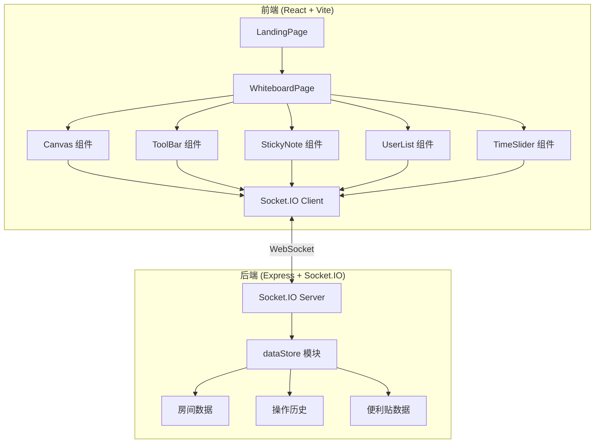
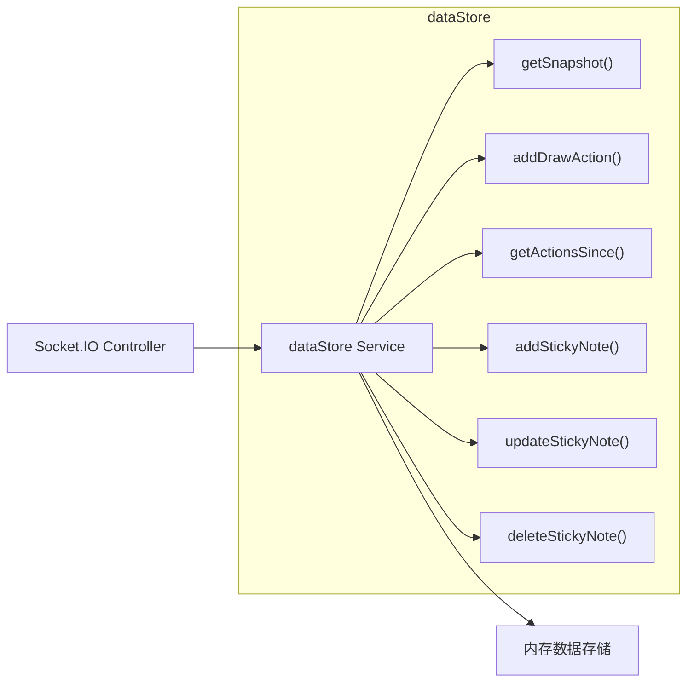
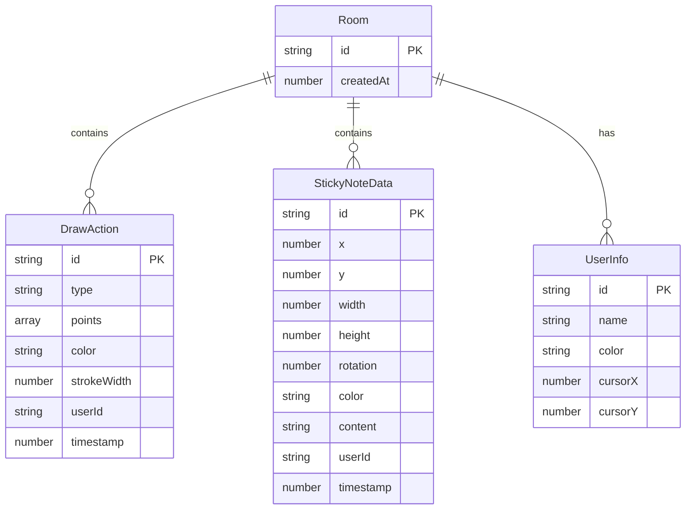

## 1. 架构设计



## 2. 技术说明

- **前端**: React 18 + TypeScript + Vite + TailwindCSS + Zustand
- **初始化工具**: vite-init (react-express-ts 模板)
- **后端**: Express 4 + Socket.IO + TypeScript
- **数据库**: 内存数据存储（dataStore模块），无需外部数据库
- **实时通信**: Socket.IO WebSocket 双向通信
- **状态管理**: Zustand 管理前端全局状态（当前工具、房间信息、用户列表）
- **路由**: react-router-dom v6

## 3. 路由定义

| 路由 | 用途 |
|------|------|
| `/` | 着陆页，创建或加入房间 |
| `/room/:roomId` | 白板页面，画布协作主界面 |

## 4. API 定义

### 4.1 Socket.IO 事件定义

**客户端 → 服务端**

| 事件名 | 参数类型 | 描述 |
|--------|----------|------|
| `create-room` | `{}` | 创建新房间，返回房间ID |
| `join-room` | `{ roomId: string; userName: string }` | 加入指定房间 |
| `leave-room` | `{ roomId: string }` | 离开房间 |
| `draw-action` | `DrawAction` | 发送绘图操作 |
| `sticky-note-add` | `StickyNoteData` | 添加便利贴 |
| `sticky-note-update` | `StickyNoteData` | 更新便利贴 |
| `sticky-note-delete` | `{ roomId: string; noteId: string }` | 删除便利贴 |
| `cursor-move` | `{ roomId: string; x: number; y: number }` | 光标位置同步 |
| `request-snapshot` | `{ roomId: string; timestamp: number }` | 请求历史快照 |

**服务端 → 客户端**

| 事件名 | 参数类型 | 描述 |
|--------|----------|------|
| `room-created` | `{ roomId: string }` | 房间创建成功 |
| `room-joined` | `{ roomId: string; users: UserInfo[]; history: DrawAction[]; stickyNotes: StickyNoteData[] }` | 加入房间成功，返回历史数据 |
| `user-joined` | `UserInfo` | 新用户加入通知 |
| `user-left` | `{ userId: string }` | 用户离开通知 |
| `draw-action` | `DrawAction` | 广播绘图操作 |
| `sticky-note-add` | `StickyNoteData` | 广播便利贴添加 |
| `sticky-note-update` | `StickyNoteData` | 广播便利贴更新 |
| `sticky-note-delete` | `{ noteId: string }` | 广播便利贴删除 |
| `cursor-move` | `{ userId: string; x: number; y: number; color: string; name: string }` | 广播光标位置 |
| `snapshot-data` | `{ drawActions: DrawAction[]; stickyNotes: StickyNoteData[] }` | 历史快照数据 |

### 4.2 TypeScript 类型定义

```typescript
type ToolType = 'pencil' | 'highlighter' | 'line' | 'rect' | 'circle' | 'text';

interface DrawAction {
  id: string;
  type: ToolType;
  points: { x: number; y: number }[];
  color: string;
  strokeWidth: number;
  fontSize?: number;
  text?: string;
  userId: string;
  timestamp: number;
}

interface StickyNoteData {
  id: string;
  x: number;
  y: number;
  width: number;
  height: number;
  rotation: number;
  color: string;
  content: string;
  userId: string;
  timestamp: number;
}

interface UserInfo {
  id: string;
  name: string;
  color: string;
  cursorX: number;
  cursorY: number;
}
```

## 5. 服务端架构图



## 6. 数据模型

### 6.1 数据模型定义



### 6.2 内存数据结构

```typescript
interface RoomStore {
  drawActions: DrawAction[];
  stickyNotes: Map<string, StickyNoteData>;
  users: Map<string, UserInfo>;
  createdAt: number;
}

const rooms: Map<string, RoomStore> = new Map();
```
